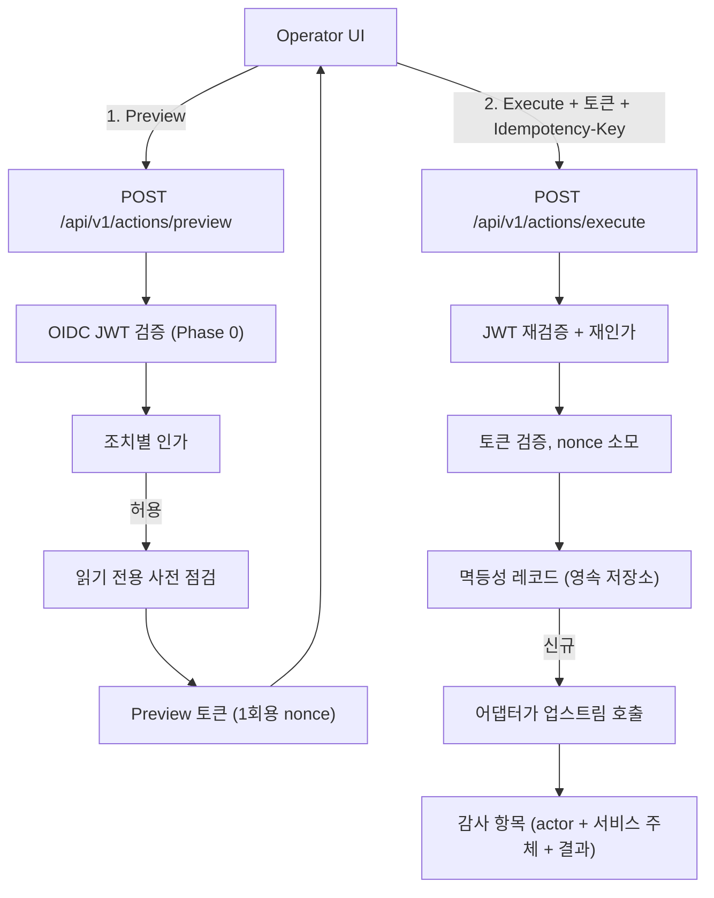

# ADR-0006: 안전한 운영 조치(Safe Actions) — 제어된 운영 조치 모델

- **상태**: 제안됨(Proposed) — 설계 제안이며, 본 ADR에 의해 구현되는 운영 조치 API 또는 변경 실행 경로는 없습니다.
  번호 안내: ADR-0005는 배포 및 GitOps 통합(PR #113)이며, 본 Safe Actions 제안은 ADR-0006입니다.
- **날짜**: 2026-10-07
- **이슈**: [#21 [ROADMAP][UX] Safe Actions — Controlled Operational Actions](https://github.com/dasomel/beluga-manager/issues/21)
- **상위 에픽**: #1
- **관련**: [ADR-0002](0002-backend-api-technology-ko.md) (Hono + TypeScript Domain API, OPA 인가 위임), [ADR-0004](0004-hierarchical-data-asset-api-ko.md) (카탈로그 계층, ABAC/RBAC 정합), `AGENTS.md` (read-first 원칙, 업스트림 OSS API와 통합 도메인의 경계), `docs/architecture.md` (Design Principles, Ownership Boundaries), `.agents/skills/beluga-manager-integration-contract/SKILL.md` (read-first 범위, 변경 기준).
- **의사결정자**: dasomel

표기 규칙: **현재 상태** 절은 관측한 사실만 적습니다(file:line 또는 실제 실행한 명령, 근거 일자 2026-10-07). **제안** 절은 설계 의도입니다. 모든 수치(TTL, 타임아웃, 보존 기간)에는 *Proposed*를 표기합니다. 외부 사실은 2026-10-07에 실제로 연 공식 URL을 달거나 *not verified*로 표기합니다.

## 배경(Context)

Beluga Manager는 Beluga 데이터 플랫폼 위의 통합 계층입니다. `AGENTS.md`와 `docs/architecture.md`는 **read-first** 기준을 정합니다. 현재 제공되는 API와 화면(Overview, Services, Pipelines, Data, Operations)은 조회·상관분석만 하며 하위 시스템을 변경하지 않습니다.

그럼에도 운영에는 반복적인 요청이 있습니다(이슈 #21): 업스트림 배치 도착 시 Airflow DAG 실행 트리거, Flink 잡의 세이브포인트/중지·재시작, 메타데이터 캐시 갱신, 실패한 커넥터 태스크 재시작. 이슈 #21은 엔지니어에게 광범위한 클러스터 자격 증명을 주지 않고 통제된 변경을 제공하라고 요구합니다. 본 ADR은 프레임워크와, 이전 초안보다 의도적으로 훨씬 좁힌 첫 단계를 제안합니다.

### 현재 상태(관측)

| 사실 | 근거 |
|---|---|
| Domain API에는 **인증 미들웨어가 없고** 호출자별 인가도 없습니다. | `docs/IMPLEMENTATION-STATUS.md:30` ("the app has no auth middleware"); `packages/domain-api/src/app.ts:50-56`는 CORS 미들웨어(origin `http://localhost:5180`)만 등록합니다. CORS는 인증이나 CSRF 방어가 아닙니다. |
| Domain API에는 DB/캐시 의존성(Postgres/Redis 클라이언트)이 없습니다. | `grep -rn -i "postgres\|redis" packages/domain-api/package.json packages/domain-api/src` 결과는 정책 타깃 enum/픽스처 문자열(`schema/policy.ts`, `stub-data/policies.ts`)뿐이며 클라이언트가 아닙니다. |
| Flink는 Flink Kubernetes Operator 아래 `FlinkDeployment/flink-cluster`(ns `streaming`)로 동작하며 **`spec.job`이 없는 세션 클러스터**입니다. | Beluga `gitops/charts/beluga-data/templates/05-flink-operator.yaml:1-9`(`job:` 블록 없음); 라이브 `kubectl -n streaming get flinkdeployment flink-cluster -o jsonpath='{.spec.job}'`은 빈 값, 라이프사이클 `STABLE`; `kubectl get flinksessionjob -A`는 "No resources found". |
| Flink 잡은 오퍼레이터 CR이 아니라 ArgoCD **Sync 훅** Job(`flink-sql-submit`)이 `sql-client.sh`로 `flink-cluster-rest:8081`에 제출합니다. 훅은 sync마다 재실행되며 **활성 상태가 아닌 파이프라인은 재제출합니다. FAILED/CANCELED/FINISHED는 의도적으로 "재제출 대상"(원하는 자동 복구)입니다**. | Beluga `gitops/charts/beluga-data/templates/14-flink-jobs.yaml:22-28`(훅 애노테이션), `:151-154`(D2 주석, `ACTIVE_STATE_RE`), `:189`의 `submit()` 함수. 라이브: `kubectl -n streaming get jobs`에서 `flink-sql-submit` Complete. |
| ArgoCD Application `beluga-data`는 `automated: {prune: true, selfHeal: true}`입니다. | Beluga `gitops/apps/beluga-data.yaml:19-22`; 라이브 `kubectl -n argocd get application beluga-data -o jsonpath='{.spec.syncPolicy}'`. |
| Beluga gitops 어디에도 세이브포인트 디렉터리가 설정되어 있지 않습니다(`origin/main`에 대한 `git grep -i savepoint`는 `docs/ha-dr-objectives*.md`, `docs/upgrade-rollback-procedures*.md`만 히트하고 매니페스트는 없음). 체크포인트 주기는 30s입니다. | Beluga `05-flink-operator.yaml:14`(`execution.checkpointing.interval: "30s"`); `refs/remotes/origin/main`에서 grep 실행. |
| Beluga는 Flink REST API를 인증 없는 대시보드/REST 표면으로 기술합니다. | Beluga `docs/critical-interfaces-inventory.md:29`. |
| Airflow는 3.3.0이며 UI 로그인에 FAB 인증 매니저 + Keycloak OIDC를 씁니다. | Beluga `VERSIONS.md:36`; `gitops/charts/beluga-data/templates/07-airflow.yaml:196-197`(`FabAuthManager`), `:74-94`(OAuth/Keycloak). |
| CNPG 클러스터는 네임스페이스 `database`의 `postgres-main`입니다. | Beluga `gitops/charts/beluga-data/templates/02-cnpg.yaml:3-5`; 라이브 `kubectl -n database get clusters.postgresql.cnpg.io` -> `postgres-main`. |
| ArgoCD `selfHeal`은 대역 외 수정을 조용히 되돌립니다. | Beluga `docs/mistakes-log.md`, 2026-08-25(gitops) 항목, 발췌: "selfHeal: true … `kubectl apply`로 직접 편집하면 ArgoCD가 몇 분 내로 조용히 origin/main 상태로 되돌린다" (beluga 커밋 1df61e0 기준). 이 항목은 관리 리소스에 대한 `kubectl apply` 직접 편집에 관한 것입니다. |

### 외부 참고 자료(2026-10-07 열람)

- Flink 1.20 REST API — <https://nightlies.apache.org/flink/flink-docs-release-1.20/docs/ops/rest_api/> (2026-10-07 열람): `POST /jobs/:jobid/savepoints`(본문: `target-directory`, `cancel-job`, `formatType`), `POST /jobs/:jobid/stop`(본문: `drain`, `targetDirectory`, `formatType`), `GET /jobs/:jobid/savepoints/:triggerid`(상태 `IN_PROGRESS`/`COMPLETED`, `location`)를 문서화하며 모두 trigger id를 반환하는 비동기입니다.
- Flink Kubernetes Operator 1.15 잡 관리 — <https://nightlies.apache.org/flink/flink-kubernetes-operator-docs-release-1.15/docs/custom-resource/job-management/> (2026-10-07 열람): `upgradeMode`는 `stateless` / `last-state` / `savepoint`; 원하는 상태는 `JobSpec.state`(`running`/`suspended`); `FlinkDeployment`와 `FlinkSessionJob`에 적용. 열람한 페이지에는 CR 기반 수동 세이브포인트 트리거(`savepointTriggerNonce`)가 **없었고**(*not verified*), 다른 방식으로 세션 클러스터에 제출된 잡을 오퍼레이터가 어떻게 다루는지도 **서술되어 있지 않습니다**(*not verified*).
- Flink Kubernetes Operator 1.15 커스텀 리소스 개요 — <https://nightlies.apache.org/flink/flink-kubernetes-operator-docs-release-1.15/docs/custom-resource/overview/> (2026-10-07 열람): `FlinkSessionJob`은 jar 기반 잡 스펙(`jarURI`)으로 설명되며 SQL 클라이언트 제출은 언급이 없습니다(*not verified*).
- Airflow stable 문서 색인 — <https://airflow.apache.org/docs/apache-airflow/stable/stable-rest-api-ref.html> (2026-10-07 열람): stable 문서가 Airflow 3.3.x용임은 확인되지만 가져온 내용은 탐색 색인뿐이었습니다. **Airflow 3 REST 기본 경로(`/api/v2`로 추정), DAG run 트리거 엔드포인트 형태, FAB 인증 매니저의 인증 방식은 *not verified*입니다.** 확인한 유일한 인증 서술: <https://airflow.apache.org/docs/apache-airflow/stable/core-concepts/auth-manager/simple/token.html> (2026-10-07 열람)은 *simple* 인증 매니저에서 `POST /auth/token`으로 JWT를 만든다고 합니다. Beluga는 FAB를 쓰므로 Beluga의 근거가 아닙니다. 이전 초안의 Airflow 2 형식 `/api/v1/dags/{dag_id}/dagRuns`는 제거했습니다.
- 이전 초안의 OPA, OpenFGA, Strimzi 문서 링크는 이번 개정에서 **다시 열지 않았으며** *not verified*이고 더 이상 사실로 인용하지 않습니다.

## 결정 동인(Decision Drivers)

1. **Read-first**: 변경은 명시적이고 엄격히 범위가 한정되어야 하며 GET이나 실수 클릭으로는 불가능해야 합니다.
2. **인증·인가 우선**: 실제 호출자 인증과 조치별 인가(필수 선행 조건 참조)가 갖춰지기 전에는 어떤 변경 경로도 존재해서는 안 됩니다.
3. **GitOps와 오퍼레이터 존중**: 조치가 ArgoCD `selfHeal`이나 오퍼레이터 reconciler와 싸우거나, 다음 sync가 조용히 되돌리거나 중복 생성하는 상태를 만들면 안 됩니다.
4. **멱등성과 재전송 방지**: 재시도나 더블클릭이 중복 효과를 내면 안 됩니다.
5. **감사 가능성**: 모든 시도(허용/거부/실패)를 기록하되, 기록이 무엇을 막는지에 대해 정직하게 서술합니다.
6. **제한된 영향 범위**: 네임스페이스·리소스 단위로 한정하며 와일드카드는 금지합니다.

## 검토한 옵션(Considered Options)

### 옵션 1: 업스트림 쓰기 API 리버스 프록시
쓰기 요청을 업스트림(Airflow, Flink REST)으로 전달합니다. **기각**: 통합 인가·감사를 우회하고, 업스트림 오류 형식이 노출되며, (Flink의 경우) 인증 없는 REST 표면을 Manager를 통해 노출합니다(현재 상태 참조).

### 옵션 2: 내장 워크플로 엔진(예: Temporal)
**기각**: Airflow/오퍼레이터와 중복되고 상태 저장 인프라를 추가하며, `docs/architecture.md` Design Principle 3("No unnecessary duplication")과 충돌합니다.

### 옵션 3: 2단계 실행과 어댑터를 갖춘 Safe Action 프레임워크 (제안)
조치별 어댑터를 통한 `preview` 후 `execute`의 2단계이며, 인증된 신원과 조치별 인가로 게이트합니다.
- **장점**: read-first 유지; 인가·감사의 단일 지점; 업스트림 프로토콜을 어댑터 뒤에 격리.
- **단점**: 영속 계층, 조치별 어댑터, 아래 인증 선행 조건이 필요.
- **결과**: **제안**.

## 결정 결과(제안)

### 0. 필수 선행 조건 — 인증·인가 (이것이 갖춰지기 전에는 어떤 변경도 배포하지 않음)

Domain API에는 현재 인증이 없으므로(현재 상태), **다음 항목이 모두 존재하고 테스트되기 전에는 변경 라우트·어댑터·UI 제어를 병합하거나 활성화할 수 없습니다.** 어느 항목이든 미설정이면 preview/execute 엔드포인트는 fail-closed(HTTP 401/403)여야 합니다.

1. **실제 토큰 검증**: 모든 `/api/*` 변경 라우트에서 Keycloak이 발급한 OIDC 액세스 토큰(JWT)을 검증합니다. realm의 JWKS로 서명, `iss`, `aud`, `exp`/`nbf`를 확인하고 알고리즘을 고정합니다. Beluga의 신원 원천은 Keycloak입니다(`VERSIONS.md:38`). 정확한 클레임·역할 이름(예: 역할을 담는 클레임)은 *not verified*이며 구현 전에 라이브 realm 설정에서 가져와야 합니다.
2. **execute마다 조치별 인가**(preview만이 아니라): 호출자 신원·조치 유형·대상 리소스를 키로 한 정책 결정. 메커니즘(OPA, OpenFGA, 프로세스 내 역할 검사)은 열린 질문입니다. preview와 execute 사이에 역할이 바뀔 수 있으므로 execute 시점에 다시 평가해야 합니다.
3. **CSRF**: 제안 — 변경 라우트는 자격 증명을 `Authorization: Bearer` 헤더로만 받고 쿠키에서는 받지 않아 교차 사이트 요청이 이를 실을 수 없게 합니다. 웹 UI에 쿠키 세션이 도입되면 변경 라우트는 추가로 CSRF 토큰, `SameSite=Strict`/`Lax` 쿠키, `Origin` 허용 목록 검사를 요구합니다. 기존 localhost CORS 설정은 CSRF 방어가 아닙니다.
4. **Confused deputy**: Manager는 개별 호출자보다 넓은 자체 서비스 자격 증명으로 업스트림을 호출합니다. 제안 규칙: (a) 업스트림 호출 전에 *호출자*의 신원으로 해당 조치·대상을 인가한다; (b) 어댑터마다 해당 어댑터가 수행하는 단일 작업으로 범위가 좁은 자격 증명을 쓴다; (c) 감사 항목에 호출자(`actor`)와 사용한 서비스 주체를 모두 기록한다; (d) 요청에서 업스트림 URL·네임스페이스·자격 증명을 받지 않고 설정의 허용 목록 대상만 쓴다. 업스트림이 서비스 자격 증명 대신 호출자 토큰을 받을 수 있는지(토큰 교환/전달)는 *not verified*이며 열린 질문입니다.
5. **재전송과 멱등성**: 3절 참조.
6. **감사 변조 저항성**: 4절 참조.

### 1. 위험 등급

| 등급 | 분류 | 특성 | 예시 |
|---|---|---|---|
| 0 | 조회 | 읽기 전용 | 기존 `GET` 라우트 |
| 1 | 되돌릴 수 있는 추가형 트리거 | 기존 상태를 바꾸지 않고 새 작업을 생성; 소유 시스템에서 무시/취소 가능 | Airflow DAG run 트리거 |
| 2 | 워크로드 영향 | 실행 중 워크로드를 바꾸거나 중단하거나, 오퍼레이터/GitOps가 reconcile하는 리소스와 상호작용 | Flink 세이브포인트 / 중지 |
| 3 | 인프라 / 파괴적 | 파드 수명주기, Kafka 토픽, 테이블 drop/purge | 범위 외 |

### 2. 단계 구분 (이전 초안보다 좁힘)

- **Phase 0**: 위 필수 선행 조건. 완료 전에는 다른 어떤 것도 시작하지 않습니다.
- **Phase 1 — preview 전용(업스트림 변경 없음)**: 프레임워크(스키마, 인가, preview, preview/거부 시도의 감사)를 **execute 어댑터를 활성화하지 않은 채** 구현합니다. preview는 읽기 전용 사전 점검만 수행합니다. 변경 위험 0으로 UX와 보안 배관을 먼저 제공합니다. 근거: 이전 초안은 Flink 중지를 Phase 1에 넣었으나 이는 read-first 원칙이 정당화하는 범위보다 넓습니다.
- **Phase 2 — 첫 실행 가능 조치: `airflow.dag.trigger`(등급 1)**: Phase 1이 실제 환경에서 검증된 뒤에만 진행합니다. 가장 위험이 낮은 변경으로, DAG run을 추가할 뿐 기존 run을 바꾸지 않습니다. 사전 점검: DAG 존재 및 일시중지 아님, 페이로드를 허용 목록 스키마로 검증. Airflow 3 기본 경로·엔드포인트·요청 형태·서비스 간 인증은 *not verified*(외부 참고 자료 참조)이며 Phase 2의 선행 조건입니다. Airflow 3이 호출자가 run id를 정하도록 허용하는지(결정적 멱등성에 필요)는 *not verified*입니다. 허용하지 않으면 멱등성은 Manager 쪽(3절)에서만 보장되며, 업스트림 호출과 결과 기록 사이에 Manager가 죽으면 중복을 막을 수 없습니다. UI에는 이를 "장애 시 at-least-once"로 명시해야 합니다.
- **미일정**: Flink 조치(아래 분석), 카탈로그 메타데이터 재동기화(Lakekeeper/Trino 메타데이터를 갱신하는 권위 있는 API를 확인하지 못했으므로 조치 자체가 *not verified*이고 정의된 대상이 없음; 다시 제안하기 전에 스파이크 필요), 커넥터 재시작, 등급 3.

### 2a. Flink: 조치를 보류하는 이유와 분석

본 ADR이 파드 재시작을 금지할 때 쓴 논거와 같은 방식을 현재 상태 사실에 적용합니다.

1. **오퍼레이터의 소유 범위.** `flink-cluster`는 `spec.job`이 없는 세션 클러스터이며 오퍼레이터는 클러스터(JobManager/TaskManager)를 reconcile하고 SQL 잡은 reconcile하지 않습니다. 잡은 `flink-sql-submit` 훅(`14-flink-jobs.yaml`)이 `sql-client.sh`로 제출했습니다. 오퍼레이터가 이런 잡을 추적하는지는 열람한 문서로는 *not verified*이며, 관측된 사실은 라이브 `FlinkDeployment`에 잡 상태가 없다는 것입니다(`kubectl get flinkdeployment`의 JOB STATUS 열이 비어 있음).
2. **ArgoCD가 stop/cancel에 하는 일.** `beluga-data`는 `selfHeal: true`이고 `flink-sql-submit` 훅은 sync마다 재실행됩니다. 훅은 잡이 활성 상태일 때만 건너뜁니다. **CANCELED 또는 FINISHED인 잡(`stop`의 결과, `cancel-job` 여부 무관)은 다음 sync에서 SQL로 재제출되며 세이브포인트를 복원하지 않습니다**(`14-flink-jobs.yaml`의 `submit()`은 복원 옵션을 넘기지 않음). 따라서 Manager가 REST로 중지해도 다음 sync에서 조용히 되돌려지고 새 잡은 커넥터 기본 동작으로 시작하며(Kafka 오프셋/Iceberg 싱크 동작은 여기서 분석하지 않음), 원래 상태보다 나쁩니다. 이는 `docs/mistakes-log.md`의 2026-08-25 항목에 기록된 selfHeal 함정과 같습니다(현재 상태 참조).
3. **중지 없는 세이브포인트**(`cancel-job=false`인 `POST /jobs/:jobid/savepoints`)는 잡 상태를 바꾸지 않으므로 훅이나 selfHeal과 충돌하지 않습니다. 하지만 **설정된 세이브포인트 디렉터리가 없으므로**(현재 상태) 대상 경로를 Manager가 제공해야 합니다. 따라서 이전 초안의 `s3://beluga-lake/savepoints/`는 현재 경로가 아니라 *제안*입니다. S3 자격 증명은 Flink 파드에 주입되어 있으므로(`05-flink-operator.yaml:64-80`) Manager에 추가 자격 증명은 필요 없지만, 버킷 경로 권한은 *not verified*입니다.
4. **오퍼레이터 네이티브 대안**과 현재 맞지 않는 이유: `upgradeMode`/`state: suspended`를 쓰는 `FlinkSessionJob`은 개요 페이지상 jar 기반(`jarURI`)이나 Beluga의 잡은 SQL 클라이언트 제출입니다. 도입하려면 세 파이프라인을 jar로 재패키징하고 Beluga 레포 GitOps 매니페스트를 바꿔야 하며 이는 본 ADR 밖의 플랫폼 결정입니다. CR 기반 세이브포인트 트리거(`savepointTriggerNonce`)는 열람한 1.15 페이지에서 *not verified*입니다. 오퍼레이터 네이티브 경로는 모두 ArgoCD가 소유한 CR을 수정하므로 런타임 쓰기가 아니라 Git(Beluga 레포 PR)을 거쳐야 합니다. 즉 Safe Action이 아니라 ADR-0005가 다루는 GitOps 변경입니다.
5. **결론(제안)**: Flink 세이브포인트/중지는 본 ADR의 어느 단계에도 포함하지 않습니다. 세이브포인트 전용 조치를 다시 검토한다면 (a) Beluga가 먼저 GitOps에 세이브포인트 디렉터리를 정의하고, (b) `cancel-job=false`로 한정하며, (c) 인증 선행 조건을 통과해야 합니다. 중지/취소는 sync 훅이 세이브포인트에서 복원하도록 바뀌거나 파이프라인이 오퍼레이터 관리로 이동하기 전에는 노출하지 않습니다. 이는 Beluga 레포 변경이며 결정이 아니라 레포 간 의존성으로 기록합니다.

범위 외(등급 3), 정정된 근거: ArgoCD `selfHeal`은 관리 리소스의 *선언된 스펙* 드리프트를 되돌립니다(2026-08-25 항목은 `kubectl apply` 직접 편집에 관한 것). 파드 삭제를 그 자체로 되돌리지는 않으며 파드는 소유 컨트롤러(ReplicaSet/StatefulSet/오퍼레이터)가 다시 만듭니다(일반적인 Kubernetes 동작이며 이번 개정에서 문서로 재확인하지 않음). 따라서 Manager가 파드를 재시작하면 안 되는 이유는 다음과 같습니다: (a) Git 리뷰와 Manager의 감사/인가 경로를 우회한다; (b) Manager 서비스 계정에 광범위한 파드 삭제 RBAC가 필요하다(confused-deputy 표면, 0절); (c) 상태 저장 워크로드에 파괴적이며(예: Flink 세션 클러스터에는 `high-availability.*` 키가 없어 Beluga `05-flink-operator.yaml:10-20`, JobManager 재시작 시 다음 sync까지 실행 중 잡이 사라질 수 있음 — 관측된 사고가 아닌 추론) 선언된 상태를 바꾸지 않으므로 지속적으로 고치는 것이 없다; (d) 지속적인 수정은 Git에 속한다. 나머지 등급 3 항목: Kubernetes Pod/Service 재시작(아래 근거 참조), Kafka 토픽 변경(Strimzi `KafkaTopic` CR이 원천 — 이번 개정에서 *재확인하지 않음*), Iceberg 테이블 drop/purge.

### 3. Preview/execute, 재전송과 멱등성 (제안)



- **Preview 토큰**(제안 설계): 서명되며 호출자 `sub`, 조치 유형, 대상, 파라미터 해시에 바인딩되고 만료와 1회용 nonce를 가집니다. 제안 수명: 5분(*Proposed*). nonce는 서버에 저장되어 사용 후 재전송할 수 없습니다.
- **멱등성**: `execute`는 `Idempotency-Key` 헤더를 요구합니다. (호출자, 키) 쌍을 요청 해시·결과와 함께 저장하며, 같은 키에 다른 파라미터는 거부하고, 같은 키·같은 파라미터는 업스트림 호출 없이 저장된 결과를 반환합니다. **제안 보존 기간: 24시간**(*Proposed*, 이전 초안의 24h/1h 모순을 하나의 값으로 대체). 저장소: **Redis는 Beluga에 없으며 가정하지 않습니다.** Domain API에는 현재 저장소가 없으므로(현재 상태) 선택지는 CNPG `postgres-main` 또는 프로세스 내 저장소입니다. 프로세스 내 저장소는 재시작 시 키를 잃고 복제본이 둘 이상이면 보장이 없으므로 단일 복제본 개발용으로만 허용하며 그렇게 표기해야 합니다. 열린 질문 3 참조.
- **장애 구간**: 업스트림 호출 후 결과 저장 전에 Manager가 죽으면, 업스트림이 호출자 지정 run id를 받지 않는 한(Airflow 3은 *not verified*) 재시도가 업스트림을 다시 호출할 수 있습니다. 업스트림 호출 전에 멱등성 항목을 `in-progress`로 기록하고, 고아 `in-progress` 항목은 재시도해도 안전한 것이 아니라 "알 수 없음 — 운영자가 확인"으로 취급합니다.

### 4. 감사 추적 (제안) — 실제로 달성 가능한 것과 아닌 것

모든 시도(허용·거부·실패)는 `{ timestamp, actor: { sub, username, roles }, servicePrincipal, action, riskClass, target, parameters (마스킹), result, durationMs, correlationId }`를 기록합니다. 비밀·PII는 직렬화 전에 마스킹하며 마스킹 규칙은 본 ADR에서 설계하지 않습니다.

이전 초안은 로그를 "immutable", "tamper-evident"라 했으나, 제안된 유일한 메커니즘(append-only DB 권한)으로는 **뒷받침되지 않습니다.** 각 메커니즘이 실제로 주는 것:

| 메커니즘 | 막는 것 | 막지 못하는 것 |
|---|---|---|
| `INSERT`/`SELECT`만 가진 앱 DB 롤(`UPDATE`/`DELETE` 없음) | 애플리케이션 버그, 침해된 Manager 프로세스의 이력 재작성 | DB 슈퍼유저/소유자, CNPG 관리자, 앱 롤 밖에서 Postgres에 접근 가능한 모든 사람 |
| 해시 체인(각 행이 이전 행의 해시를 저장) — 제안 | 체인 헤드를 모르는 자의 탐지되지 않는 행 수정/삭제 | 테이블 전체를 다시 쓰고 체인을 재계산할 수 있는 자; 헤드를 외부에 고정하지 않으면 꼬리 절단 |
| 별도 신뢰 영역으로 내보내기(WORM 버킷 / 별도 로그 저장소) | DB 접근 권한을 가진 내부자 | 미설계; Beluga에는 현재 그런 싱크가 없음(*not verified*) |

주장의 상태: append-only 롤만으로는 로그가 **애플리케이션에 대해 append-only**일 뿐 immutable도 tamper-evident도 아닙니다. tamper-evident 주장에는 외부에 헤드를 고정한 해시 체인이, tamper-proof 주장에는 별도 싱크가 필요하며 둘 다 열려 있습니다(열린 질문 1).

### 5. API 형태 스케치 (제안; 미구현)

```typescript
export interface ActionPreviewRequest {
  actionType: "airflow.dag.trigger"; // Phase 2; 다른 유형은 본 ADR이 정의하지 않음
  targetResourceUrn: string;
  parameters?: Record<string, unknown>;
}
export interface ActionPreviewResponse {
  previewToken: string;
  expiresAt: string;
  actionType: string;
  riskClass: "class-1" | "class-2";
  targetResourceUrn: string;
  summary: string;
  affectedResources: Array<{ kind: string; name: string; namespace: string }>;
  warnings: string[];
  requiresExplicitConfirmation: boolean;
}
export interface ActionExecuteRequest {
  previewToken: string;
  parameters?: Record<string, unknown>;
  confirmationAcknowledged: boolean;
} // 멱등성 키는 Idempotency-Key 헤더
export interface ActionExecutionRecord {
  executionId: string;
  actionType: string;
  status: "pending" | "running" | "completed" | "failed" | "unknown";
  startedAt: string;
  completedAt?: string;
  targetResourceUrn: string;
  initiatedBy: string;
  error?: { code: string; message: string };
  output?: Record<string, unknown>;
}
```

제안 엔드포인트: `POST /api/v1/actions/preview`, `POST /api/v1/actions/execute`, `GET /api/v1/actions/executions/{executionId}`, `GET /api/v1/actions/audit-log`(인가된 감사자로 제한).

## 결과(Consequences)

### 긍정적
- 실제 인증·인가가 존재하기 전에는 변경이 배포될 수 없습니다.
- Phase 1은 변경 위험 없이 프레임워크를 제공합니다.
- Flink 분석은 ArgoCD가 조용히 되돌릴 조치를 방지합니다.

### 부정적
- 현재 무상태인 API에 상태 저장 구성요소(멱등성, nonce 저장소, 감사 테이블)가 추가됩니다.
- 가장 요청이 많은 운영(Flink 중지)이 Beluga 레포 변경을 기다리며 보류됩니다.
- 인증 작업이 조치 프레임워크 자체보다 큰 선행 조건입니다.

## 고려한 대안(Alternatives Considered)

1. **조치별 Kubernetes Job 실행기** — 기각(*Proposed* 판단, 측정하지 않음): Manager ServiceAccount에 추가 RBAC(`create jobs`)가 필요하고 조치마다 파드 기동 오버헤드가 있습니다. 지연은 측정하지 않았습니다.
2. **클라이언트 측 확인만** — 기각: 확인 시점의 서버 측 상태 검사가 없고 직접 API 호출에 대한 보호가 없습니다.

## 위험과 완화(Risks and Mitigations)

| 위험 | 영향 | 완화(제안) |
|---|---|---|
| 인증 없이 도달 가능한 변경 라우트 | API에 닿는 누구나 조치를 트리거 | 필수 선행 조건(0절): 인증 미설정 시 fail-closed |
| 공유 서비스 자격 증명을 통한 confused deputy | 호출자가 인가되지 않은 효과를 얻음 | 0절 4항 |
| 탈취한 preview 토큰 재전송 | 중복 또는 비인가 실행 | 1회용 nonce, 호출자 바인딩, 짧은 만료 |
| 재시도로 인한 중복 실행 | DAG run 중복 | `in-progress` 상태의 멱등성 레코드; unknown 상태 처리 |
| DB 관리자에 의한 감사 재작성 | 무결성에 대한 잘못된 안심 | 한계 명시(4절); 고정(anchoring)은 열린 질문 |
| GitOps가 조치를 되돌림 | 조용한 무효화 또는 재제출 | Flink 조치 미일정(2a절) |

## 열린 질문(Open Owner Questions)

1. **감사 저장소와 변조 저항성**: 감사 기록을 어디에 두고 어느 강도의 주장이 필요한가?
   - *권고*: CNPG `postgres-main`(ns `database`)의 전용 테이블을 `INSERT` 전용 롤로 쓰고 해시 체인을 추가합니다. "애플리케이션에 대해 append-only이며, 체인 헤드를 외부에 고정할 때만 tamper-evident"라고 서술합니다. 외부 WORM 싱크가 정해지기 전에는 "immutable"이라는 표현을 쓰지 않습니다.
2. **조치별 결정을 위한 인가 엔진**(OPA vs OpenFGA vs 프로세스 내 역할, 역할을 담는 클레임).
   - *권고*: Phase 2의 단일 조치에는 Keycloak 역할 기반 프로세스 내 허용 목록으로 시작하고, 조치 등급이 둘 이상 생길 때 OPA를 도입합니다. 역할/클레임 이름은 먼저 라이브 realm에서 읽어야 합니다(not verified).
3. **멱등성/nonce 영속화**.
   - *권고*: 이미 배포된 CNPG `postgres-main`을 사용하고 Redis는 도입하지 않습니다. 프로세스 내 저장소는 단일 복제본 개발에만 허용합니다.
4. 등급 2에 대한 **4-eyes 승인**.
   - *권고*: 등급 1 DAG 트리거만 있는 동안은 불필요하며 등급 2 조치가 제안될 때 재검토합니다.
5. **Airflow 3 서비스 간 접근**(기본 경로, FAB 하의 인증, 호출자 지정 run id).
   - *권고*: Phase 2 전에 라이브 Airflow 3.3.0과 공식 Airflow REST 레퍼런스로 스파이크를 수행하고, 그때까지 전부 not verified로 취급합니다.
6. **Flink**: Beluga 레포에서 세이브포인트 디렉터리를 정의하고 제출 훅을 복원 가능하게 할 것인가, 파이프라인을 오퍼레이터 관리로 옮길 것인가?
   - *권고*: Beluga 이슈로 제기하고, 해결 전까지 Flink 조치는 Safe Actions에서 제외합니다.

## 후속 구현 과제 및 인수 테스트 아이디어

1. **인증 미들웨어(Phase 0)**: `/api/*` 변경 라우트에 OIDC JWT 검증. *인수*: 누락/만료/잘못된 audience/`alg=none` 토큰은 401, 권한 부족 유효 토큰은 403, 인증 미설정이면 모든 변경 라우트가 fail-closed.
2. **조치 스키마**(Zod/OpenAPI)와 execute 어댑터 없는 preview 엔드포인트. *인수*: 잘못된 파라미터는 400; Phase 1에서는 외부 업스트림 쓰기가 불가능(어댑터 레지스트리에 execute 핸들러가 없음을 테스트로 단언).
3. **Preview 토큰과 nonce 저장소**. *인수*: 변조된 파라미터, 만료 토큰, 다른 호출자의 토큰, 재사용된 토큰이 모두 거부됨.
4. **INSERT 전용 롤과 해시 체인을 가진 감사 테이블**. *인수*: 앱 롤은 `UPDATE`/`DELETE` 불가; 체인 검증이 수정된 행을 탐지.
5. **Airflow 어댑터(Phase 2)** — 열린 질문 5가 해소된 뒤에만. *인수*: 같은 `Idempotency-Key`는 업스트림 POST를 한 번만 발생; 업스트림 호출과 저장 사이의 크래시는 조용한 재시도가 아니라 `unknown`.
6. `packages/web`의 **`SafeActionConfirmModal`**. *인수*: 키보드 접근 가능; 확인 전에는 execute 비활성.
