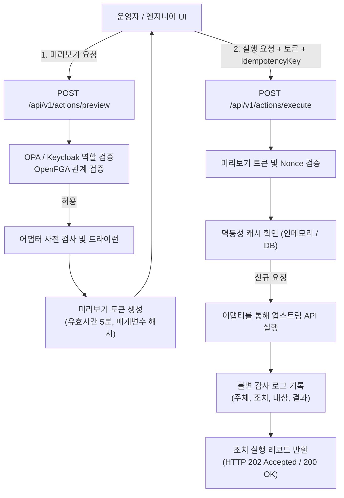

# ADR-0006: 안전한 운영 조치(Safe Actions) — 제어된 운영 조치 모델

- **상태**: 제안됨(Proposed) — 설계 제안이며, 본 ADR에 의해 구현되는 운영 조치 API 또는 변경 실행 경로는 없습니다.
  번호 체계 참고: ADR 색인 및 프롬프트의 지침 `(다음 미사용 번호 확인)`에 따라, ADR-0005는 배포 및 GitOps 통합(PR #113)에 이미 할당되었으므로 본 안전한 운영 조치 제안은 ADR-0006으로 번호를 부여합니다.
- **날짜**: 2026-10-07
- **이슈**: [#21 [ROADMAP][UX] Safe Actions — Controlled Operational Actions](https://github.com/dasomel/beluga-manager/issues/21)
- **상위 에픽**: #1
- **관련 문서**: [ADR-0002](0002-backend-api-technology-ko.md)(Hono + TypeScript Domain API, OPA 인가 위임), [ADR-0004](0004-hierarchical-data-asset-api-ko.md)(카탈로그 계층, ABAC/RBAC 정렬), `AGENTS.md`(읽기 우선 원칙, 업스트림 OSS API와 통합 도메인 간의 경계), `docs/architecture-ko.md`(소유권 경계, 내비게이션/정보 구조), `.agents/skills/beluga-manager-integration-contract/SKILL.md`(읽기 우선 범위, 변경 작업 기준).
- **결정권자**: dasomel

## 배경(Context)

Beluga Manager는 Beluga 데이터 플랫폼의 통합 및 컨트롤 플레인 계층으로 설계되었습니다. `AGENTS.md` 및 `docs/architecture-ko.md`에 명시된 바와 같이 플랫폼은 엄격한 **읽기 우선(read-first)** 기준선 아래에서 운영됩니다. 현재 배포된 API 및 프론트엔드 뷰(`Overview`, `Services`, `Pipelines`, `DataCatalog`, `Operations`)는 하위 인프라나 데이터 엔진에 대한 변경을 트리거하지 않고 조회, 상관관계 파악, 검색 기능만을 제공합니다.

그러나 일상적인 데이터 플랫폼 운영에는 목표 지향적인 개입이 필수적입니다:
1. 데이터 엔지니어는 업스트림 수집 배치가 완료되었을 때 Airflow DAG 실행을 정기적 또는 임의(ad-hoc)로 트리거해야 합니다.
2. 스트리밍 엔지니어는 스키마나 비즈니스 로직이 변경될 때 Apache Flink 작업에 대해 상태 저장 세이브포인트를 트리거하고 안전한 중지/재시작을 수행해야 합니다.
3. 플랫폼 운영자는 카탈로그나 스키마 메타데이터가 불일치할 때 온디맨드 메타데이터 캐시 무효화 또는 재동기화를 실행해야 합니다.
4. 업스트림 커넥터 태스크(예: Debezium CDC)에서 일시적 오류가 발생했을 때 전체 컨테이너 파드를 재시작하지 않고 제어된 재시작을 수행해야 합니다.

선행 시스템인 Narwhal Portal에서는 엔지니어에게 광범위한 클러스터 관리자 권한을 부여하지 않고 제어된 관리 작업을 허용하기 위해 **제한된 운영 Job 실행 패턴**을 채택했습니다. 이슈 #21은 이 패턴을 Beluga Manager에 맞게 도입하면서도 통제되지 않은 상태 변경, 우발적 데이터 손실, 권한 우회 또는 경합 상태(race condition)를 방지할 것을 요구합니다.

### 업스트림 실측 및 권위 있는 시스템
Beluga 플랫폼 내 Safe Actions 관련 업스트림 컴포넌트( `beluga/VERSIONS.md` 및 라이브 클러스터에서 확인됨):
- **Apache Flink Kubernetes Operator 1.15.0 / Flink 1.20.0**: 작업 수명주기 관리 및 세이브포인트 작업. 공식 문서: [Apache Flink 1.20 REST API](https://nightlies.apache.org/flink/flink-docs-release-1.20/docs/ops/rest_api/) (접근일: 2026-10-07); [Flink Kubernetes Operator Job Management](https://nightlies.apache.org/flink/flink-kubernetes-operator-docs-release-1.15/docs/custom-resource/job-management/) (접근일: 2026-10-07).
- **Apache Airflow 3.3.0**: DAG 트리거 및 태스크 초기화. 공식 문서: [Airflow 3.3 REST API](https://airflow.apache.org/docs/apache-airflow/stable/stable-rest-api-ref.html#operation/post_dag_run) (접근일: 2026-10-07).
- **Strimzi Kafka Operator 1.1.0 / Kafka 4.3.0**: KRaft 기반 이벤트 스트리밍. 공식 문서: [Strimzi Kafka Operator Overview](https://strimzi.io/docs/operators/latest/overview.html) (접근일: 2026-10-07).
- **Open Policy Agent (OPA) 1.19.0-static 및 OpenFGA 1.18.3**: 중앙 정책 엔진 및 세밀한 관계 기반 인가 백엔드. 공식 문서: [OPA REST API](https://www.openpolicyagent.org/docs/latest/rest-api/) (접근일: 2026-10-07); [OpenFGA Check API](https://openfga.dev/api/service#Relationship%20Queries/Check) (접근일: 2026-10-07).
- **Keycloak 26.7.1**: 중앙 신원 및 역할 제공자(`admins`, `engineers`, `analysts`).

## 결정 요인(Decision Drivers)

1. **읽기 우선 및 안전 불변식(Read-First Invariant)**: 기본 상태는 항상 읽기 전용이어야 합니다. 변경 조치는 명시적이어야 하며 엄격하게 범위를 제한하고 단순 GET 요청이나 실수에 의한 클릭으로 실행되어서는 안 됩니다.
2. **다단계 안전장치(Multi-Tier Safeguards)**: 파괴적 조치 및 운영 조치는 철저한 수명주기를 준수해야 합니다: 드라이런(dry-run) 사전 검사 -> 영향 미리보기를 포함한 사용자 명시적 확인 -> 멱등성 보호를 통한 원자적 실행 -> 불변 감사 로그 기록.
3. **우회 불가능한 인가(Non-Bypassable Authorization)**: 조치 실행은 OPA(`beluga/policies/`)를 통한 Keycloak 역할 검증 및 OpenFGA를 통한 객체 수준 관계 검증을 강제해야 합니다. Manager를 통한 조치가 레이크하우스 카탈로그 인가를 절대 우회해서는 안 됩니다.
4. **멱등성 및 동시성 제어(Idempotency & Concurrency Control)**: 네트워크 요청 재전송이나 확인 버튼 중복 클릭으로 인해 중복 DAG 실행이 발생하거나 Flink 상태 저장이 오염되어서는 안 됩니다.
5. **명확한 영향 반경 및 범위 제한(Blast-Radius Restriction)**: 조치는 네임스페이스 및 리소스 식별자로 제한되어야 하며, 와일드카드 작업은 금지됩니다.
6. **가역성 및 롤백 지침(Rollback Guidance)**: 워크로드 상태를 전이시키는 조치는 명확한 복구 경로 또는 세이브포인트 복원 대상을 명시해야 합니다.

## 검토한 대안(Considered Options)

### 옵션 1: 업스트림 OSS 쓰기 API로의 직접 리버스 프록시
Domain API 또는 UI가 업스트림 엔드포인트로 쓰기 요청을 직접 프록시(예: `POST airflow.local.beluga.internal/api/v1/dags/{dag_id}/dagRuns` 또는 Flink JobManager `POST /jobs/{jobid}/savepoints` 전달).

- **장점**: 구현 비용 최소화, Beluga Manager 내 조치 상태 관리 불필요.
- **단점**: `AGENTS.md` 및 통합 경계 원칙 위반; 업스트림 OSS 에러 포맷이 클라이언트에 누출됨; 일원화된 감사 로깅 우회; 서로 다른 업스트림 도구에 걸쳐 통합 OPA/Keycloak 인가를 강제할 수 없음; 일관된 드라이런/미리보기를 제공할 수 없음.
- **결과**: **거부됨(Rejected)**.

### 옵션 2: Manager 내부의 완전한 자율 워크플로 엔진 구축
Domain API 내부에 범용 워크플로 오케스트레이션 엔진(예: Temporal 또는 자체 사가 오케스트레이터)을 탑재하여 복잡한 다단계 인프라 변경을 조율.

- **장점**: 자동 보상 트랜잭션을 갖춘 분산 상태 머신 처리 가능.
- **단점**: 원칙 3("불필요한 중복 배제") 심각한 위반; Airflow 및 Kubernetes 오퍼레이터를 중복 구현; Beluga Manager에 과도한 운영 복잡성 및 상태 저장소 의존성을 추가함.
- **결과**: **거부됨(Rejected)**.

### 옵션 3: 2단계 실행(미리보기 및 실행)을 갖춘 통합 안전 조치 프레임워크 및 조치 어댑터 (제안안)
Domain API 내에 선언적인 경량 안전 조치 프레임워크를 정의합니다. 변경 작업은 기능 인식형(capability-aware) 서비스 어댑터가 노출하는 일급 도메인 기능으로 모델링됩니다. 실행은 2단계 패턴을 따릅니다:
1. `POST /api/v1/actions/preview`: 매개변수를 평가하고, 업스트림 API 대상 사전 검사를 수행하며, OPA/OpenFGA 정책을 평가한 후 예상 영향 반경이 포함된 미리보기 토큰을 반환합니다.
2. `POST /api/v1/actions/execute`: 미리보기 토큰, `idempotencyKey`, 매개변수를 전달받아 어댑터를 통해 조치를 실행하고, 감사 이벤트를 기록하며, 추적 레코드를 반환합니다.

- **장점**: 읽기 우선 아키텍처를 온전히 보존; 인가 및 감사 강제를 보장; 어댑터 뒤로 업스트림 프로토콜을 격리; 확인 및 드라이런을 위한 일관된 UI 사용자 경험 제공.
- **단점**: 지원되는 각 조치 유형에 대해 명시적 스키마 정의 및 어댑터 구현이 필요함.
- **결과**: **제안됨(Proposed)**.

## 결정 결과(Decision Outcome)

**제안 선택: 옵션 3 (2단계 실행을 갖춘 통합 안전 조치 프레임워크)**.

### 1. 위험 분류 매트릭스
모든 후보 조치는 4가지 표준 위험 등급으로 분류됩니다:

| 등급 | 범주 | 특징 | Phase 1 상태 | 예시 |
|---|---|---|---|---|
| **Class 0** | 단순 조회(Inspection) | 순수 읽기 전용; 상태 변경 없음. | 구현 완료 | `GET /api/v1/services`, 헬스 프로브, 로그 링크 생성. |
| **Class 1** | 안전한 유지보수(Safe Maintenance) | 멱등성 보장, 무중단, 비파괴적 메타데이터 갱신 또는 캐시 무효화. | **Phase 1 범위 포함** | 카탈로그 메타데이터 재동기화, 스키마 캐시 새로고침, 쿼리 히스토리 버퍼 플러시. |
| **Class 2** | 제어된 운영 변경(Controlled Operational Mutation) | 상태 전이 또는 워크로드 영향이 있으나, 제어 가능하고 우아하며(graceful) 재현 가능함. | **Phase 1 범위 포함** | 매개변수 기반 Airflow DAG 트리거, Flink 세이브포인트 트리거, Flink 정상 정지(stop-with-savepoint). |
| **Class 3** | 고위험 / 인프라 / 파괴적 조치 | 데이터 손실, 파드 수명주기 중단, 영구적인 상태 삭제 가능성. | **Phase 1 제외** (기본 비활성) | Kafka 토픽 생성/삭제/파티션 리밸런싱, Kubernetes Pod 삭제/재시작, 영구 볼륨 정리. |

### 2. Phase 1 후보 조치 목록 및 제외 대상

#### Phase 1 포함 조치:
1. **`catalog.metadata.resync` (Class 1)**:
   - 대상: Iceberg REST Catalog (`lakekeeper`) 또는 Trino 카탈로그 메타데이터.
   - 목적: Manager 내부 캐시를 무효화하고 특정 카탈로그/스키마에 대해 Iceberg 카탈로그 새로고침을 트리거.
   - 안전성: 완전한 멱등성 보장; 실행 중인 쿼리에 무영향.
2. **`airflow.dag.trigger` (Class 2)**:
   - 대상: Airflow DAG (`orchestration` 네임스페이스).
   - 목적: 선택적 JSON 설정 매개변수를 전달하여 DAG 실행을 트리거.
   - 사전 검사 / 드라이런: DAG가 존재하고 일시 정지되지 않았는지(`is_paused == false`) 확인; JSON 페이로드가 DAG 예상 매개변수 스키마에 부합하는지 검증.
   - 멱등성: `idempotencyKey`로부터 결정론적으로 파생된 `dag_run_id`를 사용하여 중복 스케줄링 방지.
3. **`flink.job.savepoint` (Class 2)**:
   - 대상: `flink-kubernetes-operator` 상의 활성 Flink 스트리밍 작업 (`streaming` 네임스페이스).
   - 목적: 작업을 중단하지 않고 S3 스토리지(`s3://beluga-lake/savepoints/`)로 비동기 세이브포인트를 트리거.
   - 사전 검사 / 드라이런: 작업 상태가 `RUNNING`인지 확인; SeaweedFS S3 엔드포인트 도달 가능성 및 대상 디렉터리 권한 확인.
4. **`flink.job.graceful-stop` (Class 2)**:
   - 대상: 활성 Flink 스트리밍 작업.
   - 목적: 세이브포인트를 생성하며 안전하게 Flink 작업을 정지(`stop-with-savepoint`).
   - 사전 검사 / 드라이런: 다운스트림 파이프라인 의존성(예: 활성 Iceberg 싱크 테이블) 확인; UI 상에서 명시적 2단계 확인 요구.

#### Phase 1 명시적 제외 대상:
- **Kubernetes Pod / Service 재시작**: Pod 수명주기를 직접 변경하면 ArgoCD GitOps와 충돌합니다(`selfHeal: true`로 인해 조용히 롤백되거나 충돌 발생; mistakes-log 참조). 인프라 변경은 GitOps의 고유 영역입니다.
- **Kafka 토픽 파티션 조작 및 토픽 삭제**: 토픽 정의는 Strimzi `KafkaTopic` CRD에 권위가 있습니다. 런타임 API를 통한 토픽 변경은 GitOps 드리프트를 유발합니다.
- **Iceberg 테이블 삭제 / Purge**: Manager UI를 통한 파괴적 테이블 삭제는 엄격히 금지되며, RBAC 감사가 적용된 Trino SQL을 통해서만 실행되어야 합니다.

### 3. 안전 보장 체계 및 실행 파이프라인



1. **인증 및 인가 경계**:
   - 사용자의 Keycloak JWT를 API 게이트웨이 / Domain API에서 검증 및 추출합니다.
   - 사용자 신원 및 역할(`admins`, `engineers`, `analysts`)을 OPA 정책 평가(`input.action`, `input.resource`, `input.user`)에 전달합니다.
   - 카탈로그/데이터 관련 조치의 경우 OpenFGA를 조회하여 사용자가 필요한 관계 튜플(`user:alice`, `editor`, `table:lake.orders`)을 보유하고 있는지 확인합니다.
   - 역할 요건: Class 1은 `engineers` 또는 `admins` 필요; Class 2는 리소스별 소유권을 가진 `engineers` 또는 `admins` 필요; `analysts` 역할은 Class 0(읽기 전용)으로 제한됩니다.
2. **사전 검사 및 드라이런(미리보기)**:
   - 업스트림 API를 드라이런 모드로 호출하거나 리소스 존재 여부, 잠금 상태, 정상 상태 여부를 사전 조회합니다.
   - 미리보기 응답 구성:
     - `actionId`: 고유 미리보기 식별자.
     - `summary`: 계획된 영향에 대한 사람이 읽을 수 있는 설명.
     - `affectedResources`: 영향을 받는 리소스 URN 목록.
     - `warnings`: 운영 리스크 안내(예: "이 Flink 작업을 중단하면 'lake.orders' 테이블로의 스트리밍 수집이 일시 중단됩니다").
     - `previewToken`: 사용자 ID, 매개변수, 조치 대상을 바인딩한 서명된 시간 제한 HMAC 토큰(TTL: 300초).
3. **멱등성 보호**:
   - `execute`는 `X-Idempotency-Key` (UUIDv4) HTTP 헤더를 필수로 요구합니다.
   - 처리 중이거나 보존 기간(24시간) 내에 동일한 멱등성 키를 가진 실행 요청이 수신되면, 업스트림 API를 재호출하지 않고 기존 실행 결과를 즉시 반환합니다.
4. **감사 추적(Audit Trail) 계약**:
   - 모든 실행 시도(성공, 실패, 인가 거부)는 구조화된 불변 감사 로그 항목을 생성합니다:
     `{ timestamp, actor: { id, username, roles }, action: string, riskClass: string, targetResource: { kind, namespace, name }, parameters: object (마스킹됨), result: "success" | "failure" | "denied", executionDurationMs: number, correlationId: string }`.
   - 민감한 매개변수 값(비밀번호, 토큰, 개인정보)은 감사 직렬화 전에 엄격히 마스킹됩니다.

### 4. 제안된 API 형태 스케치 (설계 제안 명시)

> **제안 안내**: 다음 스키마 및 경로는 계획된 설계 계약을 나타내며 현재 저장소 코드에는 구현되어 있지 않습니다.

```typescript
// 제안된 조치 정의 및 페이로드 스키마
export interface ActionPreviewRequest {
  actionType: "catalog.metadata.resync" | "airflow.dag.trigger" | "flink.job.savepoint" | "flink.job.graceful-stop";
  targetResourceUrn: string; // 예: "urn:beluga:service:streaming:flink-cluster"
  parameters?: Record<string, unknown>;
}

export interface ActionPreviewResponse {
  previewToken: string;
  expiresAt: string;
  actionType: string;
  riskClass: "class-1" | "class-2" | "class-3";
  targetResourceUrn: string;
  summary: string;
  affectedResources: Array<{ kind: string; name: string; namespace: string }>;
  warnings: string[];
  requiresExplicitConfirmation: boolean;
  confirmationPhrase?: string; // 고위험 Class 2의 경우 직접 타이핑 확인 요구 (예: "STOP FLINK JOB")
}

export interface ActionExecuteRequest {
  previewToken: string;
  idempotencyKey: string;
  parameters?: Record<string, unknown>;
  confirmationAcknowledged: boolean;
}

export interface ActionExecutionRecord {
  executionId: string;
  actionType: string;
  status: "pending" | "running" | "completed" | "failed";
  startedAt: string;
  completedAt?: string;
  targetResourceUrn: string;
  initiatedBy: string;
  error?: { code: string; message: string };
  output?: Record<string, unknown>; // 예: { savepointPath: "s3://..." }
}
```

제안된 HTTP 엔드포인트:
- `POST /api/v1/actions/preview`: 사전 조건을 검증하고 영향 미리보기 토큰을 반환합니다.
- `POST /api/v1/actions/execute`: 미리보기 토큰과 멱등성 키를 사용하여 원자적으로 조치를 실행합니다.
- `GET /api/v1/actions/executions/{executionId}`: 비동기 운영 작업의 상태를 조회합니다.
- `GET /api/v1/actions/audit-log`: 과거 조치 실행 기록을 조회합니다(수행자, 리소스, 일자별 필터링 지원).

## 결과(Consequences)

### 긍정적 측면
- 엔지니어에게 직접적인 Kubernetes API 또는 SSH 접근 권한을 부여하지 않고도 핵심적인 일상 플랫폼 운영(DAG 트리거, Flink 세이브포인트)을 Beluga Manager 내에서 안전하게 수행할 수 있습니다.
- 의무적인 드라이런 검증, 영향 반경 미리보기, 2단계 확인 모달을 통해 운영자 실수를 원천 차단합니다.
- 서로 다른 이종 OSS 도구 전반에 걸쳐 일원화되고 위변조 방지된 감사 기록을 제공합니다.
- 읽기 우선 원칙을 보존합니다: 변경 작업은 명시적인 조치 어댑터 뒤에 엄격히 격리되고 2단계 실행을 통해 보호됩니다.

### 부정적 측면
- Domain API 계층에 상태 추적 메커니즘(멱등성 키, 미리보기 토큰 캐싱, 감사 로그)이 도입됩니다.
- 어댑터 복잡도 증가: 각 통합 서비스는 기존의 읽기 전용 메타데이터 추출기 외에도 조치 실행 및 사전 검증 핸들러를 유지보수해야 합니다.

## 검토한 대안들(Alternatives Considered)

1. **Kubernetes CRD / Job 기반 액션 러너**: 모든 조치를 온디맨드로 생성되는 커스텀 Kubernetes Job으로 표현.
   - *거부 이유*: 가벼운 작업(메타데이터 새로고침 또는 Airflow REST 호출)을 위해 파드를 띄우는 오버헤드가 큼(지연시간 5-15초 소요); Domain API ServiceAccount에 과도한 RBAC 권한(`create jobs`)을 부여해야 함.
2. **클라이언트 측 전용 확인 모달(UI 모달이 execute를 직접 호출)**:
   - *거부 이유*: 확인 시점에 서버 측 상태를 사전 검증할 수 없음; 사용자가 조회한 시점과 실제 실행 시점 사이에 리소스 상태가 변하는 경합 상태를 방지하지 못함; 비정상적 또는 자동화된 직접 API 호출을 방어할 수 없음.

## 리스크 및 완화책(Risks and Mitigations)

| 리스크 | 영향도 | 완화 전략 |
|---|---|---|
| Flink 세이브포인트 중 업스트림 타임아웃 | 작업이 중단된 것처럼 보이며 세이브포인트 기록 여부가 불분명함. | 비동기 실행 패턴: 어댑터가 Flink REST API(`/jobs/{jobid}/savepoints/{triggerid}`)를 폴링하고 `pending` 상태를 보고하며, 파괴적 호출을 무단 재시도하지 않고 안전하게 타임아웃 처리. |
| 네트워크 재시도로 인한 중복 실행 | 실수로 인한 DAG 중복 실행 또는 작업 중복 발생. | 업스트림 어댑터를 호출하기 전에 Domain API 메모리/캐시에서 필수 `X-Idempotency-Key`를 검증. |
| 토큰 위조 또는 재생 공격 | 만료된 미리보기 토큰의 무단 실행. | 미리보기 토큰은 타임스탬프, 사용자 신원, 매개변수 해시, 5분 만료시간을 포함하는 서명된 HMAC 페이로드로 생성. |
| 조치 매개변수를 통한 권한 상승 | 운영자가 DAG 매개변수에 임의 코드를 주입. | 조치 유형별 엄격한 JSON 스키마 검증 수행; 업스트림 API로 전달하기 전 매개변수 허용 목록(allowlist) 적용. |

## 미해결 질문 및 결정권자 권고사항(Open Owner Questions)

1. **감사 로그 저장소 위치**: 감사 로그를 기존 메타 데이터베이스(`cnpg-main`) 내의 전용 PostgreSQL 테이블에 저장할 것인가, 아니면 Kubernetes Events 및 Prometheus/Loki로 투영할 것인가?
   - *권고사항*: PostgreSQL에 추가 전용(append-only) 권한의 전용 테이블(`beluga_manager_audit`)을 생성하여 감사 레코드를 저장하고, 동시에 고심도 도메인 `Event` (`source: "service"`)를 발행하여 Operations 타임라인에서 실시간으로 확인할 수 있도록 합니다.
2. **승인 워크플로(2인 결재 / 4-Eyes 원칙)**: Flink 작업 중지와 같은 Class 2 조치에 대해 프로덕션 환경에서 2명의 서로 다른 운영자의 승인이 필요한가?
   - *권고사항*: Phase 1에서는 단일 운영자가 필수 확인 모달과 명시적 확인 문구를 입력하여 실행하도록 구현하고, 2인 결재 워크플로는 엔터프라이즈 프로파일을 위한 Phase 2 과제로 이관합니다.
3. **멱등성 저장소의 영속성**: Domain API 컨테이너가 재시작되었을 때 멱등성 키를 어떻게 유지할 것인가?
   - *권고사항*: 로컬/개발 환경(MVP)에서는 1시간 TTL의 인메모리 LRU 캐시로 충분하며, 프로덕션 배포 시에는 PostgreSQL 또는 Redis 기반으로 멱등성 키를 영속화합니다.

## 후속 구현 태스크 및 수용 테스트 아이디어

1. **태스크 1: 안전 조치 도메인 스키마 및 검증 로직 구현**
   - `ActionPreviewRequest`, `ActionPreviewResponse`, `ActionExecuteRequest`, `ActionExecutionRecord`에 대한 Zod OpenAPI 스키마 작성.
   - *수용 테스트*: `idempotencyKey` 누락 또는 잘못된 매개변수 전달 시 400 Bad Request를 반환하는 라우트 단위 테스트.
2. **태스크 2: 조치 레지스트리 및 미리보기 토큰 수명주기 구현**
   - HMAC 토큰 서명, 매개변수 해싱, 만료 검사를 수행하는 `ActionRegistry` 구현.
   - *수용 테스트*: 5분이 초과된 만료 토큰 또는 변조된 매개변수 페이로드가 403 Forbidden으로 거부되는지 검증.
3. **태스크 3: Airflow DAG 트리거 어댑터 구현**
   - 결정론적 런 ID 파생 로직을 갖춘 `POST /api/v1/dags/{dag_id}/dagRuns` 호출 어댑터 구현.
   - *수용 테스트*: 동일한 멱등성 키로 중복 호출 시 업스트림 POST 요청이 여러 번 발생하지 않음을 증명하는 모의 어댑터 테스트.
4. **태스크 4: Flink 세이브포인트 및 정상 정지 어댑터 구현**
   - Flink REST API / Kubernetes Operator를 통해 세이브포인트를 트리거하는 어댑터 구현.
   - *수용 테스트*: 504 게이트웨이 타임아웃 시뮬레이션 시 실패하거나 중복 제출하지 않고 `pending` 상태 레코드를 반환하는지 검증.
5. **태스크 5: 프론트엔드 확인 모달 컴포넌트 개발**
   - `packages/web` 내에 영향 미리보기, 경고 배지, 확인 입력란을 렌더링하는 `SafeActionConfirmModal` 구현.
   - *수용 테스트*: 키보드 접근성, 엔터키 실수 방지, 확인 문구 일치 전까지 버튼 비활성화를 검증하는 Vitest 컴포넌트 테스트.
