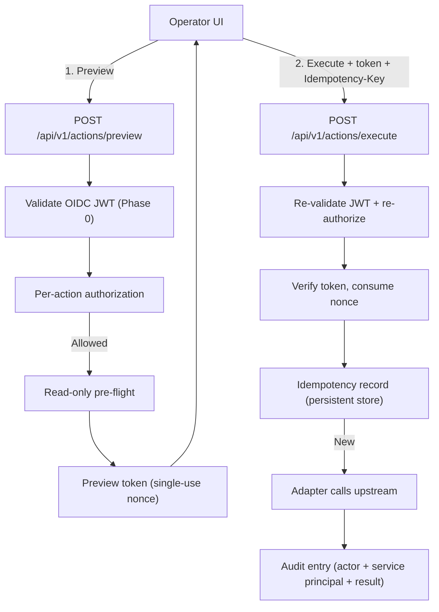

# ADR-0006: Safe Actions — Controlled Operational Actions

- **Status**: Proposed — design proposal; no operational action API or mutating execution path is implemented by this ADR.
  Note on numbering: ADR-0005 is Deployment & GitOps Integration (PR #113); this Safe Actions proposal is numbered ADR-0006.
- **Date**: 2026-10-07
- **Issue**: [#21 [ROADMAP][UX] Safe Actions — Controlled Operational Actions](https://github.com/dasomel/beluga-manager/issues/21)
- **Parent epic**: #1
- **Related**: [ADR-0002](0002-backend-api-technology.md) (Hono + TypeScript Domain API, OPA authorization delegation), [ADR-0004](0004-hierarchical-data-asset-api.md) (Catalog hierarchy, ABAC/RBAC alignment), `AGENTS.md` (read-first principle, boundary between upstream OSS APIs and unified domain), `docs/architecture.md` (Design Principles, Ownership Boundaries), `.agents/skills/beluga-manager-integration-contract/SKILL.md` (read-first scope, mutation criteria).
- **Deciders**: dasomel

Conventions: **Current state** sections state only what was observed (with a file:line or a command that was run, evidence date 2026-10-07). **Proposal** sections are design intent. Beluga repo file:line citations are as of beluga commit `1df61e0` (`origin/main`, read 2026-10-07/08); live-cluster outputs are as measured on 2026-10-07. Every number (TTL, timeout, retention) is labelled *Proposed*. External facts carry an official URL opened on 2026-10-07, or are marked *not verified*.

## Context

Beluga Manager is a unified integration layer over the Beluga Data Platform. `AGENTS.md` and `docs/architecture.md` establish a **read-first** baseline: shipping APIs and views (Overview, Services, Pipelines, Data, Operations) inspect and correlate; they do not mutate the underlying systems.

Operational maintenance still raises recurring requests (issue #21): triggering an Airflow DAG run when an upstream batch arrives; savepoint / stop-restart of Flink jobs; metadata cache refresh; restarting a failed connector task. Issue #21 asks for controlled mutations that do not require engineers to hold broad cluster credentials. This ADR proposes the framework and, deliberately, a much narrower first step than the earlier draft.

### Current state (observed)

| Fact | Evidence |
|---|---|
| The domain API has **no authentication middleware** and no per-caller authorization. | `docs/IMPLEMENTATION-STATUS.md:30` ("the app has no auth middleware"); `packages/domain-api/src/app.ts:50-56` registers only a CORS middleware (origin `http://localhost:5180`). CORS is not an authentication or CSRF control. |
| The domain API has no database or cache dependency (no Postgres/Redis client). | `grep -rn -i "postgres\|redis" packages/domain-api/package.json packages/domain-api/src` matches only policy-target enum/fixture strings (`schema/policy.ts`, `stub-data/policies.ts`), not clients. |
| Flink runs under the Flink Kubernetes Operator as `FlinkDeployment/flink-cluster` (ns `streaming`) with **no `spec.job`**, i.e. a **session cluster**. | Beluga `gitops/charts/beluga-data/templates/05-flink-operator.yaml:1-9` (no `job:` block); live `kubectl -n streaming get flinkdeployment flink-cluster -o jsonpath='{.spec.job}'` returned empty, lifecycle `STABLE`; `kubectl get flinksessionjob -A` returned "No resources found". |
| Flink jobs are submitted by an ArgoCD **Sync hook** Job (`flink-sql-submit`) using `sql-client.sh` against `flink-cluster-rest:8081`, not by operator-managed CRs. The hook re-runs on every sync and **resubmits any pipeline whose job is not in an active state; FAILED/CANCELED/FINISHED are deliberately treated as "resubmit" ("desired auto-recovery")**. | Beluga `gitops/charts/beluga-data/templates/14-flink-jobs.yaml:22-28` (hook annotations), `:151-154` (D2 comment, `ACTIVE_STATE_RE`), `submit()` function at `:189`. Live: `kubectl -n streaming get jobs` shows `flink-sql-submit` Complete. |
| ArgoCD Application `beluga-data` has `automated: {prune: true, selfHeal: true}`. | Beluga `gitops/apps/beluga-data.yaml:19-22`; live `kubectl -n argocd get application beluga-data -o jsonpath='{.spec.syncPolicy}'`. |
| No savepoint directory is configured anywhere in the Beluga gitops (`git grep -i savepoint` over `origin/main` hits only `docs/ha-dr-objectives*.md` and `docs/upgrade-rollback-procedures*.md`, no manifest). Checkpointing interval is 30s. | Beluga `05-flink-operator.yaml:14` (`execution.checkpointing.interval: "30s"`); grep run on `refs/remotes/origin/main`. |
| The Flink REST API is described by Beluga as an unauthenticated dashboard/REST surface. | Beluga `docs/critical-interfaces-inventory.md:29`. |
| Airflow is 3.3.0 and uses the FAB auth manager with Keycloak OIDC for UI login. | Beluga `VERSIONS.md:36`; `gitops/charts/beluga-data/templates/07-airflow.yaml:196-197` (`FabAuthManager`), `:74-94` (OAuth/Keycloak). |
| The CNPG cluster is `postgres-main` in namespace `database`. | Beluga `gitops/charts/beluga-data/templates/02-cnpg.yaml:3-5`; live `kubectl -n database get clusters.postgresql.cnpg.io` -> `postgres-main`. |
| ArgoCD `selfHeal` silently reverts out-of-band edits. | Beluga `docs/mistakes-log.md`, entry dated 2026-08-25 (gitops), excerpt: "selfHeal: true … editing directly with `kubectl apply` … ArgoCD silently reverts to the origin/main state within a few minutes" (as of beluga commit 1df61e0). That entry concerns direct `kubectl apply` edits to managed resources. |

### External references (opened 2026-10-07)

- Flink 1.20 REST API — <https://nightlies.apache.org/flink/flink-docs-release-1.20/docs/ops/rest_api/> (opened 2026-10-07): documents `POST /jobs/:jobid/savepoints` (body: `target-directory`, `cancel-job`, `formatType`), `POST /jobs/:jobid/stop` (body: `drain`, `targetDirectory`, `formatType`), and `GET /jobs/:jobid/savepoints/:triggerid` (status `IN_PROGRESS`/`COMPLETED`, `location`); all asynchronous with a trigger id.
- Flink Kubernetes Operator 1.15 job management — <https://nightlies.apache.org/flink/flink-kubernetes-operator-docs-release-1.15/docs/custom-resource/job-management/> (opened 2026-10-07): `upgradeMode` has `stateless` / `last-state` / `savepoint`; desired state via `JobSpec.state` (`running`/`suspended`); applies to `FlinkDeployment` and `FlinkSessionJob`. The page I opened does **not** describe a CR-based manual savepoint trigger (`savepointTriggerNonce` was not found there: *not verified*) and does **not** say how the operator treats jobs submitted to a session cluster by other means (*not verified*).
- Flink Kubernetes Operator 1.15 custom resource overview — <https://nightlies.apache.org/flink/flink-kubernetes-operator-docs-release-1.15/docs/custom-resource/overview/> (opened 2026-10-07): `FlinkSessionJob` is described with a jar-based job spec (`jarURI`); SQL-client submissions are not mentioned there (*not verified*).
- Airflow stable docs index — <https://airflow.apache.org/docs/apache-airflow/stable/stable-rest-api-ref.html> (opened 2026-10-07): confirms the stable docs are for Airflow 3.3.x, but the fetched content was only a navigation index. **The Airflow 3 REST base path (believed to be `/api/v2`), the trigger-DAG-run endpoint shape and the auth scheme for the FAB auth manager are *not verified*.** The only auth statement I verified: <https://airflow.apache.org/docs/apache-airflow/stable/core-concepts/auth-manager/simple/token.html> (opened 2026-10-07) says a JWT is created via `POST /auth/token` for the *simple* auth manager — Beluga uses FAB, so that is not evidence for Beluga. The earlier draft's Airflow 2-style `/api/v1/dags/{dag_id}/dagRuns` is removed.
- OPA, OpenFGA, Strimzi documentation links from the earlier draft were **not re-opened** in this revision: *not verified*, and they are no longer cited as facts.

## Decision Drivers

1. **Read-first**: mutations must be explicit, strictly scoped, and impossible through GET or an accidental click.
2. **Authentication and authorization first**: no mutating path may exist before real caller authentication and per-action authorization (see Hard Prerequisite).
3. **Respect GitOps and operators**: an action must not fight ArgoCD `selfHeal` or an operator's reconciler, and must not create state that the next sync silently undoes or duplicates.
4. **Idempotency and replay protection**: a retried request or double click must not cause a duplicate effect.
5. **Auditability**: every attempt (allowed, denied, failed) is recorded, with honest claims about what the record protects against.
6. **Bounded blast radius**: namespace- and resource-scoped; no wildcards.

## Considered Options

### Option 1: Reverse-proxy upstream write APIs
Forward writes to upstream endpoints (Airflow, Flink REST). **Rejected**: bypasses unified authorization and audit, leaks upstream error formats, and (for Flink) exposes an unauthenticated REST surface (see Current state) through the Manager.

### Option 2: Embedded workflow engine (e.g. Temporal)
**Rejected**: duplicates Airflow/operators and adds stateful infrastructure; conflicts with `docs/architecture.md` Design Principle 3 ("No unnecessary duplication").

### Option 3: Safe Action framework with two-phase execution and adapters (Proposed)
Two-phase `preview` then `execute` through per-action adapters, gated by authenticated identity and per-action authorization.
- **Pros**: preserves read-first; one place for authz/audit; upstream protocols stay behind adapters.
- **Cons**: needs a persistence layer, per-action adapters, and the authentication prerequisite below.
- **Outcome**: **Proposed**.

## Decision Outcome (Proposal)

### 0. HARD PREREQUISITE — authentication and authorization (nothing mutating ships before this)

Because the domain API currently has no authentication (Current state), **no mutating route, adapter or UI control may be merged or enabled until all of the following exist and are tested**. The preview/execute endpoints must fail closed (HTTP 401/403) when any item is not configured.

1. **Real token validation**: validate Keycloak-issued OIDC access tokens (JWT) on every `/api/*` mutating route — signature via the realm JWKS, `iss`, `aud`, `exp`/`nbf`, with the algorithm pinned. Keycloak is the identity source in Beluga (`VERSIONS.md:38`). Exact claim and role names (e.g. which claim carries roles) are *not verified* and must be taken from the live realm configuration before implementation.
2. **Per-action authorization on every execute** (not only at preview): a policy decision keyed by caller identity, action type and target resource. Mechanism (OPA, OpenFGA, or in-process role check) is an open question; the decision must be re-evaluated at execute time because roles may change between preview and execute.
3. **CSRF**: Proposed — mutating routes accept the credential only as an `Authorization: Bearer` header, never from a cookie, so a cross-site request cannot carry it. If a cookie session is ever introduced for the web UI, mutating routes additionally require a CSRF token, `SameSite=Strict`/`Lax` cookies and an `Origin` allow-list check. The existing localhost CORS config is not a CSRF control.
4. **Confused deputy**: the Manager will call upstream systems with its own service credential, which is broader than any one caller. Proposed rules: (a) authorize the *caller's* identity for the specific action and target before any upstream call; (b) one narrowly-scoped credential per adapter, limited to the single operation that adapter performs; (c) record both the caller (`actor`) and the service principal used in the audit entry; (d) never accept an upstream URL, namespace or credential from the request — only allow-listed targets from configuration. Whether the upstreams can accept the caller's token (token exchange / forwarding) instead is *not verified* and is an open question.
5. **Replay and idempotency**: see section 3.
6. **Audit tamper resistance**: see section 4.

### 1. Risk classes

| Class | Category | Characteristics | Examples |
|---|---|---|---|
| 0 | Inspection | Read-only | existing `GET` routes |
| 1 | Reversible, additive trigger | Creates new work without altering existing state; can be ignored/cancelled by the owning system | Airflow DAG run trigger |
| 2 | Workload-affecting | Alters or interrupts a running workload, or interacts with an operator/GitOps-reconciled resource | Flink savepoint / stop |
| 3 | Infrastructure / destructive | Pod lifecycle, Kafka topic, table drop/purge | out of scope |

### 2. Phasing (narrowed from the earlier draft)

- **Phase 0**: the hard prerequisite above. Nothing else starts before it is done.
- **Phase 1 — preview-only (no upstream mutation)**: implement the framework (schemas, authorization, preview, audit of preview/denied attempts) with **no execute adapter enabled**. The preview performs read-only pre-flight checks. This delivers the UX and the security plumbing at zero mutation risk. Rationale: the earlier draft put Flink stop in Phase 1, wider than the read-first principle justifies.
- **Phase 2 — first executable action: `airflow.dag.trigger` (Class 1)**, only after Phase 1 is exercised in a real environment. It is the lowest-risk mutation: it adds a DAG run and does not alter existing runs. Pre-flight: DAG exists and is not paused; payload validated against an allow-listed schema. Airflow 3 base path, endpoint, request shape and service-to-service auth are *not verified* (see External references) and are a precondition of Phase 2. Whether Airflow 3 lets the caller choose the run id (needed for deterministic idempotency) is *not verified*; if not, idempotency is enforced only on the Manager side (section 3), which cannot prevent a duplicate if the Manager crashes between the upstream call and recording the result — this must be stated in the UI as "at-least-once under failure".
- **Not scheduled**: Flink actions (analysis below), catalog metadata resync (I could not identify an authoritative refresh API for Lakekeeper/Trino metadata, so the action is *not verified* and has no defined target; it needs a spike before being proposed again), connector restart, Class 3.

### 2a. Flink: why Flink actions are deferred, and the analysis behind it

Same style of argument the ADR uses to forbid pod restarts, applied to Flink using the Current state facts:

1. **What the operator owns.** `flink-cluster` is a session cluster with no `spec.job`; the operator reconciles the cluster (JobManager/TaskManagers), not the SQL jobs. The jobs were submitted by `sql-client.sh` from the `flink-sql-submit` hook (`14-flink-jobs.yaml`). Whether the operator tracks such jobs is *not verified* from the docs I opened; the observed fact is that the live `FlinkDeployment` has no job status (`kubectl get flinkdeployment` shows an empty JOB STATUS column).
2. **What ArgoCD does to a stop/cancel.** `beluga-data` has `selfHeal: true` and the `flink-sql-submit` hook re-runs on every sync. The hook skips a pipeline only when its job is in an active state; **a job that is CANCELED or FINISHED (the result of `stop` with or without `cancel-job`) is resubmitted on the next sync, from SQL, without restoring the savepoint** (the submit path passes no restore option; see `submit()` in `14-flink-jobs.yaml`). So a Manager-issued REST stop is silently undone at the next sync and the new job starts from scratch semantics of its connectors (Kafka offsets / Iceberg sink behaviour not analysed here), which is worse than the original state. This is the same selfHeal trap recorded in the `docs/mistakes-log.md` entry dated 2026-08-25 (see Current state).
3. **A savepoint without stop** (`POST /jobs/:jobid/savepoints` with `cancel-job=false`) does not change job state and therefore does not fight the hook or selfHeal. But there is **no configured savepoint directory** (Current state), so the target would have to be supplied by the Manager; the earlier draft's `s3://beluga-lake/savepoints/` is therefore *a proposal*, not an existing path. S3 credentials are injected into the Flink pods (`05-flink-operator.yaml:64-80`), so no extra credential would be needed by the Manager; permissions on the bucket path are *not verified*.
4. **Operator-native alternatives**, and why they do not fit today: `FlinkSessionJob` with `upgradeMode`/`state: suspended` is jar-based (`jarURI`) per the overview page, while Beluga's jobs are SQL-client submitted; adopting it means re-packaging the three pipelines as jars and changing the GitOps manifests in the Beluga repo — a platform decision outside this ADR. CR-triggered savepoints (`savepointTriggerNonce`) were *not verified* in the 1.15 pages I opened. Any operator-native path edits a CR that ArgoCD owns, so it must go through Git (a PR to the Beluga repo), not a runtime write — i.e. it is a GitOps change, covered by ADR-0005, not a Safe Action.
5. **Conclusion (Proposed)**: Flink savepoint/stop are not part of any phase of this ADR. If a savepoint-only action is revisited, it must (a) be preceded by Beluga defining a savepoint directory in GitOps, (b) be restricted to `cancel-job=false`, and (c) pass the authentication prerequisite. Stop/cancel must not be exposed until the sync hook is changed to restore from a savepoint or the pipelines move under operator management. That is a Beluga repo change and is recorded here as a cross-repo dependency, not decided.

Also out of scope (Class 3), with corrected reasoning: ArgoCD `selfHeal` reverts drift in the *declared spec* of managed resources (the 2026-08-25 entry is about direct `kubectl apply` edits); it does not by itself undo a pod deletion — the pod would be recreated by its owning controller (ReplicaSet/StatefulSet/operator; general Kubernetes behaviour, not re-verified against docs in this revision). The reasons the Manager must not restart pods are therefore different: (a) it bypasses Git review and the Manager's audit/authorization path; (b) it requires broad pod-delete RBAC for the Manager's service account (confused-deputy surface, section 0); (c) a restart is disruptive to stateful workloads (e.g. the Flink session cluster sets no `high-availability.*` key, Beluga `05-flink-operator.yaml:10-20`, so a JobManager restart can drop running jobs until the next sync — an inference, not an observed incident) and does not change the declared state, so it fixes nothing durable; (d) any durable fix belongs in Git. Remaining Class 3 items: Kubernetes Pod/Service restart (see the reasoning below), Kafka topic changes (Strimzi `KafkaTopic` CRs are the source — *not re-verified in this revision*), Iceberg table drop/purge.

### 3. Preview/execute, replay and idempotency (Proposal)



- **Preview token** (Proposed design): signed, bound to caller `sub`, action type, target and a hash of the parameters, with an expiry and a single-use nonce. Proposed lifetime: 5 minutes. The nonce is stored server-side so a token cannot be replayed after use.
- **Idempotency**: `execute` requires an `Idempotency-Key` header. The (caller, key) pair is stored with the request hash and the result; the same key with different parameters is rejected; the same key with the same parameters returns the stored result without calling upstream. **Proposed retention: 24 hours** (single value; replaces the contradictory 24h/1h in the earlier draft). Storage: **Redis is not part of Beluga and is not assumed.** The domain API currently has no store (Current state); options are the CNPG `postgres-main` or an in-process store. An in-process store loses keys on restart and with more than one replica gives no guarantee, so it is only acceptable for single-replica development and must be labelled as such. See Open Question 3.
- **Failure window**: if the Manager crashes after the upstream call but before persisting the result, a retry may call upstream again unless the upstream accepts a caller-chosen run id (*not verified* for Airflow 3). Record the idempotency entry as `in-progress` before the upstream call and treat an orphaned `in-progress` entry as "unknown — operator must check", never as safe to retry.

### 4. Audit trail (Proposal) — what is and is not achievable

Every attempt (allowed, denied, failed) writes `{ timestamp, actor: { sub, username, roles }, servicePrincipal, action, riskClass, target, parameters (redacted), result, durationMs, correlationId }`. Secrets and PII are redacted before serialization; the redaction rules are not designed in this ADR.

The earlier draft called the log "immutable" and "tamper-evident". That is **not** supported by the only mechanism proposed (an append-only database role). What each mechanism actually gives:

| Mechanism | Protects against | Does not protect against |
|---|---|---|
| App DB role with `INSERT`/`SELECT` only (no `UPDATE`/`DELETE`) | Application bugs and a compromised Manager process rewriting history | A database superuser/owner, a CNPG admin, or anyone with Postgres access outside the app role |
| Hash chain (each row stores a hash of the previous row) — Proposed | Undetected row edits/deletes by someone lacking the chain head | An actor who can rewrite the whole table and recompute the chain; truncation of the tail unless the head is anchored elsewhere |
| Export to a separate system under a different trust domain (WORM bucket / separate log store) | Insider with DB access | Not designed; no such sink exists in Beluga today (*not verified*) |

State of the claim: with the append-only role alone the log is **append-only for the application**, not immutable and not tamper-evident. A tamper-evidence claim requires the hash chain with an externally anchored head, and a tamper-proof claim requires a separate sink; both are open (Open Question 1).

### 5. API shape sketch (Proposal; not implemented)

```typescript
export interface ActionPreviewRequest {
  actionType: "airflow.dag.trigger"; // Phase 2; other types are not defined by this ADR
  targetResourceUrn: string;
  parameters?: Record<string, unknown>;
}
export interface ActionPreviewResponse {
  previewToken: string;
  expiresAt: string;
  actionType: string;
  riskClass: "class-1" | "class-2";
  targetResourceUrn: string;
  summary: string;
  affectedResources: Array<{ kind: string; name: string; namespace: string }>;
  warnings: string[];
  requiresExplicitConfirmation: boolean;
}
export interface ActionExecuteRequest {
  previewToken: string;
  parameters?: Record<string, unknown>;
  confirmationAcknowledged: boolean;
} // idempotency key is the Idempotency-Key header
export interface ActionExecutionRecord {
  executionId: string;
  actionType: string;
  status: "pending" | "running" | "completed" | "failed" | "unknown";
  startedAt: string;
  completedAt?: string;
  targetResourceUrn: string;
  initiatedBy: string;
  error?: { code: string; message: string };
  output?: Record<string, unknown>;
}
```

Proposed endpoints: `POST /api/v1/actions/preview`, `POST /api/v1/actions/execute`, `GET /api/v1/actions/executions/{executionId}`, `GET /api/v1/actions/audit-log` (restricted to authorized auditors).

## Consequences

### Positive
- Mutations cannot ship before real authentication/authorization exists.
- Phase 1 delivers the framework with no mutation risk.
- The Flink analysis prevents an action that ArgoCD would silently undo.

### Negative
- Adds stateful components (idempotency, nonce store, audit table) to a currently stateless API.
- The most-requested operations (Flink stop) are deferred, pending Beluga repo changes.
- Authentication work is a prerequisite larger than the action framework itself.

## Alternatives Considered

1. **Kubernetes Job-per-action runner** — Rejected (Proposed judgement, not measured): extra RBAC (`create jobs`) for the Manager ServiceAccount and per-action pod startup overhead; latency not measured.
2. **Client-side-only confirmation** — Rejected: no server-side state check at confirmation time and no protection against direct API calls.

## Risks and Mitigations

| Risk | Impact | Mitigation (Proposed) |
|---|---|---|
| Mutating route reachable without auth | Anyone reaching the API can trigger actions | Hard prerequisite (section 0): fail closed when auth is not configured |
| Confused deputy via shared service credential | Caller obtains effects they are not authorized for | Section 0 item 4 |
| Replay of a captured preview token | Duplicate or unauthorized execution | Single-use nonce, caller binding, short expiry |
| Duplicate execution on retry | Duplicate DAG runs | Idempotency record with `in-progress` state; unknown-state handling |
| Audit rewrite by DB admin | False sense of integrity | State the limits (section 4); anchoring is open |
| Action undone by GitOps | Silent no-op or resubmission | Flink actions not scheduled (section 2a) |

## Open Owner Questions

1. **Audit storage and tamper resistance**: where do audit records live and how strong a claim is required?
   - *Recommendation*: a dedicated table in CNPG `postgres-main` (ns `database`) written by an `INSERT`-only role, plus a hash chain; describe it as "append-only for the application, tamper-evident only if the chain head is anchored externally". Do not use the word "immutable" until an external WORM sink is chosen.
2. **Authorization engine for per-action decisions** (OPA vs OpenFGA vs in-process roles, and the claim that carries roles).
   - *Recommendation*: start with an in-process allow-list keyed on Keycloak roles for the single Phase 2 action; adopt OPA only when more than one action class exists. Role/claim names must be read from the live realm first (not verified).
3. **Idempotency/nonce persistence**.
   - *Recommendation*: CNPG `postgres-main` (already deployed); do not introduce Redis. Allow in-process storage only for single-replica development.
4. **Four-eyes approval** for Class 2.
   - *Recommendation*: not needed while only the Class 1 DAG trigger exists; revisit when a Class 2 action is proposed.
5. **Airflow 3 service-to-service access** (base path, auth under FAB, caller-chosen run id).
   - *Recommendation*: a spike against the live Airflow 3.3.0 instance and the official Airflow REST reference before Phase 2; until then treat all of it as not verified.
6. **Flink**: define a savepoint directory and make the submit hook restore-aware in the Beluga repo, or move pipelines under operator management?
   - *Recommendation*: raise as a Beluga issue; keep Flink actions out of Safe Actions until resolved.

## Follow-up Implementation Tasks & Acceptance Test Ideas

1. **Authentication middleware (Phase 0)**: OIDC JWT validation on `/api/*` mutating routes. *Acceptance*: missing/expired/wrong-audience/`alg=none` tokens give 401; valid token with insufficient role gives 403; unconfigured auth makes every mutating route fail closed.
2. **Action schemas** (Zod/OpenAPI) and preview endpoint without any execute adapter. *Acceptance*: 400 on malformed parameters; no outbound upstream write is possible in Phase 1 (test asserts the adapter registry has no execute handler).
3. **Preview token and nonce store**. *Acceptance*: tampered parameters, expired token, other caller's token and a reused token are all rejected.
4. **Audit table with INSERT-only role and hash chain**. *Acceptance*: app role cannot `UPDATE`/`DELETE`; chain verification detects a modified row.
5. **Airflow adapter (Phase 2)** — only after Open Question 5 is answered. *Acceptance*: duplicate `Idempotency-Key` produces one upstream POST; crash between upstream call and persistence yields `unknown`, not a silent retry.
6. **`SafeActionConfirmModal`** in `packages/web`. *Acceptance*: keyboard accessible; execute disabled until acknowledgment.
