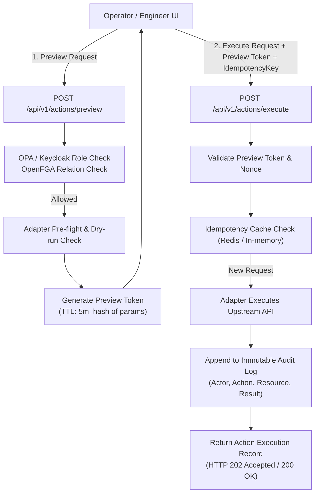

# ADR-0006: Safe Actions — Controlled Operational Actions

- **Status**: Proposed — design proposal; no operational action API or mutating execution path is implemented by this ADR.
  Note on numbering: Per ADR index and prompt instruction `(check the next free numbers)`, ADR-0005 was allocated to Deployment & GitOps Integration (PR #113); this Safe Actions proposal is numbered ADR-0006.
- **Date**: 2026-10-07
- **Issue**: [#21 [ROADMAP][UX] Safe Actions — Controlled Operational Actions](https://github.com/dasomel/beluga-manager/issues/21)
- **Parent epic**: #1
- **Related**: [ADR-0002](0002-backend-api-technology.md) (Hono + TypeScript Domain API, OPA authorization delegation), [ADR-0004](0004-hierarchical-data-asset-api.md) (Catalog hierarchy, ABAC/RBAC alignment), `AGENTS.md` (read-first principle, boundary between upstream OSS APIs and unified domain), `docs/architecture.md` (Ownership Boundaries, Navigation / Information Architecture), `.agents/skills/beluga-manager-integration-contract/SKILL.md` (read-first scope, mutation criteria).
- **Deciders**: dasomel

## Context

Beluga Manager is designed as a unified integration and control-plane layer over the Beluga Data Platform. As established in `AGENTS.md` and `docs/architecture.md`, the platform operates under a strict **read-first** baseline: current shipping APIs and frontend views (`Overview`, `Services`, `Pipelines`, `DataCatalog`, `Operations`) provide inspection, correlation, and discovery without initiating mutations on the underlying infrastructure or data engines.

However, operational data platform maintenance routinely requires targeted interventions:
1. Data engineers need to trigger scheduled or ad-hoc Airflow DAG runs when upstream ingest batches arrive.
2. Streaming engineers must trigger stateful savepoints and perform controlled stop/restart operations on Apache Flink jobs when schema or business logic updates occur.
3. Platform operators require on-demand metadata cache invalidation or re-synchronization when catalogs or schemas diverge.
4. Transient failures in upstream connector tasks (e.g. Debezium CDC) require controlled restart without restarting the entire container pod.

In the predecessor system (Narwhal Portal), a pattern of **limited operational Job execution** was adopted to allow controlled administrative tasks without granting engineers broad cluster-admin credentials. Issue #21 calls for adapting that pattern into Beluga Manager while preventing uncontrolled mutations, accidental data loss, authorization bypasses, or silent race conditions.

### Upstream Verification & Authoritative Systems
Upstream components relevant to Safe Actions in Beluga (verified in `beluga/VERSIONS.md` and live cluster inspection):
- **Apache Flink Kubernetes Operator 1.15.0 / Flink 1.20.0**: Job lifecycle management and savepoint operations. Official documentation: [Apache Flink 1.20 REST API](https://nightlies.apache.org/flink/flink-docs-release-1.20/docs/ops/rest_api/) (access date: 2026-10-07); [Flink Kubernetes Operator Job Management](https://nightlies.apache.org/flink/flink-kubernetes-operator-docs-release-1.15/docs/custom-resource/job-management/) (access date: 2026-10-07).
- **Apache Airflow 3.3.0**: DAG triggering and task clearing. Official documentation: [Airflow 3.3 REST API](https://airflow.apache.org/docs/apache-airflow/stable/stable-rest-api-ref.html#operation/post_dag_run) (access date: 2026-10-07).
- **Strimzi Kafka Operator 1.1.0 / Kafka 4.3.0**: KRaft-based event streaming. Official documentation: [Strimzi Kafka Operator Overview](https://strimzi.io/docs/operators/latest/overview.html) (access date: 2026-10-07).
- **Open Policy Agent (OPA) 1.19.0-static & OpenFGA 1.18.3**: Central authorization engine and fine-grained relationship authorization backend. Official documentation: [OPA REST API](https://www.openpolicyagent.org/docs/latest/rest-api/) (access date: 2026-10-07); [OpenFGA Check API](https://openfga.dev/api/service#Relationship%20Queries/Check) (access date: 2026-10-07).
- **Keycloak 26.7.1**: Central identity and role provider (`admins`, `engineers`, `analysts`).

## Decision Drivers

1. **Read-First & Safety Invariant**: The default posture remains read-only. Mutating actions must be explicit, strictly scoped, and incapable of executing through plain GET requests or accidental clicks.
2. **Multi-Tier Safeguards**: Destructive or operational actions must follow a rigorous lifecycle: dry-run pre-flight check -> explicit user confirmation with impact preview -> atomic execution with idempotency protection -> immutable audit trail.
3. **Non-Bypassable Authorization**: Action execution must enforce Keycloak role checks via OPA (`beluga/policies/`) and object-level relationship checks via OpenFGA. An action triggered through the Manager must never bypass Lakehouse catalog authorization or grant broader permissions than the user's platform identity.
4. **Idempotency & Concurrency Control**: Replaying a network request or clicking a button twice must not trigger duplicate DAG runs or corrupt Flink state saves.
5. **Clear Blast-Radius & Scope Restriction**: Actions must be bounded by namespace and resource identifiers; wildcard operations are forbidden.
6. **Reversibility & Rollback Guidance**: Actions that transition workload state must have defined recovery paths or savepoint restore targets.

## Considered Options

### Option 1: Direct Reverse Proxy to Upstream OSS Write APIs
The Domain API or UI proxies write requests directly to upstream endpoints (e.g. forwarding `POST` requests to `airflow.local.beluga.internal/api/v1/dags/{dag_id}/dagRuns` or Flink JobManager `POST /jobs/{jobid}/savepoints`).

- **Pros**: Minimal implementation overhead; no action state management needed in Beluga Manager.
- **Cons**: Violates `AGENTS.md` and integration boundaries; leaks upstream OSS error formats into the client; bypasses unified audit logging; cannot enforce unified OPA/Keycloak authorization across disparate upstream tools; cannot offer dry-run/preview consistency.
- **Outcome**: **Rejected**.

### Option 2: Full Autonomous Workflow Engine inside Manager
Embed a general-purpose workflow orchestration engine (e.g., Temporal or custom saga orchestrator) in the Domain API to orchestrate complex multi-step infrastructure mutations.

- **Pros**: Handles arbitrary distributed state machines with automatic compensations.
- **Cons**: Severe violation of principle 3 ("No unnecessary duplication"); duplicates Airflow and Kubernetes operators; adds significant operational footprint and stateful storage dependencies to Beluga Manager.
- **Outcome**: **Rejected**.

### Option 3: Unified Safe Action Framework with Two-Phase Execution & Action Adapters (Proposed)
Define a lightweight, declarative Safe Action Framework in the Domain API. Mutating operations are modeled as first-class domain capabilities exposed by capability-aware service adapters. Execution uses a two-phase pattern:
1. `POST /api/v1/actions/preview` evaluates parameters, runs pre-flight checks against upstream APIs, evaluates OPA/OpenFGA policies, and returns a preview token with estimated blast radius.
2. `POST /api/v1/actions/execute` accepts the preview token, an `idempotencyKey`, and parameter overrides, executes the action via the adapter, records an audit event, and returns a tracking record.

- **Pros**: Strictly preserves the read-first architecture; guarantees authorization and audit enforcement; isolates upstream protocols behind adapters; provides unified UI UX for confirmations and dry-runs.
- **Cons**: Requires explicit schema definitions and adapter implementations for each supported action type.
- **Outcome**: **Proposed**.

## Decision Outcome

**Proposed choice: Option 3 (Unified Safe Action Framework with Two-Phase Execution)**.

### 1. Risk Classification Matrix
All candidate actions are categorized into four standardized risk classes:

| Class | Category | Characteristics | Phase 1 Status | Examples |
|---|---|---|---|---|
| **Class 0** | Inspection | Purely read-only; zero mutation. | Implemented | `GET /api/v1/services`, health checks, log link generation. |
| **Class 1** | Safe Maintenance | Idempotent, zero-downtime, non-destructive refresh or cache invalidation. | **In Scope (Phase 1)** | Catalog metadata re-sync, schema cache refresh, query history buffer flush. |
| **Class 2** | Controlled Operational Mutation | State-altering or workload-affecting, but controlled, graceful, and repeatable. | **In Scope (Phase 1)** | Airflow DAG trigger with params, Flink job savepoint trigger, Flink graceful stop-with-savepoint. |
| **Class 3** | High-Risk / Infrastructure / Destructive | Potential data loss, pod lifecycle disruption, or permanent state deletion. | **Out of Scope (Phase 1)** (Default disabled) | Kafka topic creation/deletion/partition rebalance, Kubernetes Pod deletion/restart, volume cleanup. |

### 2. Candidate Action Catalogue for Phase 1 vs Out of Scope

#### Phase 1 In-Scope Actions:
1. **`catalog.metadata.resync` (Class 1)**:
   - Target: Iceberg REST Catalog (`lakekeeper`) or Trino catalog metadata.
   - Purpose: Force cache invalidation in Manager and trigger Iceberg catalog refresh for a specific catalog/schema.
   - Safety: Fully idempotent; zero impact on active queries.
2. **`airflow.dag.trigger` (Class 2)**:
   - Target: Airflow DAG (`orchestration` namespace).
   - Purpose: Trigger a DAG run with optional JSON configuration parameters.
   - Pre-flight / Dry-run: Verify DAG exists and is not paused (`is_paused == false`); validate JSON payload schema against expected DAG parameters.
   - Idempotency: `dag_run_id` deterministically derived from `idempotencyKey` to prevent double-scheduling.
3. **`flink.job.savepoint` (Class 2)**:
   - Target: Active Flink streaming job on `flink-kubernetes-operator` (`streaming` namespace).
   - Purpose: Trigger an asynchronous savepoint to S3 storage (`s3://beluga-lake/savepoints/`) without stopping the job.
   - Pre-flight / Dry-run: Verify job status is `RUNNING`; verify SeaweedFS S3 storage endpoint is reachable; verify target directory permission.
4. **`flink.job.graceful-stop` (Class 2)**:
   - Target: Active Flink streaming job.
   - Purpose: Stop Flink job with savepoint (`stop-with-savepoint`).
   - Pre-flight / Dry-run: Check for downstream pipeline dependencies (e.g. active Iceberg sink tables); require explicit two-step user confirmation in the UI.

#### Explicitly Out of Scope for Phase 1:
- **Kubernetes Pod / Service restart**: Modifying Pod lifecycle directly bypasses ArgoCD GitOps (`selfHeal: true` will conflict or revert; see mistakes-log). Any infrastructure change belongs in GitOps.
- **Kafka topic partition manipulation / topic deletion**: Topic definitions are authoritative in Strimzi `KafkaTopic` custom resources. Deleting or resizing topics via runtime API causes GitOps drift.
- **Iceberg Table drop / purge**: Destructive table drops are strictly forbidden via the Manager UI; must be executed through authenticated Trino SQL with RBAC audit.

### 3. Safety Guarantees & Enforcement Pipeline



1. **Authentication & Authorization Boundary**:
   - The user's Keycloak JWT is extracted by the API gateway/Domain API.
   - The user identity and roles (`admins`, `engineers`, `analysts`) are passed to OPA policy evaluation (`input.action`, `input.resource`, `input.user`).
   - For catalog/data-related operations, OpenFGA is queried to ensure the user has the required relationship tuple (`user:alice`, `editor`, `table:lake.orders`).
   - Role requirements: Class 1 requires `engineers` or `admins`; Class 2 requires `engineers` or `admins` with resource-specific ownership; `analysts` role is restricted to Class 0 (read-only).
2. **Pre-flight & Dry-Run (Preview)**:
   - Upstream API is queried in dry-run mode (or checked for resource existence, active locks, and healthy state).
   - The preview response contains:
     - `actionId`: Unique preview identifier.
     - `summary`: Human-readable description of planned impact.
     - `affectedResources`: Explicit list of resource URNs.
     - `warnings`: Operational risks (e.g., "Stopping this Flink job will pause streaming ingestion into table 'lake.orders'").
     - `previewToken`: Signed, time-bounded HMAC token (TTL: 300s) binding user ID, parameters, and action target.
3. **Idempotency Protection**:
   - `execute` requires the HTTP header `X-Idempotency-Key` (UUIDv4).
   - If an execution request with the same idempotency key is received while processing or within the retention window (24 hours), the API returns the original execution result without re-invoking the upstream API.
4. **Audit Trail Contract**:
   - Every execution attempt (successful, failed, or unauthorized) generates an immutable structured audit log entry:
     `{ timestamp, actor: { id, username, roles }, action: string, riskClass: string, targetResource: { kind, namespace, name }, parameters: object (redacted), result: "success" | "failure" | "denied", executionDurationMs: number, correlationId: string }`.
   - Sensitive parameter values (passwords, tokens, PII) are strictly redacted prior to audit serialization.

### 4. API Shape Sketch (Clearly Labeled Design Proposal)

> **Proposal Note**: The following schemas and routes represent the planned design contract and are not implemented in the current repository code.

```typescript
// Proposed Action Definition & Payload Schemas
export interface ActionPreviewRequest {
  actionType: "catalog.metadata.resync" | "airflow.dag.trigger" | "flink.job.savepoint" | "flink.job.graceful-stop";
  targetResourceUrn: string; // e.g. "urn:beluga:service:streaming:flink-cluster"
  parameters?: Record<string, unknown>;
}

export interface ActionPreviewResponse {
  previewToken: string;
  expiresAt: string;
  actionType: string;
  riskClass: "class-1" | "class-2" | "class-3";
  targetResourceUrn: string;
  summary: string;
  affectedResources: Array<{ kind: string; name: string; namespace: string }>;
  warnings: string[];
  requiresExplicitConfirmation: boolean;
  confirmationPhrase?: string; // For high-risk Class 2, require typing e.g. "STOP FLINK JOB"
}

export interface ActionExecuteRequest {
  previewToken: string;
  idempotencyKey: string;
  parameters?: Record<string, unknown>;
  confirmationAcknowledged: boolean;
}

export interface ActionExecutionRecord {
  executionId: string;
  actionType: string;
  status: "pending" | "running" | "completed" | "failed";
  startedAt: string;
  completedAt?: string;
  targetResourceUrn: string;
  initiatedBy: string;
  error?: { code: string; message: string };
  output?: Record<string, unknown>; // e.g. { savepointPath: "s3://..." }
}
```

Proposed HTTP Endpoints:
- `POST /api/v1/actions/preview`: Validate preconditions and return an impact preview token.
- `POST /api/v1/actions/execute`: Atomically execute an action using a preview token and idempotency key.
- `GET /api/v1/actions/executions/{executionId}`: Query status of asynchronous operational tasks.
- `GET /api/v1/actions/audit-log`: Query historical action execution records (filterable by actor, resource, date range).

## Consequences

### Positive
- Enables essential day-to-day platform operations (DAG triggers, Flink savepoints) directly within Beluga Manager without granting engineers direct Kubernetes API or SSH access.
- Eliminates operator errors through mandatory dry-run validation, blast-radius preview, and two-step confirmation modals.
- Provides a centralized, tamper-evident audit record across heterogeneous OSS tools.
- Preserves the read-first architecture: mutations are strictly isolated behind explicit action adapters and protected by two-phase execution.

### Negative
- Introduces stateful tracking (idempotency keys, preview token caching, and audit logs) into the Domain API tier.
- Adapter complexity increases: each integrated service must maintain action-execution and pre-flight validation handlers in addition to existing read-only metadata extractors.

## Alternatives Considered

1. **Kubernetes CRD / Job-based Action Runner**: Represent every action as a custom Kubernetes Job created on demand.
   - *Why rejected*: Overhead of spawning Kubernetes Pods for lightweight operations (e.g. metadata refresh or REST call to Airflow) is high (5-15s latency); introduces excessive RBAC permissions (`create jobs`) to the Domain API ServiceAccount.
2. **Client-side only confirmation (UI modal directly calling execute)**:
   - *Why rejected*: Fails to validate server-side state at confirmation time; allows race conditions where resource state changes between user inspection and execution; provides no protection against malicious or automated direct API calls.

## Risks and Mitigations

| Risk | Impact | Mitigation Strategy |
|---|---|---|
| Upstream timeout during Flink savepoint | Operation hangs; unclear whether savepoint was written. | Asynchronous execution pattern: adapter polls Flink REST API (`/jobs/{jobid}/savepoints/{triggerid}`); reports `pending` status; times out safely without retrying destructive calls. |
| Duplicate execution caused by network retry | Accidental duplicate DAG runs or duplicate jobs. | Mandatory `X-Idempotency-Key` validated in Domain API memory/cache before invoking upstream adapters. |
| Token forgery or replay attacks | Unauthorized execution of expired preview tokens. | Preview tokens are signed HMAC payloads containing timestamp, user identity, parameter hash, and a 5-minute expiry. |
| Privilege escalation via action parameters | Operator injects arbitrary code into DAG parameters. | Strict JSON schema validation per action type; parameter allowlisting before forwarding to upstream APIs. |

## Open Owner Questions

1. **Audit Storage Destination**: Should the audit log be stored in a dedicated PostgreSQL table in the existing meta-database (`cnpg-main`), or projected to Kubernetes Events and Prometheus/Loki?
   - *Recommendation*: Store audit records in a dedicated table in PostgreSQL (`beluga_manager_audit`) with append-only access, and simultaneously emit a high-severity Domain `Event` (`source: "service"`) to allow real-time visibility on the Operations timeline.
2. **Approval Workflow (Two-Person / 4-Eyes Principle)**: Should Class 2 actions (such as Flink job stop) require dual authorization (two different operators) in production environments?
   - *Recommendation*: Phase 1 implements single-operator execution with mandatory confirmation modal and typed acknowledgment phrase. Dual authorization should be deferred to Phase 2 for enterprise profiles.
3. **Idempotency Store Persistence**: How should idempotency keys be retained across Domain API container restarts?
   - *Recommendation*: In-memory LRU cache with 1-hour TTL is sufficient for MVP local/dev; production deployment should back idempotency keys with PostgreSQL or Redis.

## Follow-up Implementation Tasks & Acceptance Test Ideas

1. **Task 1: Safe Action Domain Schemas and Validation Logic**
   - Implement Zod OpenAPI schemas for `ActionPreviewRequest`, `ActionPreviewResponse`, `ActionExecuteRequest`, and `ActionExecutionRecord`.
   - *Acceptance test*: Route unit tests verifying 400 Bad Request on missing `idempotencyKey` or malformed parameter payloads.
2. **Task 2: Action Registry and Preview Token Lifecycle**
   - Implement `ActionRegistry` with HMAC token signing, parameter hashing, and expiration checks.
   - *Acceptance test*: Expired tokens (>5 minutes) or tampered parameter payloads are rejected with 403 Forbidden.
3. **Task 3: Airflow DAG Trigger Adapter**
   - Implement Airflow action adapter calling `POST /api/v1/dags/{dag_id}/dagRuns` with deterministic run ID derivation.
   - *Acceptance test*: Mock adapter test proving that duplicate calls with identical idempotency keys do not generate multiple upstream POST requests.
4. **Task 4: Flink Savepoint and Graceful Stop Adapter**
   - Implement Flink action adapter triggering savepoints via Flink REST API / Kubernetes Operator.
   - *Acceptance test*: Simulating a 504 gateway timeout returns a `pending` status record rather than failing closed or double-submitting.
5. **Task 5: Frontend Confirmation Modal Component**
   - Create reusable `SafeActionConfirmModal` in `packages/web` displaying impact preview, warning badges, and confirmation input.
   - *Acceptance test*: Vitest component test verifying keyboard accessibility, Enter-key prevention, and button disablement until acknowledgment criteria are met.
