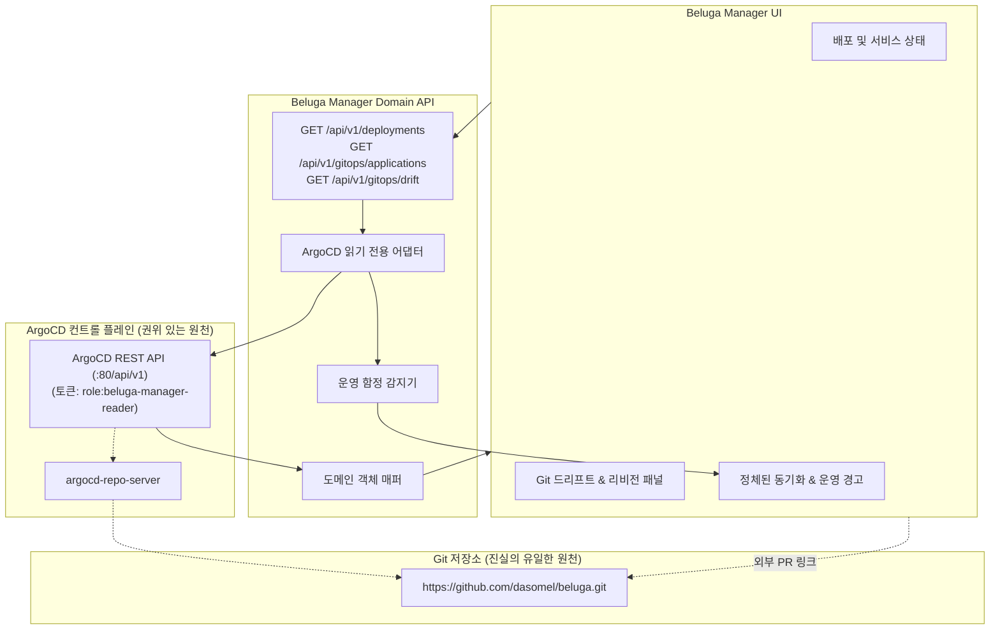

# ADR-0008: ArgoCD 기반 GitOps 통합 — 배포 및 동기화 가시성 모델

- **상태**: 제안됨(Proposed) — 설계 제안이며, 본 ADR에 의해 구현되는 라이브 ArgoCD 어댑터, 쓰기 API 또는 동기화 트리거는 없습니다.
  번호 체계 참고: ADR-0005는 Beluga Manager 컨테이너 패키징 및 배포 아키텍처(PR #113), ADR-0006은 안전한 운영 조치(PR #134, 이슈 #21), ADR-0007은 관측성 통합(PR #135, 이슈 #24)을 다루며, 본 GitOps 제안은 ADR-0008(이슈 #25)로 번호를 부여합니다.
- **날짜**: 2026-10-07
- **이슈**: [#25 [ROADMAP][ARCH] Deployment & GitOps Integration with Beluga](https://github.com/dasomel/beluga-manager/issues/25)
- **상위 에픽**: #1
- **관련 문서**: [ADR-0002](0002-backend-api-technology-ko.md)(Domain API, Hono), [ADR-0005](0005-deployment-gitops-integration-ko.md)(배포 패키징 및 이미지 아키텍처), `AGENTS.md`(읽기 우선 원칙, 업스트림 OSS와 통합 도메인 간 경계), `docs/architecture-ko.md`(섹션 5 소유권 경계, 섹션 6 Operations & Services 뷰), `beluga/docs/mistakes-log.md`(정체된 동기화 작업, 훅 경합 상태, 재부팅 후 Flink 작업 유실, manual edit에 대한 selfHeal 롤백).
- **결정권자**: dasomel

## 배경(Context)

Beluga는 ArgoCD app-of-apps 아키텍처(`beluga/gitops/apps/app-of-apps.yaml`, `beluga-root`)를 사용하여 데이터 플랫폼 인프라 프로비저닝 및 GitOps 동기화를 제어합니다. 루트 애플리케이션은 `https://github.com/dasomel/beluga.git`으로부터 다음 두 가지 주요 플랫폼 애플리케이션을 지속적으로 조정(reconcile)합니다:
1. `beluga-platform`: 기준 시스템 인프라 배포 (MetalLB, APISIX 게이트웨이, cert-manager, Keycloak, OpenLDAP, OPA, OpenFGA).
2. `beluga-data`: 레이크하우스 데이터 엔진 배포 (SeaweedFS S3, CloudNativePG, Strimzi Kafka, Lakekeeper Iceberg REST 카탈로그, Flink Operator, Trino, Airflow, Superset).

두 애플리케이션 모두 자동 동기화(`automated: { prune: true, selfHeal: true }`) 및 서버 사이드 적용(`ServerSideApply=true`)으로 구성되어 있습니다. [ADR-0005](0005-deployment-gitops-integration-ko.md)에서는 Beluga Manager 자체의 패키징 및 컨테이너화가 결정되었습니다(Phase 1 컨테이너 이미지 `37e8507` 배포 완료; 차트 배치에 대해 옵션 1 제안).

그러나 이슈 #25는 **Beluga Manager와 GitOps 플레인 간의 운영 통합**을 정의할 것도 함께 요구합니다. 운영자와 엔지니어는 ArgoCD 대시보드 관리자 로그인이나 직접적인 `kubectl` 접근 없이도 Beluga Manager 내에서 배포 상태, 설정 드리프트(drift), 애플리케이션 헬스를 직접 파악할 수 있어야 합니다. 또한 `beluga/docs/mistakes-log.md`에 기록된 실제 운영 실패 사례(정체된 sync hook, 재부팅 후 Flink 작업 유실, SSA 병합 교착 상태, 무단 수정에 대한 `selfHeal` 자동 복구)를 본 통합 계약에서 정면으로 다루어야 합니다.

### 업스트림 실측 및 권위 있는 기준
- **ArgoCD 2.13.0** (`beluga/VERSIONS.md`에서 확인됨): `https://argocd.local.beluga.internal`에서 접근 가능.
- **라이브 클러스터 상태**: 읽기 전용 클러스터 점검 결과 `argocd` 네임스페이스에 3개의 실행 중인 애플리케이션 확인: `beluga-root`(Synced/Healthy), `beluga-platform`(Synced/Healthy), `beluga-data`(Synced/Healthy).
- **ArgoCD REST API**: [ArgoCD API Specification](https://argo-cd.readthedocs.io/en/stable/operator-manual/api/) (접근일: 2026-10-07) - `GET /api/v1/applications` 및 `GET /api/v1/applications/{name}`을 통해 애플리케이션 트리, 헬스 상태, 동기화 상태, 작업 상태(operationState), 목표/라이브 리비전을 제공.
- **ArgoCD RBAC 정책**: [ArgoCD RBAC Documentation](https://argo-cd.readthedocs.io/en/stable/operator-manual/rbac/) (접근일: 2026-10-07) - `argocd-rbac-cm` ConfigMap을 통한 선언적 역할 정의 지원.
- **ArgoCD 리소스 훅**: [ArgoCD Resource Hooks Documentation](https://argo-cd.readthedocs.io/en/stable/user-guide/resource_hooks/) (접근일: 2026-10-07) - 동기화 훅(`PreSync`, `Sync`, `PostSync`) 및 삭제 정책(`BeforeHookCreation`, `HookSucceeded`) 지원.

## 결정 요인(Decision Drivers)

1. **읽기 우선 GitOps 경계(Read-First Boundary)**: Beluga Manager는 Git을 우회하거나 그림자 GitOps 컨트롤러로 동작해서는 안 됩니다. Git 커밋만이 클러스터 상태 변경의 유일하고 권위 있는 트리거입니다. Phase 1에서 변경 조치(동기화 트리거, 강제 새로고침, 앱 삭제)는 엄격히 금지됩니다.
2. **조회와 변경의 명확한 분리(Show vs. Mutate Separation)**: Manager UI는 GitOps 동기화 팩트(동기화 상태, 헬스 상태, Git 리비전, 설정 드리프트)를 투명하게 표시하되, 실수나 승인되지 않은 대역 외(out-of-band) 수정을 허용하지 않아야 합니다.
3. **최소 권한 인증(Least-Privilege Authentication)**: Domain API는 관리자 자격증명을 배제하고 `applications, get` 권한으로 좁혀진 전용 읽기 전용 ServiceAccount 토큰을 통해 ArgoCD에 연결합니다.
4. **기존 운영 함정 극복**: `beluga/docs/mistakes-log.md`에 문서화된 장애 패턴(정체된 sync hook, 재부팅 후 스트리밍 작업 유실, SSA 병합 충돌)을 방지하는 안전장치를 설계에 반영합니다.
5. **독립된 도메인 모델 매핑**: 업스트림 ArgoCD 개념(`Application`, `sync.status`, `health.status`, `operationState`)을 네이티브 Beluga 도메인 모델(`Deployment`, `Service`, `Workload`)로 매핑하여 웹 클라이언트에 내부 스키마 누출을 방지합니다.

## 검토한 대안(Considered Options)

### 옵션 1: 인앱 GitOps 직접 변경기 (Manager UI에 동기화/롤백/편집 노출)
Beluga Manager UI에 "지금 동기화", "롤백", 매니페스트 편집 버튼을 제공하여 ArgoCD 쓰기 API(`POST /api/v1/applications/{name}/sync`)를 직접 호출.
- **장점**: 모든 작업을 단일 UI에서 처리할 수 있어 편리함.
- **단점**: `AGENTS.md` 경계 및 GitOps 원칙 심각한 위반; Git 리뷰 및 CI 검증 게이트 우회; 치명적인 sync hook 경합(mistakes-log 51행) 유발 위험; `selfHeal`에 의해 즉시 되돌려져 운영자 혼란 유발.
- **결과**: **거부됨(Rejected)**.

### 옵션 2: kube-apiserver를 통한 Kubernetes CRD 직접 폴링
Domain API가 ArgoCD HTTP API를 우회하고 Kubernetes API를 통해 `argoproj.io/v1alpha1` `Application` 커스텀 리소스를 직접 조회(`GET /apis/argoproj.io/v1alpha1/applications`).
- **장점**: 기존 클러스터 자격증명 재사용.
- **단점**: repo-server를 우회하므로 계산된 Git-vs-Live diff를 얻을 수 없음; Manager에 광범위한 K8s 클러스터 수준 RBAC 권한 요구; 외부 호스팅 ArgoCD 환경 지원 불가.
- **결과**: **거부됨(Rejected)**.

### 옵션 3: 도메인 매핑 및 운영 안전장치를 갖춘 읽기 전용 ArgoCD 어댑터 (제안안)
Domain API는 스코프가 제한된 읽기 전용 토큰을 사용하여 ArgoCD REST API와 통신하는 전용 **GitOps 어댑터**를 구현합니다:
1. 애플리케이션 동기화 상태(`Synced`, `OutOfSync`), 헬스(`Healthy`, `Degraded`, `Progressing`), 활성 Git 리비전을 노출합니다.
2. 라이브 상태와 선언 상태 간의 드리프트 요약(어떤 리소스가 왜 불일치하는지)을 제공합니다.
3. 알려진 정체된 동기화 작업(예: 멈춘 배치 훅 작업)을 감지하고 경고를 표시합니다.
4. ArgoCD 애플리케이션을 Beluga `Service` 및 `Deployment` 도메인 객체와 상관관계로 묶습니다.
5. 모든 변경 작업은 Beluga GitHub 저장소 풀 리퀘스트 링크로 유도합니다.
- **장점**: GitOps 무결성 유지; 권한 누출 방지; 변경 위험 없는 풍부한 가시성 제공; 과거 운영 함정 직접 해결.
- **단점**: UI에서 임의 수동 동기화를 즉시 트리거할 수 없음 (Git 푸시 또는 ArgoCD 대시보드 사용 필요).
- **결과**: **제안됨(Proposed)**.

## 결정 결과(Decision Outcome)

**제안 선택: 옵션 3 (도메인 매핑 및 운영 안전장치를 갖춘 읽기 전용 ArgoCD 어댑터)**.



### 1. 표시 대 변경 매트릭스 (Phase 1 경계)

| 기능 / 정보 | Manager UI 정책 | 업스트림 권위 시스템 | 운영상의 근거 |
|---|---|---|---|
| 애플리케이션 동기화 상태 (`Synced`, `OutOfSync`) | **표시 (읽기 전용)** | ArgoCD API | 핵심적인 운영 가시성 제공. |
| 애플리케이션 헬스 (`Healthy`, `Degraded`, `Progressing`) | **표시 (읽기 전용)** | ArgoCD API / K8s status | 인프라 헬스와 도메인 서비스 간의 상관관계 파악. |
| 대상 및 라이브 Git 커밋 SHA | **표시 (읽기 전용)** | ArgoCD Repo Server | 현재 배포된 정확한 커밋 버전 확인. |
| 리소스 수준 드리프트 Diff | **표시 (읽기 전용)** | ArgoCD Diff API | 런타임에 발생한 미커밋 변경 사항 추적. |
| 정체된 동기화 작업 경고 | **표시 (읽기 전용)** | ArgoCD `operationState` | 멈춰 있는 배치 잡(예: `flink-sql-submit`) 조기 식별. |
| 동기화 트리거 ("지금 동기화") | **금지 (변경 작업)** | Git Push / ArgoCD UI | Git 코드 리뷰 우회 방지; 훅 경합 방지. |
| 이전 리비전으로 롤백 | **금지 (변경 작업)** | Git Revert PR | 롤백 이력은 Git에 남아야 함. |
| 인플레이스 매니페스트 편집 | **금지 (변경 작업)** | Git Repository | `selfHeal: true`에 의해 몇 분 내 자동 덮어써짐. |
| 하드 리프레시 / 캐시 무효화 | **금지 (변경 작업)** | ArgoCD CLI / UI | 감사 추적이 필요한 조치; Phase 2 Safe Actions로 검토. |

### 2. ArgoCD 인증 계약
1. **ArgoCD RBAC 정책**:
   `beluga/gitops/charts/beluga-platform/templates/`(또는 `argocd-rbac-cm`)에 전용 읽기 전용 역할을 정의합니다:
   ```csv
   p, role:beluga-manager-reader, applications, get, */*, allow
   p, role:beluga-manager-reader, logs, get, */*, allow
   ```
2. **토큰 프로비저닝**:
   Domain API는 Kubernetes Secret 참조(`ARGOCD_AUTH_TOKEN`)를 통해 인증 토큰을 전달받습니다. 이 토큰은 `argocd` 네임스페이스의 전용 ServiceAccount에서 생성되며, 관리자 자격증명(`admin`, `admin-secret`)은 절대 마운트하거나 저장하지 않습니다.

### 3. 도메인 모델 매핑 명세
GitOps 어댑터는 ArgoCD 애플리케이션 구조를 통합 도메인 모델로 변환합니다:

1. **`Application` -> Beluga 도메인 엔티티**:
   - `beluga-platform` -> Service `svc-platform` 및 시스템 Deployment 스코프.
   - `beluga-data` -> 데이터 플랫폼 서비스 목록 (`svc-kafka`, `svc-flink`, `svc-trino`, `svc-airflow`, `svc-iceberg`).
2. **상태 필드 정규화**:
   - ArgoCD `.status.sync.status`:
     - `"Synced"` -> Domain `syncStatus: "synced"`
     - `"OutOfSync"` -> Domain `syncStatus: "drifted"`
     - `"Unknown"` -> Domain `syncStatus: "unknown"`
   - ArgoCD `.status.health.status`:
     - `"Healthy"` -> Domain `healthStatus: "healthy"`
     - `"Degraded"` -> Domain `healthStatus: "degraded"`
     - `"Progressing"` -> Domain `healthStatus: "stale"` (또는 전이 중)
     - `"Missing"` -> Domain `healthStatus: "degraded"`
3. **리비전 메타데이터**:
   - `.status.sync.revision`(라이브 Git SHA-1) 및 `.spec.source.targetRevision`(`main` 브랜치 등)을 불변 문자열 필드로 노출.

### 4. 알려진 플랫폼 함정에 대한 직접 완화 방안 (`mistakes-log.md`)

`beluga/docs/mistakes-log.md`에 기록된 실제 장애 사례를 반영한 안전장치:

| 알려진 플랫폼 함정 | 과거 실측 근거 | 근본 원인 | Manager 통합 안전장치 |
|---|---|---|---|
| **정체된 동기화 작업 (Stuck Sync)** | 47행, 51행: `.status.operationState`가 훅 잡을 기다리며 `Running`에 영구 고착되어 후속 Git 동기화 차단. | Sync hook(`argocd.argoproj.io/hook: Sync`, `BeforeHookCreation`)의 경합 또는 조용한 실패. | Manager가 `phase == "Running"` 상태 지속 시간 > 10분을 감지하여 눈에 띄는 **운영 경고** 표시: *"동기화가 훅 잡에서 지연 중입니다: 잡 로그를 확인하세요"*; 동시 동기화 절대 시도 금지. |
| **재부팅 후 Flink 작업 유실** | 56행, 61행, 76행: 클러스터/노드 재부팅 시 Flink 세션 클러스터가 초기화되고, 1회성 배치 훅(`flink-sql-submit`)으로 제출된 SQL 작업이 재실행되지 않음. | Sync hook은 GitOps 동기화 시점에만 실행되며 노드 재부팅이나 파드 재스케줄링 시에는 실행되지 않음. | Operations 뷰에서 Flink 런타임 상태와 GitOps 상태를 대조: 상위 앱이 `Synced/Healthy`임에도 Flink 작업이 `SUSPENDED` 또는 `NOT_FOUND`인 불일치 상황을 플래그 표시. |
| **`selfHeal` 자동 롤백 혼란** | 47행: 수동 `kubectl apply` 변경 사항이 몇 분 내에 ArgoCD selfHeal에 의해 조용히 origin/main 상태로 덮어써짐. | `automated.selfHeal: true`가 대역 외 클러스터 변경을 지속적으로 덮어씀. | Manager UI에서 운영자에게 명시적 경고: *"Git이 유일한 원천입니다. 런타임 임의 수정은 3분 내에 GitOps selfHeal에 의해 덮어써집니다."* |
| **SSA 병합 볼륨 교착 상태** | 54행, 58행: 볼륨 타입 변경(emptyDir -> PVC 또는 ConfigMap -> Secret) 시 SSA가 `may not specify more than 1 volume type`으로 거부. | Kubernetes API가 실행 중인 Deployment/StatefulSet에 대해 인플레이스 볼륨 타입 변경을 금지함. | 드리프트 검사기에서 볼륨 타입 불일치를 강조하고 주석 표시: *"볼륨 전이를 위해 Recreate 전략 또는 파드 삭제가 필요합니다."* |
| **Repo-Server 실패 캐시** | 52행: `argocd-repo-server`가 일시적 DNS 오류를 캐싱하여 복구 후에도 동일한 실패 메시지를 반복 출력. | repo-server 프로세스 내부의 Git 캐시 지속. | 캐시 경과 시간을 표시하고 15분 이상 지속 시 ArgoCD CLI를 통한 하드 리프레시를 권고. |

### 5. 제안된 API 형태 스케치 (설계 제안안)

> **제안 참고**: 아래 스키마와 경로는 계획된 설계 계약을 나타내며 현재 저장소 코드에 구현되어 있지 않습니다.

```typescript
// 제안된 GitOps 도메인 스키마
export interface GitOpsApplicationSummary {
  name: string; // 예: "beluga-data"
  project: string; // "default"
  repoUrl: string; // "https://github.com/dasomel/beluga.git"
  path: string; // "gitops/charts/beluga-data"
  targetRevision: string; // "main"
  liveRevision: string; // "2081fef..."
  syncStatus: "synced" | "drifted" | "unknown";
  healthStatus: "healthy" | "degraded" | "progressing" | "missing";
  lastSyncedAt: string;
  operationState?: {
    phase: "Running" | "Succeeded" | "Failed" | "Error";
    startedAt: string;
    message?: string;
    isStuck: boolean; // 10분 이상 Running 시 true
  };
  managedResourcesCount: number;
  outOfSyncResourcesCount: number;
}

export interface GitOpsResourceDrift {
  kind: string; // "Deployment"
  name: string; // "flink-cluster"
  namespace: string; // "streaming"
  liveStateSummary: string;
  targetStateSummary: string;
  diffSummary?: string; // 통합 diff 표현
}
```

제안된 HTTP 엔드포인트:
- `GET /api/v1/gitops/applications`: 동기화 및 헬스 요약을 포함한 ArgoCD 애플리케이션 목록 조회.
- `GET /api/v1/gitops/applications/{name}`: 리소스 트리 및 작업 상태를 포함한 단일 애플리케이션 상세 조회.
- `GET /api/v1/gitops/applications/{name}/drift`: 라이브 상태와 Git 설정 간 드리프트가 발생한 리소스 목록 조회.

## 결과(Consequences)

### 긍정적 측면
- 운영자에게 광범위한 클러스터 관리자 권한을 부여하지 않고도 Beluga Manager와 하위 GitOps 엔진 간의 가시성 격차를 해소.
- Git을 유일한 변경 원천으로 강제함으로써 우발적인 대역 외 변경으로부터 플랫폼을 보호.
- Operations 뷰에서 알려진 플랫폼 장애 모드(정체된 훅 잡, 재부팅 후 스트리밍 잡 유실)에 대한 조기 진단 감지 제공.
- PR 기반 Git 워크플로를 지원하는 향후 Phase 2 배포 운영의 깔끔한 기반 마련.

### 부정적 측면
- Phase 1에서는 Manager UI에서 즉각적인 롤백이나 동기화 재시도를 트리거할 수 없음 (ArgoCD UI 또는 Git 사용 필요).
- ArgoCD REST API 가용성에 의존: `argocd-server` 장애 시 GitOps 상태가 `unknown`으로 저하됨.

## 검토한 대안(Alternatives Considered)

1. **ArgoCD 대신 FluxCD Controller 임베딩**:
   - *거부 이유*: Beluga 플랫폼은 이미 `app-of-apps` 구조를 갖춘 ArgoCD 2.13.0으로 확고히 표준화되어 있습니다. FluxCD를 도입하면 아키텍처 파편화가 발생하고 원칙 3을 위반합니다.
2. **Domain API에서 직접 Git 커밋 트리거**:
   - *거부 이유*: Domain API가 `dasomel/beluga`에 대한 푸시 권한을 갖는 GitHub 개인 액세스 토큰(PAT) 또는 SSH 쓰기 키를 보유해야 합니다. Manager 내에 쓰기 토큰을 보관하면 심각한 보안 및 공격면 리스크가 발생합니다.

## 위험 요인 및 완화 방안(Risks and Mitigations)

| 위험 | 영향 | 완화 전략 |
|---|---|---|
| ArgoCD API 다운타임 / 지연 | `/api/v1/gitops/*` 요청 지연 또는 실패. | GitOps 어댑터에 2000ms HTTP 타임아웃 강제; 애플리케이션 요약 30초 캐싱; `syncStatus: "unknown"`으로 우아하게 저하. |
| 우발적 변경 노출 | 미인가 경로를 통해 쓰기 API가 호출됨. | GitOps 어댑터는 HTTP GET 메서드만 구현; 어댑터 코드베이스에 일체의 쓰기/동기화 메서드 부재. |
| 민감한 diff 유출 | Git 드리프트 diff가 Secret 평문 값을 노출함. | ArgoCD가 diff 응답에서 `kind: Secret` 데이터를 자동 마스킹함; Domain API가 자격증명 패턴을 추가 스크러빙. |
| 오래된 Git 리비전 캐시 | Manager가 과거 커밋 SHA를 표시함. | `targetRevision`(브랜치)과 해석된 `liveRevision`(커밋 SHA)을 타임스탬프와 함께 표기. |

## 미결 소유자 질문(Open Owner Questions)

1. **Phase 2 Git 변경 워크플로**: Phase 2에서 Beluga Manager가 GitHub API를 통해 이미지 태그나 설정값 수정을 위한 Git Pull Request 생성을 지원해야 하는가?
   - *권고안*: 지원을 권고합니다. GitHub PR 생성을 통해 셀프서비스 플랫폼 업데이트를 가능하게 하면서도 코드 리뷰, CI 검증, 감사 추적성을 온전히 보존할 수 있습니다.
2. **Flink 작업 선언적 마이그레이션**: 재부팅 후 작업 유실을 방지하기 위해 `14-flink-jobs.yaml`을 배치 Sync 훅에서 Flink K8s Operator 1.15의 네이티브 `FlinkDeployment` CRD로 전환해야 하는가?
   - *권고안*: 전환을 강력히 권고합니다. `FlinkDeployment` 커스텀 리소스로 스트리밍 작업을 관리하면 1회성 배치 훅에 의존하지 않고 노드 재부팅 후에도 Flink 작업 상태가 선언적으로 자가 치유됩니다.
3. **드리프트 Diff 상세도**: Manager가 완전한 통합 YAML diff를 표시해야 하는가, 아니면 상위 수준 필드 요약을 표시해야 하는가?
   - *권고안*: Phase 1에서는 상위 필드 요약(예: `image: v1 -> v2`, `replicas: 1 -> 2`)만 제공하고, 완전한 diff는 ArgoCD 애플리케이션 UI로 딥링크할 것을 권고합니다.

## 후속 구현 작업 및 수용 테스트 아이디어(Follow-up Tasks)

1. **작업 1: GitOps 애플리케이션 스키마 및 읽기 전용 라우터**
   - `GitOpsApplicationSummary` 및 `GitOpsResourceDrift`용 Zod OpenAPI 스키마 구현.
   - *수용 테스트*: 스키마 직렬화 및 선택적 `operationState` 필드 처리를 검증하는 단위 테스트.
2. **작업 2: ArgoCD REST 클라이언트 어댑터**
   - Bearer 토큰 인증과 2초 타임아웃을 지원하는 `GET /api/v1/applications` 통신 클라이언트 구현.
   - *수용 테스트*: ArgoCD의 HTTP 401 또는 503 응답이 `status: "unknown"`을 반환하며 Domain API를 크래시시키지 않음을 검증하는 목 서버 테스트.
3. **작업 3: 정체된 동기화 훅 진단 감지기**
   - 10분 이상 실행 중인 동기화 작업을 감지하는 `.status.operationState` 평가 로직 구현.
   - *수용 테스트*: `phase: "Running"` 및 `startedAt: "20분 전"`인 애플리케이션이 `isStuck: true` 및 경고 메시지를 트리거하는지 검증하는 단위 테스트.
4. **작업 4: 배포 및 서비스 상관관계 매핑**
   - ArgoCD 애플리케이션 리소스를 Beluga 도메인 `Service` 및 `Deployment` 엔티티와 연동하는 매퍼 구현.
   - *수용 테스트*: `beluga-data` 내 리소스가 `svc-kafka`, `svc-flink`, `svc-trino`와 올바르게 연관되는지 확인하는 검증 테스트.
5. **작업 5: 프론트엔드 GitOps 상태 배지 컴포넌트**
   - `Synced`(초록), `Drifted`(주황), `Stuck Hook`(빨강) 및 툴팁 설명을 표시하는 UI 컴포넌트 구현.
   - *수용 테스트*: 올바른 접근성 레이블과 색상이 할당되는지 확인하는 컴포넌트 렌더 테스트.
