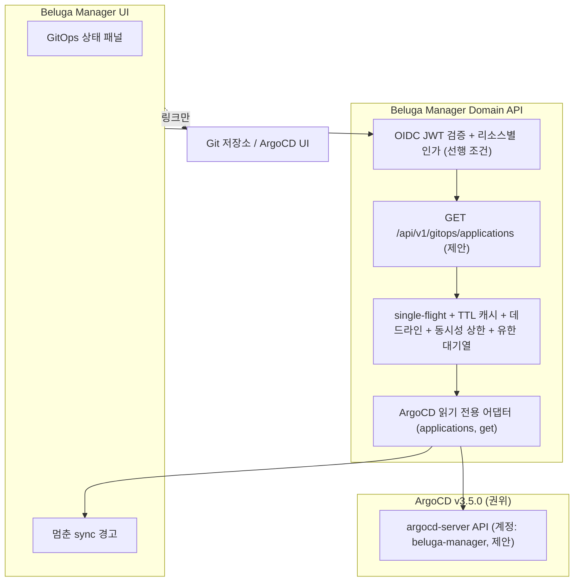

# ADR-0008: ArgoCD 기반 GitOps 통합 — 배포 및 동기화 가시성 모델

- **상태**: 제안됨(Proposed) — 설계 제안이며, 본 ADR에 의해 구현되는 라이브 ArgoCD 어댑터, 쓰기 API, sync 트리거는 없습니다.
  번호 안내: ADR-0005는 배포 및 GitOps 통합(PR #113), ADR-0006은 Safe Actions(PR #134, 이슈 #21), ADR-0007은 관측성 통합(PR #135, 이슈 #24)이며, 본 제안은 ADR-0008(이슈 #25)입니다.
- **날짜**: 2026-10-07
- **이슈**: [#25 [ROADMAP][ARCH] Deployment & GitOps Integration with Beluga](https://github.com/dasomel/beluga-manager/issues/25)
- **상위 에픽**: #1
- **관련 문서**: [ADR-0002](0002-backend-api-technology-ko.md)(Domain API, Hono), [ADR-0005](0005-deployment-gitops-integration-ko.md)("ADR-0005와의 관계" 참조), ADR-0006(Safe Actions, 0절 필수 선행 조건과 2a절 Flink 분석), `AGENTS.md`(read-first 원칙, 업스트림 OSS와 통합 도메인의 경계), `docs/architecture.md`("Design Principles" — 원칙 3, 6 — 및 "Ownership Boundaries" 제목; 제목에 번호가 없고 그 파일에 Operations & Services 절은 없음), `beluga/docs/mistakes-log.md`(현재 상태에서 날짜로 인용).
- **의사결정자**: dasomel

표기 규칙: **현재 상태**는 관측한 사실만 적습니다(file:line 또는 실제 실행한 명령, 근거 일자 2026-10-07). **제안**은 설계 의도입니다. 모든 수치(캐시 TTL, 타임아웃, 임계값)에는 *Proposed*를 표기합니다. 외부 사실은 2026-10-07에 실제로 연 공식 URL을 달거나 *not verified*로 표기합니다.

## ADR-0005와의 관계

ADR-0005와 본 ADR은 모두 이슈 #25에서 나왔으며 서로 중복되어서는 안 됩니다.
- **ADR-0005 소관**: Beluga Manager 자체를 Beluga GitOps로 패키징·배포하는 방법(차트 위치, Beluga 레포의 `Application` 등록, 이미지 고정, Git revert 기반 업그레이드/롤백). 아직 *Proposed*이며 열린 질문 1(차트 위치)은 미결입니다. "Read-only boundary" 항목과 열린 질문 4("읽기 전용 ArgoCD 상태 어댑터가 MVP 범위인가")는 본 ADR의 주제를 명시적으로 미뤄 두었습니다.
- **본 ADR 소관**: Manager가 GitOps 계층을 *관찰*하는 방법(읽기 전용 ArgoCD 상태 어댑터, 도메인 매핑, 운영 가드레일, ArgoCD에 대한 보안 계약). 차트 위치, `Application` 등록, 이미지 처리는 결정하지 않으며 ADR-0005의 결정을 바꾸지 않습니다. ADR-0005가 수락되면 Manager 자신의 `Application`은 어댑터가 보여 줄 수 있는 또 하나의 애플리케이션이 될 뿐이며, 여기의 어떤 것도 그에 의존하지 않습니다.
- ADR-0005의 열린 질문 4는 *여기서 제안으로 답합니다*(예, 아래 선행 조건 이후의 후속 단계로, 읽기 전용). 수락은 dasomel의 결정입니다.

## 배경(Context)

### 현재 상태(관측)

| 사실 | 근거 |
|---|---|
| Beluga는 ArgoCD app-of-apps를 운영합니다. `beluga-root`가 `https://github.com/dasomel/beluga.git`에서 `beluga-platform`, `beluga-data` Application을 렌더링하며 세 앱 모두 `automated: {prune: true, selfHeal: true}`입니다. | Beluga `gitops/apps/app-of-apps.yaml:1-21`, `gitops/apps/beluga-data.yaml:19-22`, `gitops/apps/beluga-platform.yaml:21`; 라이브 `kubectl -n argocd get applications.argoproj.io` -> 앱 3개. |
| **ArgoCD는 v3.5.0**입니다(이전 초안의 2.13.0이 아님). `VERSIONS.md` 행, 부트스트랩 스크립트, 실행 중 이미지가 일치합니다. | Beluga `VERSIONS.md:19`("ArgoCD \| 3.5.0"); `scripts/gitops/01-argocd-bootstrap.sh:19,23`(`v3.5.0`의 `install.yaml`); 라이브 `kubectl -n argocd get deploy argocd-server -o jsonpath='{.spec.template.spec.containers[0].image}'` -> `quay.io/argoproj/argocd:v3.5.0`. |
| 세 앱의 라이브 상태: 모두 `Synced` / `Healthy`, 마지막 오퍼레이션 `Succeeded`; `spec.source.targetRevision`은 `HEAD`(브랜치 이름이 아님); `.status.sync.revision`은 전체 커밋 SHA(`ce493324…`). | `kubectl -n argocd get application <name> -o jsonpath='{.status.sync.status} {.status.health.status} {.status.operationState.phase} {.spec.source.targetRevision} {.status.sync.revision}'`(읽기 전용, 2026-10-07). |
| 각 Application은 관리 리소스를 `kind/name/namespace/status/version`만으로 나열합니다(매니페스트 내용 없음). | 라이브 `kubectl -n argocd get application beluga-data -o jsonpath='{.status.resources[0]}'` -> `{"kind":"ConfigMap","name":"trino-access-control","namespace":"analytics","status":"Synced","version":"v1"}`. |
| **ArgoCD 설정은 Beluga GitOps 차트로 관리되지 않습니다.** ArgoCD는 부트스트랩 스크립트가 업스트림 `install.yaml`을 적용하고 `argocd-cmd-params-cm`을 패치(`server.insecure: "true"`; APISIX가 TLS를 종료하고 평문 HTTP로 `argocd-server:80`에 전달)하여 설치됩니다. `gitops/` 아래에 ArgoCD/RBAC 매니페스트는 없습니다. | Beluga `scripts/gitops/01-argocd-bootstrap.sh:19-29`; `git ls-tree -r --name-only refs/remotes/origin/main gitops \| grep -i "argocd\|rbac"` -> 출력 없음; 라이브 `kubectl -n argocd get svc argocd-server` -> 포트 `80/TCP,443/TCP`. |
| 라이브 `argocd-rbac-cm`의 **data가 비어 있습니다**(사용자 정의 정책·`policy.csv` 없음). 읽기 전용 전용 계정이나 롤도 없습니다. | `kubectl -n argocd get cm argocd-rbac-cm -o jsonpath='{.data}'` -> 빈 값. |
| Domain API에는 **인증 미들웨어가 없습니다**. | `docs/IMPLEMENTATION-STATUS.md:30`("the app has no auth middleware"); `packages/domain-api/src/app.ts:50-56`은 CORS(origin `http://localhost:5180`)만 등록. |
| Domain API에는 **`Deployment`나 GitOps 스키마가 없습니다**. 존재하는 스텁 Service id는 `svc-trino`, `svc-airflow`, `svc-iceberg`, `svc-kafka`, `svc-flink`, `svc-superset`, `svc-kubernetes`, `svc-observability`입니다. **`svc-platform`은 없습니다.** | `packages/domain-api/src/schema/`(deployment/gitops 파일 없음); `packages/domain-api/src/stub-data/services.ts:9-129`(`id:` 필드); `git grep -n "svc-platform" -- packages` -> 히트 없음. 읽기 전용 Flink 어댑터는 `main`에 있습니다(`packages/domain-api/src/adapters/flink/`, PR #132). |
| ArgoCD 호스트 `argocd.local.beluga.internal`은 Beluga 도메인 레지스트리에 있습니다. | Beluga `AGENTS.md:16-18`. |

`beluga/docs/mistakes-log.md`의 운영 이력. 로그에는 **행 번호가 없고** 날짜 열로 항목을 구분합니다. 아래 file:line은 2026-10-07에 읽은 beluga 레포 `refs/remotes/origin/main` 기준이며 변동될 수 있습니다.

| 날짜 / 줄 | 인용 발췌(한국어 항목에서 발췌) | 관련성 |
|---|---|---|
| 2026-08-25, 49행 (gitops) | "`beluga-platform`/`beluga-data` … `selfHeal: true` … `kubectl apply`로 직접 편집하면 ArgoCD가 몇 분 내로 **조용히 origin/main 상태로 되돌린다**" | 대역 외 편집은 되돌려집니다. 간격은 "몇 분"이며 측정된 수치가 아닙니다. |
| 2026-08-26, 53행 (harness) | ArgoCD 자신의 sync 오퍼레이션이 `Running`(다른 훅 대기 중)인 동안 오케스트레이터가 Sync 훅 리소스를 수동으로 `kubectl delete`하면 둘이 "같은 훅 리소스를 놓고 경합"했습니다. | 진행 중인 sync 오퍼레이션과 병행한 조작은 위험합니다. 먼저 `.status.operationState.phase`를 확인해야 합니다. |
| 2026-08-26, 54행 (harness) | `argocd-repo-server`의 일시적 DNS 실패 후 DNS가 복구됐는데도 `.status.operationState.message`에 옛 에러가 남았고, "`refresh=hard` 애노테이션만으로는 repo-server 프로세스 내부의 실패 상태가 갱신되지 않는 경우가 있다 — `rollout restart deployment/argocd-repo-server`로 해소". | 오래된 메시지가 재시도 실패를 뜻하지는 않습니다. 로그의 해법은 hard refresh만이 아니라 repo-server 재시작입니다. |
| 2026-08-30, 56행 (gitops) 및 2026-09-08, 60행 (gitops) | 볼륨 타입이 바뀔 때(emptyDir -> PVC; 같은 볼륨 이름에서 ConfigMap -> Secret) ArgoCD SSA가 `may not specify more than 1 volume type`으로 실패. | 볼륨 타입 변경 시 Server-Side Apply 병합 실패. 로그의 예방책은 볼륨 이름 변경 또는 2단계 커밋입니다. |
| 2026-10-07, 86행 (gitops) | `flink-sql-submit` Sync 훅 Job이 `BackoffLimitExceeded`로 실패하여 `beluga-data` sync가 계속 재시도(OutOfSync, "hook batch/Job/flink-sql-submit" 대기)되고 이후 변경을 인수하지 못함. "훅은 sync 때만 실행되므로 정적 검증·CI에서는 드러나지 않았다". | 실패한 Sync 훅은 애플리케이션 전체 sync를 막습니다. |

이전 초안의 "재부팅 후 Flink 잡 유실 / sync 훅은 재부팅 시 재실행되지 않음" 주장은 **로그로 뒷받침되지 않습니다**. 56, 61, 76행은 SSA, Cilium TLS, Lakekeeper에 관한 것이고 87-88행은 Keycloak 토큰 교환과 lakekeeper-bootstrap 훅에 관한 것입니다. 제가 말할 수 있는 것은 **매니페스트로부터의 추론이며 관측된 사고도 로그 항목도 아닙니다**: Flink 세션 클러스터 설정에는 `high-availability.*` 키가 없고(Beluga `gitops/charts/beluga-data/templates/05-flink-operator.yaml:10-20`), Beluga 자체 HA 문서는 HA가 없으면 JobManager 장애가 실행 중 프로그램을 실패시킨다고 하며(Beluga `docs/ha-dr-objectives.md:101`), 제출 훅은 ArgoCD Sync에서만 실행됩니다(`gitops/charts/beluga-data/templates/14-flink-jobs.yaml:27`). 따라서 JobManager 재시작 후 다음 sync까지 잡이 없을 수 있습니다. 본 ADR은 그런 일이 실제로 발생했다고 주장하지 않습니다.

### 외부 참고 자료(2026-10-07 열람)

- Argo CD RBAC — <https://argo-cd.readthedocs.io/en/stable/operator-manual/rbac/> (2026-10-07 열람; 페이지가 "Since v3.0.0" / "New since v3.2"를 언급하므로 3.x 문서이며 정확한 문서 버전은 표기되지 않음): 정책 문법 `p, <role/user/group>, <resource>, <action>, <object>, <effect>`; 리소스에 `applications`, `logs`, `exec` 등; 정책은 `argocd-rbac-cm`의 `policy.csv`에 있음; `logs`는 **별도 리소스**입니다("when granted with the `get` action, this policy allows a user to see Pod's logs").
- Argo CD 사용자 관리 — <https://argo-cd.readthedocs.io/en/stable/operator-manual/user-management/> (2026-10-07 열람): 로컬 사용자는 `argocd-cm`에 정의(예: `accounts.alice: apiKey, login`); 토큰은 `argocd account generate-token --account <name>`으로 생성; 새 로컬 사용자는 RBAC 규칙을 추가하지 않으면 `policy.default`로 대체됩니다. 제가 읽은 페이지는 API 키의 토큰 만료 옵션이나 폐기 방법을 **서술하지 않습니다**: *not verified*.
- Argo CD API — <https://argo-cd.readthedocs.io/en/stable/developer-guide/api-docs/> (2026-10-07 열람): Swagger UI는 Argo CD UI의 `/swagger-ui`에 있고, 인증은 bearer 토큰(예시에서는 `$ARGOCD_SERVER/api/v1/session`으로 획득)이며, 예시 엔드포인트는 `api/v1`을 씁니다. 이 페이지는 `/api/v1/applications`나 `/api/v1/applications/{name}`을 **나열하지 않고** API 안정성 보장도 서술하지 않습니다. 따라서 3.5.0의 정확한 애플리케이션 엔드포인트와 응답 필드는 *문서로는 not verified*이며, 위에서 관측한 Application CR 필드가 검증된 부분입니다. 이전 초안이 인용한 URL(`operator-manual/api/`)은 API 레퍼런스가 아니었으므로 제거했습니다.
- Argo CD 헬스 — <https://argo-cd.readthedocs.io/en/stable/operator-manual/health/> (2026-10-07 열람): 헬스 값 `Healthy`, `Progressing`, `Degraded`, `Suspended`, 그리고(집계 설명에서) `Missing`, `Unknown`. 이 페이지는 **sync** 상태 값은 다루지 않습니다. `Synced`는 라이브에서 관측했고 `OutOfSync`/`Unknown`은 *not verified*입니다.
- Argo CD sync 단계/훅 — <https://argo-cd.readthedocs.io/en/stable/user-guide/sync-waves/> (2026-10-07 열람; `resource_hooks/`는 이제 여기로 리다이렉트): 훅 단계 `PreSync`/`Sync`/`PostSync`/`SyncFail`; 삭제 정책 `HookSucceeded`/`HookFailed`/`BeforeHookCreation`; "If any of them fails the whole sync process will be marked as failed".
- Argo CD diffing — <https://argo-cd.readthedocs.io/en/stable/user-guide/diffing/> (2026-10-07 열람): diff에서 Secret 값을 마스킹한다는 언급이 없습니다. 이전 초안의 "ArgoCD가 diff 응답에서 `kind: Secret` 데이터를 자동으로 마스킹한다"는 주장은 근거가 없어 **삭제했습니다**.

## 결정 동인(Decision Drivers)

1. **Read-first GitOps 경계**: 클러스터 상태 변경의 유일한 권위 있는 트리거는 Git이며, Manager는 sync, 롤백, refresh, 편집을 하지 않습니다.
2. Manager API에 대한 **인증·인가 우선**(필수 선행 조건, ADR-0006 0절). API에는 현재 인증이 없기 때문입니다.
3. **ArgoCD에 대한 최소 권한**: `applications, get`만 허용된 전용 계정 — logs, exec, sync, override 없음.
4. **증폭 금지**: Manager 요청 하나가 무제한의 ArgoCD 호출로 번지면 안 됩니다.
5. **불확실한 사실을 권위 있는 것처럼 제시하지 않음**(`docs/architecture.md` Design Principle 6): 애플리케이션-서비스 매핑은 추론이 아니라 명시적 설정입니다.
6. **중복이 아닌 재사용**: ArgoCD가 GitOps 상태의 원천이며 패키징의 소유자는 계속 ADR-0005입니다.

## 검토한 옵션(Considered Options)

### 옵션 1: 앱 내 GitOps 변경기(Manager UI에서 Sync/Rollback/Edit)
**기각**: Git 리뷰와 CI를 우회하고, 로그에 sync 훅 경합과 조용한 selfHeal 되돌림이 기록되어 있으며(2026-08-25, 2026-08-26 항목), Manager에 쓰기 자격 증명이 필요합니다.

### 옵션 2: Kubernetes API에서 `Application` CR을 직접 읽기
**기각**(*Proposed* 판단): Manager에 `applications.argoproj.io`에 대한 클러스터 수준 RBAC를 줘야 하고 클러스터 내 ArgoCD에 종속됩니다. ArgoCD API는 명시적이고 좁은 롤(`applications, get`)을 제공합니다. 여기서 쓰는 상태 필드는 CR에서 관측했으므로 CR 경로도 기술적으로 가능하며, 기각 사유는 권한 범위입니다.

### 옵션 3: 명시적 도메인 매핑과 가드레일을 갖춘 읽기 전용 ArgoCD 어댑터 (제안)
좁은 읽기 전용 ArgoCD 계정 하나를 쓰는 단일 어댑터입니다. sync/health/revision과 리소스별 sync 상태를 보여 주고, 멈춘 sync 오퍼레이션을 표시하며, 모든 변경은 ArgoCD UI와 Git 저장소 링크로 안내합니다.
- **장점**: GitOps 무결성 유지; 최소 권한; 매니페스트 내용이 어댑터를 지나지 않음.
- **단점**: 운영자는 Manager에서 sync나 롤백을 할 수 없음; Beluga 레포가 소유하는 새 ArgoCD 설정이 필요.
- **결과**: **제안**.

## 결정 결과(제안)



### 0. 필수 선행 조건 — Manager API의 인증·인가

Manager API가 실제 Keycloak OIDC/JWT 토큰을 검증하고(JWKS 서명, `iss`, `aud`, `exp`) 호출자를 **리소스별로** 인가하기(호출자가 볼 수 있는 애플리케이션) 전에는 본 ADR의 어떤 것도 구현하거나 활성화할 수 없습니다. 이는 ADR-0006 0절과 같은 선행 조건입니다(CSRF 규칙 포함: 쿠키가 아닌 bearer 헤더; 읽기 전용 `GET` 라우트에서는 접근 통제가 핵심이지만 향후 비-GET 라우트는 ADR-0006의 규칙을 상속). 이 어댑터가 읽기 전용이라도 revision SHA, 애플리케이션 이름, 오류 메시지는 플랫폼 토폴로지와 운영 상태를 드러냅니다. 인증이 설정되지 않으면 라우트는 fail-closed(401/403)입니다. 클레임/역할 이름은 *not verified*이며 라이브 realm에서 가져와야 합니다.

### 1. 보기 vs 변경 (Phase 1)

| 기능 / 정보 | Manager 입장 | 출처 |
|---|---|---|
| 애플리케이션 sync 상태, health 상태 | **표시** | ArgoCD Application status |
| `targetRevision`(관측값 `HEAD`)과 확정된 `.status.sync.revision`(커밋 SHA) | **표시** | ArgoCD Application |
| 리소스별 sync 상태(kind/name/namespace/status) | **표시** | `.status.resources[]`(관측한 필드) |
| 오퍼레이션 phase/message와 멈춤 경고 | **표시** | `.status.operationState` |
| 리소스 매니페스트, live/target diff, 파드 로그 | Phase 1에서 **노출하지 않음**(ArgoCD UI로 딥링크) | Secret이 담길 수 있는 내용이 어댑터를 지나지 않게 함; ArgoCD diff의 Secret 마스킹은 확인되지 않음 |
| Sync, hard refresh, 롤백, 매니페스트 편집, 앱 삭제 | **금지** | Git push / 외부 ArgoCD UI |

### 2. ArgoCD에 대한 인증 계약 (제안)

현재 상태: `argocd-rbac-cm`은 비어 있고 ArgoCD 설정은 Beluga gitops에 없습니다. 아래는 모두 **제안**이며 **Beluga 레포 변경**입니다(Beluga 레포가 클러스터 상태를 소유하며 Manager는 이를 편집하지 않습니다). 그쪽 이슈로 추적해야 합니다.

1. **계정**: `apiKey` 기능만 가진(`login` 없음) 로컬 계정 `beluga-manager`를 `argocd-cm`에 정의합니다(`accounts.beluga-manager: apiKey`, 사용자 관리 문서 기준).
2. **RBAC**(`argocd-rbac-cm`의 `policy.csv`), 읽기 전용이며 **logs 없음**:
   ```csv
   p, role:beluga-manager-reader, applications, get, default/beluga-*, allow
   g, beluga-manager, role:beluga-manager-reader
   ```
   객체 패턴 `default/beluga-*`(세 Application이 쓰는 프로젝트는 `default`이며 앱 이름 패턴은 *Proposed* 축소)가 이전의 `*/*`를 대체합니다. 이전 초안은 `logs, get, */*`도 부여했으나, 파드 로그에는 비밀이 있을 수 있고 결정 동인 3이 "applications get만"이므로 삭제했습니다. `policy.default`는 이 계정에 더 넓은 접근을 주면 안 됩니다(문서상 규칙이 없는 사용자는 `policy.default`로 대체되며, 라이브 기본값은 여기서 확인하지 않았음 — *not verified*).
3. **위치**: 이전 초안의 `beluga-platform/templates/`가 아닙니다 — 거기에는 ArgoCD 템플릿이 없습니다. `scripts/gitops/01-argocd-bootstrap.sh` 확장 또는 Beluga 레포에 ArgoCD 설정 차트/매니페스트를 추가하는 선택지가 있으며 이는 Beluga 레포의 결정입니다(열린 질문 1).
4. **토큰 취급**: 토큰은 Manager Deployment가 참조하는 Kubernetes Secret(`secretKeyRef` 환경 변수)에 두며 values, 로그, 감사 기록에는 절대 두지 않습니다. **교체(Proposed)**: 일정에 따라 및 노출이 의심될 때 토큰을 재발급하고 Secret을 갱신합니다. API 키 토큰에 만료를 둘 수 있는지, 폐기할 수 있는지는 제가 연 문서에서 *not verified*이므로 구현 전에 3.5.0 CLI로 교체 절차를 확인해야 합니다.
5. **Confused deputy**: 어댑터는 모든 호출자에 대해 서비스 토큰 하나를 쓰므로 그 토큰의 범위(모든 `beluga-*` 앱)가 어느 호출자든 볼 수 있는 최대치입니다. 따라서 Manager는 데이터를 반환하기 전에 *호출자*를 애플리케이션별로 인가하고(0절) 결과를 호출자의 허용 집합으로 필터링하며 최종 사용자 토큰을 ArgoCD로 전달하지 않습니다. ArgoCD SSO로 사용자별 신원을 전달할 수 있는지는 *not verified*이며 범위 밖입니다.
6. **TLS와 서버 URL 검증(SSRF)**: ArgoCD 기본 URL은 배포 설정(허용 목록의 클러스터 내부 서비스 URL)에서만 오며 요청 파라미터에서는 오지 않습니다. 어댑터는 다른 호스트로의 리다이렉트를 따르지 않고, 응답 크기를 제한하며, 필요한 고정 GET 경로만 씁니다. TLS: 현재 ArgoCD는 클러스터 내부에서 평문 HTTP이므로(`server.insecure: "true"`, 현재 상태) `argocd-server:80` 호출은 암호화되지 않습니다. Manager는 최소한 대상이 설정된 서비스인지 확인해야 하며 TLS 검증 경로(`443`)를 평가해야 합니다. 그 인증서 체인은 *not verified*입니다.

### 3. 도메인 매핑 (제안)

현재 `Deployment`나 GitOps 도메인 타입은 없습니다(현재 상태). 본 ADR은 기존 타입에 매핑하는 것이 아니라 새 타입을 제안합니다.

1. **Application -> Service**: ArgoCD 애플리케이션을 픽스처에 존재하는 Manager 서비스 id에 대응시키는 **명시적 설정 표**. 예: `beluga-data` -> `svc-trino`, `svc-airflow`, `svc-iceberg`, `svc-kafka`, `svc-flink`, `svc-superset`. `beluga-platform`에는 **현재 대응하는 서비스 id가 없으며**(`svc-platform` 없음) 별도 결정으로 서비스 id가 추가되기 전에는 애플리케이션 수준 항목으로 표시합니다. 대응은 `docs/architecture.md` Design Principle 6을 지키기 위해 추론이 아닌 선언입니다.
2. **상태 정규화**(도메인 값 이름은 *Proposed*): sync `Synced` -> `synced`(관측), 다른 값은 3.5.0 값이 검증된 뒤에만 `unknown`/`out-of-sync`로 전달(*not verified*); health `Healthy`/`Progressing`/`Degraded`/`Suspended`/`Missing`/`Unknown`은 1:1로 전달(문서화됨). 이전 초안처럼 `Progressing`을 "stale" 상태에 매핑하지 **않습니다**.
3. **Revision 메타데이터**: `spec.source.targetRevision`(관측값 `HEAD`)과 `.status.sync.revision`(SHA)을 읽기 전용 문자열로 노출합니다.

### 4. 운영 이력에서 도출한 가드레일 (제안)

| 상황(출처: 현재 상태의 로그 발췌) | Manager 동작 |
|---|---|
| sync 오퍼레이션이 `Running`에 머묾(훅 대기; 2026-08-26, 2026-10-07 항목) | `.status.operationState.phase == "Running"`이 **10분(Proposed)**을 넘으면 오퍼레이션 메시지와 ArgoCD UI 링크와 함께 경고를 표시합니다. sync를 트리거하거나 재시도하지 않습니다. |
| 실패한 Sync 훅이 애플리케이션을 막음(2026-10-07 항목) | `operationState.message`(마스킹)와, 메시지에 있으면 훅 리소스 이름을 표시하고 Manager에서 조치하지 않습니다. |
| repo-server 장애 후 오래된 오퍼레이션 메시지(2026-08-26, 54행) | 메시지를 타임스탬프와 함께 표시하고 오래되었을 수 있다고 안내합니다. 문서화된 운영자 해법은 Manager 밖의 repo-server 재시작입니다. 이전 초안의 "hard refresh 권고"는 로그가 hard refresh만으로는 해소되지 않을 수 있다고 하므로 삭제했습니다. |
| 대역 외 편집이 selfHeal로 되돌려짐(2026-08-25) | 정적 UI 안내: "Git이 권위이며 런타임 편집은 selfHeal에 의해 몇 분 내 되돌려진다"(수치 주장 없음; 로그는 "몇 분"이라 함). |
| SSA 볼륨 타입 실패(2026-08-30, 2026-09-08) | 실패한 리소스와 ArgoCD 메시지를 표시하며 자동 조치는 없습니다. 로그의 해법(볼륨 이름 변경 또는 2단계 커밋)은 운영자용 문서이지 조치가 아닙니다. |
| 앱이 `Synced/Healthy`인데 Flink 잡이 없음 | **가드레일이 아닌 열린 질문**: Flink 어댑터(PR #132)와, 관측된 사고가 아닌 위의 추론에 의존합니다. Phase 1에 포함하지 않습니다. |

### 5. 요청 증폭 제어 (제안)

형제 어댑터 작업(PR #132 병합, #133)도 같은 제어가 필요했습니다. 그 규약과의 정합은 구현 시 확인해야 합니다(여기서 다시 읽지 않았음). 모든 값은 *Proposed*입니다.
- **갱신당 업스트림 호출 1회**: 목록 호출 하나로 전체 화면을 채우며 목록을 위한 애플리케이션별 팬아웃은 없습니다.
- **Single-flight**: 동시에 들어온 동일 요청은 진행 중인 업스트림 호출 하나를 공유합니다.
- **TTL 캐시**: 30초.
- **호출당 타임아웃** 2000ms와 대기를 포함한 **전체 요청 데드라인** 5초.
- 진행 중 ArgoCD 호출 **동시성 상한** 2, **유한 대기열** 10; 초과 요청은 기다리지 않고 degraded/503 응답.
- 타임아웃, 401/403/5xx, 회로 차단 시: 마지막 캐시 값을 stale 표시와 함께 제공하거나 `unknown`; 페이지 전체에 HTTP 500을 반환하지 않습니다.

### 6. API 형태 스케치 (제안; 미구현)

```typescript
export interface GitOpsApplicationSummary {
  name: string;                 // 예: "beluga-data"
  project: string;              // 관측값: "default"
  targetRevision: string;       // 관측값: "HEAD"
  liveRevision: string;         // .status.sync.revision의 커밋 SHA
  syncStatus: "synced" | "unknown";            // 다른 값은 3.5.0에서 검증된 뒤에만
  healthStatus: "healthy" | "progressing" | "degraded" | "suspended" | "missing" | "unknown";
  operation?: { phase: string; startedAt: string; finishedAt?: string; message?: string; stalled: boolean };
  serviceIds: string[];         // 명시적 설정에서
  resources: Array<{ kind: string; name: string; namespace: string; syncStatus: string }>;
  fetchedAt: string;            // 최신성 표시
}
```

제안 엔드포인트: `GET /api/v1/gitops/applications`, `GET /api/v1/gitops/applications/{name}`. live/target 상태 요약과 diff를 담던 이전 초안의 `/drift` 엔드포인트는 Phase 1에서 제외합니다(1절 참조).

## 결과(Consequences)

### 긍정적
- 운영자가 ArgoCD 자격 증명 없이 sync/health/revision을 봅니다.
- ArgoCD에 대한 최소 권한이며 매니페스트 내용이 Manager를 지나지 않습니다.
- ADR-0005의 패키징 범위와 명확히 분리됩니다.

### 부정적
- Beluga 레포의 ArgoCD 계정/RBAC 변경과 비밀 취급 절차가 필요합니다.
- Manager에서 sync/롤백을 할 수 없습니다.
- 코딩 전에 3.5.0의 ArgoCD API 형태를 검증해야 합니다.

## 고려한 대안(Alternatives Considered)

1. **Flux로 전환 또는 내장** — 기각: Beluga는 기존 app-of-apps와 함께 ArgoCD(`VERSIONS.md:19`, v3.5.0)로 표준화되어 있고 이점이 제시되지 않았습니다. (이전 초안의 "2.13.0"은 정정했습니다.)
2. **Manager가 Git에 직접 커밋** — 기각: `dasomel/beluga`에 대한 쓰기 토큰이 필요해 영향 범위가 큽니다. 이후의 PR 생성 흐름은 열린 질문 2입니다.

## 위험과 완화(Risks and Mitigations)

| 위험 | 영향 | 완화(제안) |
|---|---|---|
| 인증 없는 Manager API가 플랫폼 상태를 노출 | 누구나 앱 이름, SHA, 메시지를 봄 | 필수 선행 조건(0절) |
| 과도한 ArgoCD 토큰 | 침해 시 일치하는 모든 앱에 도달 | 좁은 `applications, get`, 이름 패턴 범위, logs 없음, 교체 |
| 설정 가능한 URL을 통한 SSRF / 리다이렉트 | Manager가 임의 호스트 접근에 악용 | 설정 전용 URL, 리다이렉트 불가, 고정 경로, 응답 상한 |
| ArgoCD API 지연 또는 중단 | 페이지 지연 또는 실패 | 5절 제어; stale/unknown 대체 |
| 오퍼레이션 메시지에 비밀 포함 | 브라우저로 비밀 노출 | 직렬화 전 마스킹; 메시지 길이 제한; 매니페스트 비노출 |
| 3.5.0에서 다른 상태 필드 읽기 | 잘못된 상태 표시 | 코딩 전 3.5.0으로 검증; 알 수 없는 값은 `unknown`으로 전달 |

## 열린 질문(Open Owner Questions)

1. **ArgoCD 계정/RBAC 설정은 Beluga 레포 어디에 둘 것인가**(부트스트랩 스크립트 vs 새 차트)?
   - *권고*: Beluga 이슈로 제기합니다. selfHeal과 리뷰가 적용되도록 스크립트 패치보다 선언적 매니페스트를 선호합니다.
2. **Phase 2: Manager가 Git PR을 생성할 것인가?**
   - *권고*: ADR-0006의 인증 선행 조건 이후에만, 범위가 좁은 GitHub App으로 하며 개인 쓰기 토큰은 쓰지 않습니다.
3. **Flink 잡과 GitOps 상태의 상관** 및 Sync 훅 기반 Flink 잡 제출의 이전.
   - *권고*: 여기서 결정하지 않습니다. ADR-0006 2a절이 Flink/ArgoCD 상호작용을 이미 분석했고, 본 ADR 현재 상태의 추론은 가드레일이 되기 전에 관측된 재현이 필요합니다.
4. `server.insecure: "true"`를 감안한 **Manager와 `argocd-server` 간 TLS**.
   - *권고*: 검증된 체인으로 `443` 포트 호출을 평가하고, 불가능하면 NetworkPolicy와 함께 클러스터 내부 평문 HTTP를 수용하되 잔여 위험을 문서화합니다.
5. **ArgoCD 3.5.0이 내보내는 sync 상태 값과 정확한 애플리케이션 엔드포인트는 무엇인가?**
   - *권고*: 코딩 전에 라이브 argocd-server의 Swagger UI(API 문서 페이지 기준 `/swagger-ui`)로 스파이크를 수행합니다.

## 후속 구현 과제 및 인수 테스트 아이디어

1. **인증/인가 미들웨어**(ADR-0006 Phase 0과 공유). *인수*: 미인증·비인가 호출자는 401/403; 인증 미설정이면 fail-closed.
2. **Beluga 레포 변경**: ArgoCD 계정 `beluga-manager` + RBAC(읽기 전용, logs 없음). *인수*: 토큰으로 `applications, get`은 성공하고 logs/sync 호출은 ArgoCD가 거부(먼저 비운영 클러스터에서 검증).
3. 고정 GET 경로, 리다이렉트 불가, 크기 상한을 갖춘 **ArgoCD 클라이언트 어댑터**. *인수*: 401/403/5xx/타임아웃 모의 테스트가 처리되지 않은 오류가 아니라 stale/`unknown`을 만들고, 다른 호스트로의 리다이렉트는 거부.
4. **증폭 가드**. *인수*: 동시 N개 요청이 업스트림 호출 하나를 만들고, 대기열·동시성 한도가 초과 부하를 거부하며, 전체 데드라인이 지켜짐.
5. 검증된 3.5.0 값으로 **상태 매핑**. *인수*: 알 수 없는 값은 `unknown`; `Progressing`은 healthy나 stale로 보고되지 않음.
6. **멈춘 오퍼레이션 탐지기**. *인수*: 설정된 임계값을 넘는 `Running`은 `stalled: true`로 설정되고 메시지는 마스킹됨.
7. `packages/web`의 **프런트엔드 상태 배지**. *인수*: 접근 가능한 레이블; 오래된 데이터는 눈에 띄게 표시.
