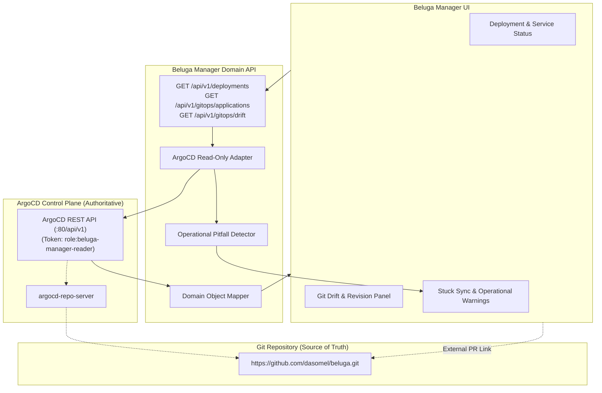

# ADR-0008: GitOps Integration with ArgoCD — Deployment & Synchronization Visibility

- **Status**: Proposed — design proposal; no live ArgoCD adapter, write API, or sync trigger is implemented by this ADR.
  Note on numbering: ADR-0005 was allocated to Beluga Manager container packaging & deployment architecture (PR #113); ADR-0006 covers Safe Actions (PR #134, issue #21); ADR-0007 covers Observability Integration (PR #135, issue #24); this GitOps proposal is numbered ADR-0008 (issue #25).
- **Date**: 2026-10-07
- **Issue**: [#25 [ROADMAP][ARCH] Deployment & GitOps Integration with Beluga](https://github.com/dasomel/beluga-manager/issues/25)
- **Parent epic**: #1
- **Related**: [ADR-0002](0002-backend-api-technology.md) (Domain API, Hono), [ADR-0005](0005-deployment-gitops-integration.md) (Deployment packaging & image architecture), `AGENTS.md` (read-first principle, boundary between upstream OSS and unified domain), `docs/architecture.md` (Section 5 Ownership Boundaries, Section 6 Operations & Services Views), `beluga/docs/mistakes-log.md` (stuck sync operations, hook race conditions, post-reboot Flink job loss, selfHeal rollback of manual edits).
- **Deciders**: dasomel

## Context

Beluga owns data platform infrastructure provisioning and GitOps synchronization using an ArgoCD app-of-apps architecture (`beluga/gitops/apps/app-of-apps.yaml`, `beluga-root`). The root application continuously reconciles two primary platform applications from `https://github.com/dasomel/beluga.git`:
1. `beluga-platform`: Deploys baseline system infrastructure (MetalLB, APISIX gateway, cert-manager, Keycloak, OpenLDAP, OPA, OpenFGA).
2. `beluga-data`: Deploys the Lakehouse data engines (SeaweedFS S3, CloudNativePG, Strimzi Kafka, Lakekeeper Iceberg REST catalog, Flink Operator, Trino, Airflow, Superset).

Both applications are configured with automated synchronization (`automated: { prune: true, selfHeal: true }`) and server-side apply (`ServerSideApply=true`). In [ADR-0005](0005-deployment-gitops-integration.md), the packaging and containerization of Beluga Manager itself was decided (Phase 1 container images shipped in `37e8507`; Option 1 proposed for chart placement).

However, issue #25 also requires defining the **operational integration between Beluga Manager and the GitOps plane**. Operators and engineers need visibility into deployment status, configuration drift, and application health directly within Beluga Manager without requiring direct `kubectl` access or cluster-admin logins to the ArgoCD dashboard. Furthermore, the operational history recorded in `beluga/docs/mistakes-log.md` documents recurring failure modes (stuck sync hooks, post-reboot Flink job losses, SSA merge deadlocks, and silent `selfHeal` rollbacks) that must be addressed by this integration contract.

### Upstream Verification & Authoritative Standards
- **ArgoCD 2.13.0** (verified in `beluga/VERSIONS.md`): Reachable at `https://argocd.local.beluga.internal`.
- **Live Cluster Status**: Read-only cluster inspection confirms 3 running applications in namespace `argocd`: `beluga-root` (Synced/Healthy), `beluga-platform` (Synced/Healthy), `beluga-data` (Synced/Healthy).
- **ArgoCD REST API**: [ArgoCD API Specification](https://argo-cd.readthedocs.io/en/stable/operator-manual/api/) (access date: 2026-10-07) defines `GET /api/v1/applications` and `GET /api/v1/applications/{name}` returning application tree, health status, sync status, operation state, and target/live revisions.
- **ArgoCD RBAC Policy**: [ArgoCD RBAC Documentation](https://argo-cd.readthedocs.io/en/stable/operator-manual/rbac/) (access date: 2026-10-07) supports declarative role definitions via `argocd-rbac-cm` ConfigMap.
- **ArgoCD Resource Hooks**: [ArgoCD Resource Hooks Documentation](https://argo-cd.readthedocs.io/en/stable/user-guide/resource_hooks/) (access date: 2026-10-07) defines sync hooks (`PreSync`, `Sync`, `PostSync`) and delete policies (`BeforeHookCreation`, `HookSucceeded`).

## Decision Drivers

1. **Read-First GitOps Boundary**: Beluga Manager must never bypass Git or act as a shadow GitOps controller. Git commits remain the sole authoritative trigger for cluster state changes. Mutating actions (sync triggers, hard refresh, app deletion) are strictly forbidden in Phase 1.
2. **Clear Show vs. Mutate Separation**: The Manager UI must transparently present GitOps synchronization facts (sync status, health status, git revision, configuration drift) without allowing accidental or unvetted out-of-band mutations.
3. **Least-Privilege Authentication**: Domain API connects to ArgoCD using a dedicated, read-only ServiceAccount token with narrow `applications, get` permissions, avoiding admin or write credentials.
4. **Resilience to Known Operational Pitfalls**: Design around documented failure modes in `beluga/docs/mistakes-log.md` (stuck sync hooks, post-reboot streaming job loss, and SSA merge conflicts).
5. **Decoupled Domain Model Mapping**: Map upstream ArgoCD concepts (`Application`, `sync.status`, `health.status`, `operationState`) into native Beluga Domain models (`Deployment`, `Service`, `Workload`) without leaking ArgoCD-specific internal schemas into the web frontend.

## Considered Options

### Option 1: Direct In-App GitOps Mutator (Manager UI Exposes Sync/Rollback/Edit Actions)
Provide "Sync Now", "Rollback", and manifest editing buttons in the Beluga Manager UI that invoke ArgoCD write APIs (`POST /api/v1/applications/{name}/sync`).
- **Pros**: Convenience for operators wanting a single dashboard for everything.
- **Cons**: Severe violation of `AGENTS.md` boundaries and GitOps principles; bypasses Git review and CI validation gates; can trigger catastrophic sync-hook races (as documented in `mistakes-log.md` row 51); risks operator confusion when `selfHeal` immediately reverts out-of-band changes.
- **Outcome**: **Rejected**.

### Option 2: Direct Kubernetes CRD Polling via kube-apiserver
Domain API bypasses ArgoCD's HTTP API and queries the `argoproj.io/v1alpha1` `Application` custom resources directly via Kubernetes API (`GET /apis/argoproj.io/v1alpha1/applications`).
- **Pros**: Uses existing Kubernetes cluster credentials.
- **Cons**: Bypasses ArgoCD's repo-server; cannot retrieve computed git-vs-live diffs; requires granting the Manager broader Kubernetes cluster-level RBAC (`applications.argoproj.io`); breaks air-gapped or remote GitOps setups where ArgoCD is hosted externally.
- **Outcome**: **Rejected**.

### Option 3: Read-Only ArgoCD Adapter with Domain Mapping & Operational Guardrails (Proposed)
Domain API implements a dedicated, read-only **GitOps Adapter** that communicates with ArgoCD's REST API using a scoped read-only service account token. The adapter:
1. Surfaces application sync status (`Synced`, `OutOfSync`), health (`Healthy`, `Degraded`, `Progressing`), and active git revisions.
2. Exposes live-versus-desired drift summaries (which resources are out of sync and why).
3. Detects and flags known stuck sync operations (e.g. stalled batch hook jobs).
4. Correlates ArgoCD applications with Beluga `Service` and `Deployment` domain objects.
5. Directs all mutation operations to Git pull requests via deep-links to the Beluga GitHub repository.
- **Pros**: Preserves GitOps integrity; prevents authorization leaks; provides rich visibility without mutation risks; addresses historical operational traps directly.
- **Cons**: Operators cannot trigger ad-hoc manual sync from the UI (must push to Git or use the external ArgoCD dashboard).
- **Outcome**: **Proposed**.

## Decision Outcome

**Proposed choice: Option 3 (Read-Only ArgoCD Adapter with Domain Mapping & Operational Guardrails)**.



### 1. Show vs. Mutate Matrix (Phase 1 Boundary)

| Capability / Information | Manager UI Posture | Upstream Authoritative System | Operational Rationale |
|---|---|---|---|
| Application Sync Status (`Synced`, `OutOfSync`) | **Show (Read-Only)** | ArgoCD API | Essential operational visibility. |
| Application Health (`Healthy`, `Degraded`, `Progressing`) | **Show (Read-Only)** | ArgoCD API / K8s status | Correlates infrastructure health with domain services. |
| Target vs Live Git Commit SHA | **Show (Read-Only)** | ArgoCD Repo Server | Informs operators which git commit is currently deployed. |
| Resource-Level Drift Diff | **Show (Read-Only)** | ArgoCD Diff API | Allows data engineers to see uncommitted runtime drifts. |
| Stuck Sync Operation Warning | **Show (Read-Only)** | ArgoCD `operationState` | Highlights stalled batch jobs (e.g. `flink-sql-submit`). |
| Sync Trigger ("Sync Now") | **FORBIDDEN (Mutating)** | Git Push / ArgoCD UI | Bypasses Git review; risks hook race conditions. |
| Rollback to Previous Revision | **FORBIDDEN (Mutating)** | Git Revert PR | Rollbacks must be recorded in Git history. |
| In-place Manifest Editing | **FORBIDDEN (Mutating)** | Git Repository | ArgoCD `selfHeal: true` will silently overwrite edits. |
| Hard Refresh / Cache Invalidation | **FORBIDDEN (Mutating)** | ArgoCD CLI / UI | Mutation action; reserved for Phase 2 Safe Actions if audited. |

### 2. Authentication Contract to ArgoCD
1. **ArgoCD RBAC Policy**:
   In `beluga/gitops/charts/beluga-platform/templates/` (or `argocd-rbac-cm`), define a dedicated read-only role:
   ```csv
   p, role:beluga-manager-reader, applications, get, */*, allow
   p, role:beluga-manager-reader, logs, get, */*, allow
   ```
2. **Token Provisioning**:
   Domain API receives an ArgoCD authentication token via Kubernetes Secret reference (`ARGOCD_AUTH_TOKEN`). The token is generated from a dedicated ServiceAccount in namespace `argocd`. No admin credentials (`admin`, `admin-secret`) are mounted or stored.

### 3. Domain Model Mapping Specification
The GitOps adapter translates ArgoCD application structures into the unified Beluga domain model:

1. **`Application` -> Beluga Domain Entity**:
   - `beluga-platform` maps to Service `svc-platform` and System Deployment scope.
   - `beluga-data` maps to Data Platform Services (`svc-kafka`, `svc-flink`, `svc-trino`, `svc-airflow`, `svc-iceberg`).
2. **Status Field Normalization**:
   - ArgoCD `.status.sync.status`:
     - `"Synced"` -> Domain `syncStatus: "synced"`
     - `"OutOfSync"` -> Domain `syncStatus: "drifted"`
     - `"Unknown"` -> Domain `syncStatus: "unknown"`
   - ArgoCD `.status.health.status`:
     - `"Healthy"` -> Domain `healthStatus: "healthy"`
     - `"Degraded"` -> Domain `healthStatus: "degraded"`
     - `"Progressing"` -> Domain `healthStatus: "stale"` (or transitioning)
     - `"Missing"` -> Domain `healthStatus: "degraded"`
3. **Revision Metadata**:
   - `.status.sync.revision` (Live Git SHA-1) and `.spec.source.targetRevision` (e.g. `main` or branch) are exposed as immutable string fields.

### 4. Direct Mitigations for Known Platform Traps (`mistakes-log.md`)

Based on documented real-world production defects in `beluga/docs/mistakes-log.md`:

| Known Platform Trap | Historical Evidence | Root Cause | Manager Integration Guardrail |
|---|---|---|---|
| **Stuck Sync Operation** | Row 47, 51: `.status.operationState` stuck in `Running` waiting for a hook job; blocks all subsequent git syncs. | Sync hooks (`argocd.argoproj.io/hook: Sync`, `BeforeHookCreation`) competing or failing silently. | Manager detects `operationState.phase == "Running"` with duration > 10m; displays a prominent **Operational Warning**: *"Application sync stalled on hook job: check job logs"*; never attempts concurrent sync. |
| **Post-Reboot Flink Job Loss** | Row 56, 61, 76: Cluster/node reboot restarts Flink session cluster; SQL jobs submitted via one-time batch hook (`flink-sql-submit`) are not re-executed. | Sync hooks only execute during GitOps sync events, not during node reboots or pod rescheduling. | Operations view correlates Flink Job status with GitOps status: flags Flink jobs whose runtime status is `SUSPENDED` or `NOT_FOUND` despite the parent application reporting `Synced/Healthy`. |
| **Silent `selfHeal` Rollbacks** | Row 47: Manual `kubectl apply` edits are silently reverted to Git state within minutes by ArgoCD selfHeal. | `automated.selfHeal: true` continuously overwrites out-of-band cluster edits. | Manager UI explicitly warns operators: *"Git is the authoritative source. Runtime edits will be overwritten by GitOps selfHeal within 3 minutes."* |
| **SSA Merge Volume Deadlocks** | Row 54, 58: Changing volume types (emptyDir -> PVC or ConfigMap -> Secret) causes Server-Side Apply to fail with `may not specify more than 1 volume type`. | Kubernetes API forbids mutating volume types in-place on existing Deployments/StatefulSets. | Drift inspector highlights volume type mismatches and annotates: *"Recreate strategy or pod deletion required for volume transition."* |
| **Repo-Server Cached Failures** | Row 52: `argocd-repo-server` caches transient DNS errors; repeats stale failure message despite recovery. | Repo-server internal git cache persistence. | Domain API indicates cache age and recommends hard refresh via ArgoCD CLI if error persists > 15m. |

### 5. Proposed API Shape Sketch (Clearly Labeled Design Proposal)

> **Proposal Note**: The following schemas and routes represent the planned design contract and are not implemented in the current repository code.

```typescript
// Proposed GitOps Domain Schemas
export interface GitOpsApplicationSummary {
  name: string; // e.g. "beluga-data"
  project: string; // "default"
  repoUrl: string; // "https://github.com/dasomel/beluga.git"
  path: string; // "gitops/charts/beluga-data"
  targetRevision: string; // "main"
  liveRevision: string; // "2081fef..."
  syncStatus: "synced" | "drifted" | "unknown";
  healthStatus: "healthy" | "degraded" | "progressing" | "missing";
  lastSyncedAt: string;
  operationState?: {
    phase: "Running" | "Succeeded" | "Failed" | "Error";
    startedAt: string;
    message?: string;
    isStuck: boolean; // Flagged if Running > 10m
  };
  managedResourcesCount: number;
  outOfSyncResourcesCount: number;
}

export interface GitOpsResourceDrift {
  kind: string; // "Deployment"
  name: string; // "flink-cluster"
  namespace: string; // "streaming"
  liveStateSummary: string;
  targetStateSummary: string;
  diffSummary?: string; // Unified diff representation
}
```

Proposed HTTP Endpoints:
- `GET /api/v1/gitops/applications`: List managed ArgoCD applications with sync and health summaries.
- `GET /api/v1/gitops/applications/{name}`: Detailed view of a single application including tree and operation state.
- `GET /api/v1/gitops/applications/{name}/drift`: List resources exhibiting live-vs-git configuration drift.

## Consequences

### Positive
- Bridges the visibility gap between Beluga Manager and the underlying GitOps deployment engine without granting wide cluster credentials to operators.
- Protects the platform from accidental out-of-band mutations by enforcing Git as the sole mutating source of truth.
- Provides early diagnostic detection of known platform failure modes (stalled sync hooks, post-reboot streaming job loss) directly in the Operations view.
- Provides a clean foundation for future Phase 2 deployment operations (PR-based Git workflows).

### Negative
- Operators cannot trigger instant rollbacks or sync retries directly within Beluga Manager in Phase 1 (requires accessing ArgoCD UI or Git).
- Dependency on ArgoCD REST API availability: if `argocd-server` is degraded, GitOps status degrades to `unknown`.

## Alternatives Considered

1. **Embedding FluxCD Controller instead of ArgoCD**:
   - *Why rejected*: Beluga platform is firmly standardized on ArgoCD 2.13.0 with an existing `app-of-apps` architecture. Introducing FluxCD would create architectural divergence and violate principle 3.
2. **Triggering Git commits directly from Domain API**:
   - *Why rejected*: Domain API would require GitHub Personal Access Tokens or SSH write keys with push access to `dasomel/beluga`. Storing and using write tokens in the Manager introduces severe security and blast-radius risks.

## Risks and Mitigations

| Risk | Impact | Mitigation Strategy |
|---|---|---|
| ArgoCD API downtime / latency | Domain API requests to `/api/v1/gitops/*` hang or fail. | Enforce 2000ms HTTP timeout in GitOps adapter; cache application summary for 30s; degrade gracefully to `syncStatus: "unknown"`. |
| Accidental mutation exposure | Engineer invokes write API via unauthorized route. | GitOps adapter only implements HTTP GET methods; zero write/sync methods exist in the adapter codebase. |
| Ingestion of sensitive diffs | Git drift diff exposes plaintext Secret values. | ArgoCD automatically redacts `kind: Secret` data in diff responses; Domain API redacts any parameters matching credential keys. |
| Stale git revision cache | Manager shows outdated commit SHA. | Surface both `targetRevision` (branch) and resolved `liveRevision` (commit SHA) with timestamp. |

## Open Owner Questions

1. **Phase 2 Git Mutation Workflow**: In Phase 2, should Beluga Manager support creating Git Pull Requests (via GitHub API) to update image tags or configuration values?
   - *Recommendation*: Yes. Creating GitHub PRs preserves code review, CI validation, and auditability while enabling self-service platform updates from the Manager UI.
2. **Flink Job Declarative Migration**: Should `14-flink-jobs.yaml` migrate from batch Sync hooks to the native `FlinkDeployment` CRD of Flink Kubernetes Operator 1.15 to prevent post-reboot job loss?
   - *Recommendation*: Yes. Managing streaming jobs via `FlinkDeployment` custom resources makes Flink job state declarative, self-healing, and resilient across node reboots without relying on one-off batch hooks.
3. **Drift Diff Granularity**: Should the Manager show full unified YAML diffs or high-level field summaries?
   - *Recommendation*: High-level field summaries (e.g. `image: v1 -> v2`, `replicas: 1 -> 2`) for Phase 1; full diffs should deep-link to the ArgoCD application UI.

## Follow-up Implementation Tasks & Acceptance Test Ideas

1. **Task 1: GitOps Application Schema and Read-Only Router**
   - Implement Zod OpenAPI schemas for `GitOpsApplicationSummary` and `GitOpsResourceDrift`.
   - *Acceptance test*: Unit tests validating schema serialization and handling of optional `operationState` fields.
2. **Task 2: ArgoCD REST Client Adapter**
   - Implement HTTP client communicating with `GET /api/v1/applications` with Bearer token authentication and 2s timeout.
   - *Acceptance test*: Mock server test verifying that HTTP 401 or 503 from ArgoCD results in `status: "unknown"` and does not crash the Domain API.
3. **Task 3: Stuck Sync Hook Diagnostic Detector**
   - Implement logic evaluating `.status.operationState` to detect sync jobs running > 10 minutes.
   - *Acceptance test*: Unit test asserting that an application with `phase: "Running"` and `startedAt: "20 minutes ago"` triggers `isStuck: true` and warning message.
4. **Task 4: Deployment & Service Correlation Mapping**
   - Implement mapper linking ArgoCD application resources to Beluga Domain `Service` and `Deployment` entities.
   - *Acceptance test*: Verification test proving that resources in `beluga-data` are correctly associated with `svc-kafka`, `svc-flink`, and `svc-trino`.
5. **Task 5: Frontend GitOps Status Badge Component**
   - Create UI status badges in `packages/web` displaying `Synced` (green), `Drifted` (amber), and `Stuck Hook` (red) with tooltip explanations.
   - *Acceptance test*: Component render test verifying correct accessible labels and color assignments.
