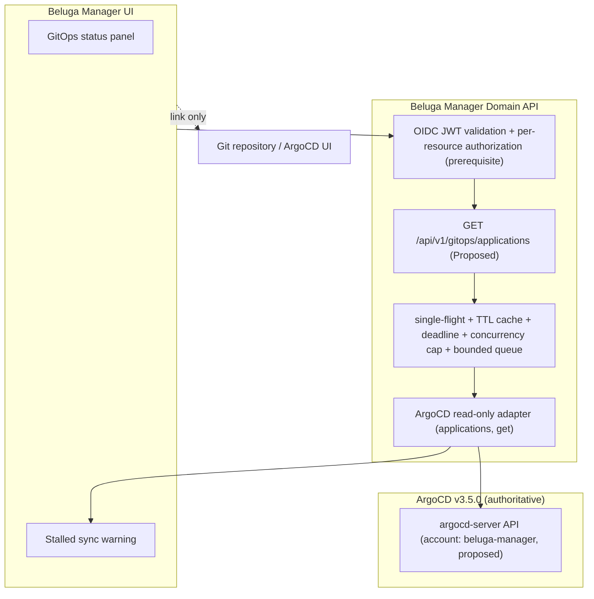

# ADR-0008: GitOps Integration with ArgoCD — Deployment & Synchronization Visibility

- **Status**: Proposed — design proposal; no live ArgoCD adapter, write API, or sync trigger is implemented by this ADR.
  Note on numbering: ADR-0005 is Deployment & GitOps Integration (PR #113); ADR-0006 is Safe Actions (PR #134, issue #21); ADR-0007 is Observability Integration (PR #135, issue #24); this proposal is ADR-0008 (issue #25).
- **Date**: 2026-10-07
- **Issue**: [#25 [ROADMAP][ARCH] Deployment & GitOps Integration with Beluga](https://github.com/dasomel/beluga-manager/issues/25)
- **Parent epic**: #1
- **Related**: [ADR-0002](0002-backend-api-technology.md) (Domain API, Hono), [ADR-0005](0005-deployment-gitops-integration.md) (see "Relationship to ADR-0005"), ADR-0006 (Safe Actions, section 0 hard prerequisite and section 2a Flink analysis), `AGENTS.md` (read-first principle, boundary between upstream OSS and unified domain), `docs/architecture.md` (headings "Design Principles" — principles 3 and 6 — and "Ownership Boundaries"; the headings are un-numbered and there is no Operations & Services section in that file), `beluga/docs/mistakes-log.md` (cited by date, see Current state).
- **Deciders**: dasomel

Conventions: **Current state** lists only observed facts (file:line or a command that was run; evidence date 2026-10-07). **Proposal** is design intent. Every number (cache TTL, timeout, threshold) is labelled *Proposed*. External facts carry an official URL opened on 2026-10-07, or are marked *not verified*.

## Relationship to ADR-0005

ADR-0005 and this ADR both come from issue #25 and must not duplicate each other.
- **ADR-0005 owns**: how Beluga Manager itself is packaged and deployed through Beluga's GitOps (chart location, the `Application` registration in the Beluga repo, image pinning, upgrade/rollback by Git revert). It is still *Proposed* and its Open Question 1 (chart location) is undecided. Its "Read-only boundary" bullet and Open Question 4 ("whether a read-only ArgoCD status adapter is in MVP scope") explicitly defer the topic of this ADR.
- **This ADR owns**: how the Manager *observes* the GitOps plane (read-only ArgoCD status adapter, domain mapping, operational guardrails, and the security contract to ArgoCD). It does not decide chart placement, `Application` registration or image handling, and it does not change ADR-0005's decisions. If ADR-0005 is accepted, the Manager's own `Application` simply becomes one more application the adapter can show; nothing here depends on that.
- ADR-0005's Open Question 4 is *answered here as a proposal* (yes, as a later phase, read-only, after the prerequisites below); acceptance is dasomel's decision.

## Context

### Current state (observed)

| Fact | Evidence |
|---|---|
| Beluga runs an ArgoCD app-of-apps: `beluga-root` renders the `beluga-platform` and `beluga-data` Applications from `https://github.com/dasomel/beluga.git`; all three have `automated: {prune: true, selfHeal: true}`. | Beluga `gitops/apps/app-of-apps.yaml:1-21`, `gitops/apps/beluga-data.yaml:19-22`, `gitops/apps/beluga-platform.yaml:21`; live `kubectl -n argocd get applications.argoproj.io` -> three apps. |
| **ArgoCD is v3.5.0** (not 2.13.0 as an earlier draft said): `VERSIONS.md` row, bootstrap script, and the running image agree. | Beluga `VERSIONS.md:19` ("ArgoCD \| 3.5.0"); `scripts/gitops/01-argocd-bootstrap.sh:19,23` (`install.yaml` of `v3.5.0`); live `kubectl -n argocd get deploy argocd-server -o jsonpath='{.spec.template.spec.containers[0].image}'` -> `quay.io/argoproj/argocd:v3.5.0`. |
| Live status of the three apps: all `Synced` / `Healthy`, last operation `Succeeded`; `spec.source.targetRevision` is `HEAD` (not a branch name); `.status.sync.revision` is a full commit SHA (`ce493324…` as measured on 2026-10-07; the revision has since advanced, which does not affect the observation). | `kubectl -n argocd get application <name> -o jsonpath='{.status.sync.status} {.status.health.status} {.status.operationState.phase} {.spec.source.targetRevision} {.status.sync.revision}'` (read-only, 2026-10-07). |
| Each Application lists its managed resources with only `kind/name/namespace/status/version` (no manifest content). | Live `kubectl -n argocd get application beluga-data -o jsonpath='{.status.resources[0]}'` -> `{"kind":"ConfigMap","name":"trino-access-control","namespace":"analytics","status":"Synced","version":"v1"}`. |
| **ArgoCD configuration is not managed by the Beluga GitOps charts.** ArgoCD is installed by a bootstrap script applying the upstream `install.yaml`, then patching `argocd-cmd-params-cm` (`server.insecure: "true"`; APISIX terminates TLS and forwards plain HTTP to `argocd-server:80`). No ArgoCD/RBAC manifest exists under `gitops/`. | Beluga `scripts/gitops/01-argocd-bootstrap.sh:19-29`; `git ls-tree -r --name-only refs/remotes/origin/main gitops \| grep -i "argocd\|rbac"` -> no output; live `kubectl -n argocd get svc argocd-server` -> ports `80/TCP,443/TCP`. |
| Live `argocd-rbac-cm` has **empty data** (no custom policy, no `policy.csv`); no dedicated read-only account or role exists. | `kubectl -n argocd get cm argocd-rbac-cm -o jsonpath='{.data}'` -> empty. |
| The domain API has **no authentication middleware**. | `docs/IMPLEMENTATION-STATUS.md:30` ("the app has no auth middleware"); `packages/domain-api/src/app.ts:50-56` registers only CORS (origin `http://localhost:5180`). |
| There is **no `Deployment` or GitOps schema** in the domain API; the stub Service ids that exist are `svc-trino`, `svc-airflow`, `svc-iceberg`, `svc-kafka`, `svc-flink`, `svc-superset`, `svc-kubernetes`, `svc-observability`. **`svc-platform` does not exist.** | `packages/domain-api/src/schema/` (no deployment/gitops file); `packages/domain-api/src/stub-data/services.ts:9-129` (`id:` fields); `git grep -n "svc-platform" -- packages` -> no hit. A read-only Flink adapter exists on `main` (`packages/domain-api/src/adapters/flink/`, PR #132). |
| ArgoCD host `argocd.local.beluga.internal` is in the Beluga domain registry. | Beluga `AGENTS.md:16-18`. |

Operational history in `beluga/docs/mistakes-log.md`. The log has **no row numbers**; entries are identified by the date column. The log is a moving file, so entries are cited by date plus a quoted excerpt, not by line number (as of beluga commit `1df61e0`). Other Beluga file:line citations in this ADR are also as of that commit.

| Date / line | Quoted excerpt (translated from the Korean entry) | Relevance |
|---|---|---|
| 2026-08-25 (gitops) | "`beluga-platform`/`beluga-data` … `selfHeal: true` … editing directly with `kubectl apply` … ArgoCD **silently reverts to the origin/main state within a few minutes**" | Out-of-band edits are reverted; the interval is "a few minutes", not a measured number. |
| 2026-08-26 (harness) | An orchestrator manually `kubectl delete`-ing a Sync-hook resource while ArgoCD's own sync operation was `Running` (waiting on another hook) made the two "compete for the same hook resource". | Concurrent actions with a running sync operation are unsafe; check `.status.operationState.phase` first. |
| 2026-08-26 (harness) | After a transient DNS failure in `argocd-repo-server`, `.status.operationState.message` kept the old error although DNS had recovered; "`refresh=hard` alone may not refresh the failure state inside the repo-server process — `rollout restart deployment/argocd-repo-server` resolves it". | A stale message does not mean retries are failing. The log's remedy is a repo-server restart, not only a hard refresh. |
| 2026-08-30 (gitops) and 2026-09-08 (gitops) | ArgoCD SSA failing with `may not specify more than 1 volume type` when a volume's type changed (emptyDir -> PVC; ConfigMap -> Secret under the same volume name). | Server-Side Apply merge failures on volume type changes; the log's prevention is to rename the volume or split the change over two commits. |
| 2026-10-07 (gitops) | A `flink-sql-submit` Sync-hook Job failed with `BackoffLimitExceeded`; `beluga-data` sync kept retrying (OutOfSync, waiting on "hook batch/Job/flink-sql-submit") and could not pick up later changes; "the hook only runs at sync time, so static checks/CI did not reveal it". | A failed Sync hook blocks the whole application sync. |

The earlier draft's claim "Flink jobs are lost after reboot / sync hooks are not re-run on reboot" is **not supported by the log**: the entries dated 2026-08-30 and 2026-09-08 are about SSA volume-type failures, 2026-09-08 about Cilium TLS handshakes, 2026-10-04 about Lakekeeper bootstrap, and the later 2026-10-07 entries about Keycloak token exchange and a lakekeeper-bootstrap hook. What I can state, as an **inference from manifests, not an observed incident and not in the log**: the Flink session cluster's configuration sets no `high-availability.*` key (Beluga `gitops/charts/beluga-data/templates/05-flink-operator.yaml:10-20`), Beluga's own HA doc says that without HA a JobManager failure fails running programs (Beluga `docs/ha-dr-objectives.md:101`), and the submit hook runs only on ArgoCD Sync (`gitops/charts/beluga-data/templates/14-flink-jobs.yaml:27`). So a JobManager restart could leave jobs absent until the next sync. This ADR does not claim it has happened.

### External references (opened 2026-10-07)

- Argo CD RBAC — <https://argo-cd.readthedocs.io/en/stable/operator-manual/rbac/> (opened 2026-10-07; the page refers to "Since v3.0.0" / "New since v3.2", i.e. 3.x docs; the exact doc version is not printed): policy syntax `p, <role/user/group>, <resource>, <action>, <object>, <effect>`; resources include `applications`, `logs`, `exec`, …; policies live in `argocd-rbac-cm` under `policy.csv`; `logs` is a **separate resource** ("when granted with the `get` action, this policy allows a user to see Pod's logs").
- Argo CD user management — <https://argo-cd.readthedocs.io/en/stable/operator-manual/user-management/> (opened 2026-10-07): local users are defined in `argocd-cm` (e.g. `accounts.alice: apiKey, login`); tokens are created with `argocd account generate-token --account <name>`; a new local user falls back to `policy.default` unless RBAC rules are added. The page I read does **not** state token expiry options or revocation for API keys: *not verified*.
- Argo CD API — <https://argo-cd.readthedocs.io/en/stable/developer-guide/api-docs/> (opened 2026-10-07): Swagger UI is at `/swagger-ui` of the Argo CD UI; authentication uses a bearer token (obtained via `$ARGOCD_SERVER/api/v1/session` in the example); example endpoints use `api/v1`. The page does **not** list `/api/v1/applications` or `/api/v1/applications/{name}`, nor API stability guarantees. The exact application endpoints and response fields for 3.5.0 are therefore *not verified from docs*; the observed Application CR fields above are the verified part. The earlier draft's cited URL (`operator-manual/api/`) was not the API reference and is removed.
- Argo CD health — <https://argo-cd.readthedocs.io/en/stable/operator-manual/health/> (opened 2026-10-07): health values `Healthy`, `Progressing`, `Degraded`, `Suspended`, and (in the aggregation text) `Missing`, `Unknown`. The page does not cover **sync** status values; `Synced` is observed live, while `OutOfSync`/`Unknown` are *not verified*.
- Argo CD sync phases/hooks — <https://argo-cd.readthedocs.io/en/stable/user-guide/sync-waves/> (opened 2026-10-07; `resource_hooks/` now redirects here): hook phases `PreSync`/`Sync`/`PostSync`/`SyncFail`; deletion policies `HookSucceeded`/`HookFailed`/`BeforeHookCreation`; "If any of them fails the whole sync process will be marked as failed".
- Argo CD diffing — <https://argo-cd.readthedocs.io/en/stable/user-guide/diffing/> (opened 2026-10-07): says nothing about masking Secret values in diffs. The earlier draft's claim that "ArgoCD automatically redacts `kind: Secret` data in diff responses" is therefore **removed as unsupported**.

## Decision Drivers

1. **Read-first GitOps boundary**: Git is the only authoritative trigger of cluster state change; the Manager never syncs, rolls back, refreshes or edits.
2. **Authentication and authorization first** on the Manager API (hard prerequisite, ADR-0006 section 0), because the API currently has no authentication.
3. **Least privilege toward ArgoCD**: a dedicated account allowed only `applications, get` — no logs, exec, sync, override.
4. **No amplification**: one Manager request must not translate into unbounded ArgoCD calls.
5. **No uncertain facts presented as authoritative** (`docs/architecture.md` Design Principle 6): application-to-service mapping is explicit configuration, not inference.
6. **Reuse, not duplication**: ArgoCD stays the source of GitOps status; ADR-0005 stays the owner of packaging.

## Considered Options

### Option 1: In-app GitOps mutator (Sync/Rollback/Edit in the Manager UI)
**Rejected**: bypasses Git review and CI; the log shows sync-hook races and silent selfHeal reversions (2026-08-25, 2026-08-26 entries); requires write credentials in the Manager.

### Option 2: Read `Application` CRs directly from the Kubernetes API
**Rejected** (Proposed judgement): requires giving the Manager cluster-level RBAC on `applications.argoproj.io` and ties it to in-cluster ArgoCD; the ArgoCD API gives an explicit, narrowly-scoped role (`applications, get`). Note that the status fields used here were observed on the CR, so the CR route is technically feasible; the rejection is about privilege scope.

### Option 3: Read-only ArgoCD adapter with explicit domain mapping and guardrails (Proposed)
A single adapter using one narrow read-only ArgoCD account; surfaces sync/health/revision and per-resource sync status; flags a stalled sync operation; deep-links to the ArgoCD UI and to the Git repository for any change.
- **Pros**: preserves GitOps integrity; minimal privilege; no manifest content crosses the adapter.
- **Cons**: operators cannot sync or roll back from the Manager; requires new ArgoCD configuration owned by the Beluga repo.
- **Outcome**: **Proposed**.

## Decision Outcome (Proposal)



### 0. HARD PREREQUISITE — authentication and authorization on the Manager API

Nothing in this ADR may be implemented or enabled until the Manager API validates real Keycloak OIDC/JWT tokens (signature via JWKS, `iss`, `aud`, `exp`) and authorizes the caller **per resource** (which applications a caller may see). This is the same prerequisite as ADR-0006 section 0 (including its CSRF rule: bearer header, not cookie; for read-only `GET` routes the main concern is access control, but any future non-GET route inherits ADR-0006's rules). Even though this adapter is read-only, the revision SHAs, application names and error messages reveal platform topology and operational state. Routes fail closed (401/403) when authentication is not configured. Claim/role names are *not verified* and must be taken from the live realm.

### 1. Show vs. mutate (Phase 1)

| Capability / Information | Manager posture | Source |
|---|---|---|
| Application sync status, health status | **Show** | ArgoCD Application status |
| `targetRevision` (observed `HEAD`) and resolved `.status.sync.revision` (commit SHA) | **Show** | ArgoCD Application |
| Per-resource sync status (kind/name/namespace/status) | **Show** | `.status.resources[]` (observed fields) |
| Operation phase/message and stalled-operation warning | **Show** | `.status.operationState` |
| Resource manifests, live/target diffs, pod logs | **Not exposed** in Phase 1 (deep-link to the ArgoCD UI) | Avoids moving Secret-bearing content through the adapter; Secret masking in ArgoCD diffs is not verified |
| Sync, hard refresh, rollback, manifest edit, app deletion | **FORBIDDEN** | Git push / external ArgoCD UI |

### 2. Authentication contract to ArgoCD (Proposal)

Current state: `argocd-rbac-cm` is empty and ArgoCD configuration is not in Beluga gitops. Everything below is **proposed** and is a **Beluga-repo change** (the Beluga repo owns cluster state; the Manager never edits it), to be tracked as an issue there.

1. **Account**: a local account `beluga-manager` with the `apiKey` capability only (no `login`), defined in `argocd-cm` (`accounts.beluga-manager: apiKey`, per the user-management docs).
2. **RBAC** (in `argocd-rbac-cm`, `policy.csv`), read-only and **without logs**:
   ```csv
   p, role:beluga-manager-reader, applications, get, default/beluga-*, allow
   g, beluga-manager, role:beluga-manager-reader
   ```
   The object pattern `default/beluga-*` (project `default` is what the three Applications use; the app-name pattern is a Proposed narrowing) replaces the earlier `*/*`. The earlier draft also granted `logs, get, */*`; that is removed because pod logs may contain secrets, and Decision Driver 3 is "applications get only". `policy.default` must not give the account broader access (the docs state a user without rules falls back to `policy.default`; the live default is not inspected here, *not verified*).
3. **Where it lives**: not `beluga-platform/templates/` as the earlier draft said — no ArgoCD templates exist there. Options are extending `scripts/gitops/01-argocd-bootstrap.sh` or adding an ArgoCD-config chart/manifests to the Beluga repo; that choice belongs to the Beluga repo (Open Question 1).
4. **Token handling**: the token is stored in a Kubernetes Secret referenced by the Manager Deployment (env from `secretKeyRef`); never in values, logs or the audit trail. **Rotation (Proposed)**: regenerate the token and update the Secret on a schedule and on any suspected exposure; whether API-key tokens can carry an expiry or be revoked is *not verified* in the docs I opened, so the rotation procedure must be confirmed against the 3.5.0 CLI before implementation.
5. **Confused deputy**: the adapter uses one service token for every caller, so the token's reach (all `beluga-*` apps) is the maximum any caller could see. The Manager therefore authorizes the *caller* per application (section 0) before returning data, filters the result to the caller's allowed set, and never forwards the end user's token to ArgoCD. Whether ArgoCD SSO could carry per-user identity is *not verified* and out of scope.
6. **TLS and server-URL validation (SSRF)**: the ArgoCD base URL comes only from deployment configuration (an allow-listed in-cluster service URL), never from a request parameter. The adapter must not follow redirects to other hosts, must cap response size, and must use only the fixed GET paths it needs. TLS: today ArgoCD is plain HTTP inside the cluster (`server.insecure: "true"`, Current state), so in-cluster calls to `argocd-server:80` are unencrypted; the Manager must at least verify the target is the configured service, and a TLS-verified path (`443`) should be evaluated; its certificate chain is *not verified*.

### 3. Domain mapping (Proposal)

There is no `Deployment` or GitOps domain type today (Current state); this ADR proposes new types, it does not map onto existing ones.

1. **Application -> Service**: an **explicit configuration table** mapping an ArgoCD application to the Manager service ids that exist in the fixtures, for example `beluga-data` -> `svc-trino`, `svc-airflow`, `svc-iceberg`, `svc-kafka`, `svc-flink`, `svc-superset`. `beluga-platform` has **no matching service id today** (`svc-platform` does not exist); it is shown as an application-level entry unless a service id is added by a separate decision. The mapping is declared, not inferred, to respect `docs/architecture.md` Design Principle 6.
2. **Status normalization** (domain value names are Proposed): sync `Synced` -> `synced` (observed), other values passed through as `unknown`/`out-of-sync` only after the 3.5.0 values are verified (*not verified*); health `Healthy`/`Progressing`/`Degraded`/`Suspended`/`Missing`/`Unknown` passed through 1:1 (documented). `Progressing` is **not** mapped to a "stale" state as the earlier draft did.
3. **Revision metadata**: expose `spec.source.targetRevision` (observed `HEAD`) and `.status.sync.revision` (SHA) as read-only strings.

### 4. Guardrails derived from the operational history (Proposal)

| Situation (source: Current state log excerpts) | Manager behaviour |
|---|---|
| Sync operation stays `Running` (hook waiting; 2026-08-26 and 2026-10-07 entries) | Show a warning when `.status.operationState.phase == "Running"` for longer than **10 minutes (Proposed)**, with the operation message and a link to the ArgoCD UI. Never trigger or retry a sync. |
| Failed Sync hook blocks the application (2026-10-07 entry) | Surface `operationState.message` (redacted) and the name of the hook resource if present in it; no remediation from the Manager. |
| Stale operation message after repo-server failure (2026-08-26) | Show the message together with its timestamp and a note that it may be stale; the documented operator remedy is a repo-server restart outside the Manager. The earlier draft's "recommend hard refresh" is removed: the log says a hard refresh alone may not clear it. |
| Out-of-band edits get reverted by selfHeal (2026-08-25) | Static UI note: "Git is authoritative; runtime edits are reverted by selfHeal within minutes" (no numeric claim; the log says "a few minutes"). |
| SSA volume-type failures (2026-08-30, 2026-09-08) | Show the failing resource and ArgoCD's message; no auto-remediation. The log's remedy (rename the volume or use a two-step commit) is documentation for operators, not an action. |
| Flink jobs absent while the app is `Synced/Healthy` | **Open question, not a guardrail**: it depends on the Flink adapter (PR #132) and on the inference above, which is not an observed incident. Not part of Phase 1. |

### 5. Request amplification controls (Proposal)

The sibling adapter work (PRs #132 merged, #133) needed the same controls; alignment with those conventions is to be checked at implementation (I did not re-read them here). All values are *Proposed*:
- **One upstream call per refresh**: a single list call serves the whole view; no per-application fan-out for the list.
- **Single-flight**: concurrent identical requests share one in-flight upstream call.
- **TTL cache**: 30 s.
- **Per-call timeout** 2000 ms and a **total request deadline** (including queueing) of 5 s.
- **Concurrency cap** of 2 in-flight ArgoCD calls and a **bounded queue** of 10; excess requests get a degraded/503 response rather than waiting.
- On timeout, 401/403/5xx, or open circuit: serve the last cached value marked stale, or `unknown`; never return an HTTP 500 for the whole page.

### 6. API shape sketch (Proposal; not implemented)

```typescript
export interface GitOpsApplicationSummary {
  name: string;                 // e.g. "beluga-data"
  project: string;              // observed: "default"
  targetRevision: string;       // observed: "HEAD"
  liveRevision: string;         // commit SHA from .status.sync.revision
  syncStatus: "synced" | "unknown";            // other values only after verification on 3.5.0
  healthStatus: "healthy" | "progressing" | "degraded" | "suspended" | "missing" | "unknown";
  operation?: { phase: string; startedAt: string; finishedAt?: string; message?: string; stalled: boolean };
  serviceIds: string[];         // from explicit configuration
  resources: Array<{ kind: string; name: string; namespace: string; syncStatus: string }>;
  fetchedAt: string;            // staleness indicator
}
```

Proposed endpoints: `GET /api/v1/gitops/applications`, `GET /api/v1/gitops/applications/{name}`. The earlier draft's `/drift` endpoint with live/target state summaries and diffs is dropped for Phase 1 (see section 1).

## Consequences

### Positive
- Operators see sync/health/revision without ArgoCD credentials.
- Minimal privilege toward ArgoCD and no manifest content passing through the Manager.
- Explicit separation from ADR-0005's packaging scope.

### Negative
- Needs ArgoCD account/RBAC changes in the Beluga repo and a secret-handling procedure.
- No sync/rollback from the Manager.
- ArgoCD API shape for 3.5.0 must still be verified before coding.

## Alternatives Considered

1. **Switch to or embed Flux** — rejected: Beluga standardizes on ArgoCD (`VERSIONS.md:19`, v3.5.0) with an existing app-of-apps; no benefit shown. (The earlier draft said "2.13.0"; corrected.)
2. **Manager commits to Git directly** — rejected: would need a write token to `dasomel/beluga`, a large blast radius. A later PR-creating flow is Open Question 2.

## Risks and Mitigations

| Risk | Impact | Mitigation (Proposed) |
|---|---|---|
| Unauthenticated Manager API leaks platform state | Any caller sees app names, SHAs, messages | Hard prerequisite (section 0) |
| Over-broad ArgoCD token | Compromise reaches all matched apps | Narrow `applications, get`, name-pattern scope, no logs, rotation |
| SSRF / redirect via configurable URL | Manager used to reach arbitrary hosts | Config-only URL, no redirects, fixed paths, response cap |
| ArgoCD API slow or down | Page latency or failure | Section 5 controls; stale/unknown fallback |
| Operation message contains secrets | Secret exposure to browser | Redact before serialization; message length cap; no manifests exposed |
| Reading status fields that differ in 3.5.0 | Wrong status shown | Verify against 3.5.0 before coding; pass unknown values through as `unknown` |

## Open Owner Questions

1. **Where does ArgoCD account/RBAC configuration live in the Beluga repo** (bootstrap script vs. a new chart)?
   - *Recommendation*: raise a Beluga issue; prefer declarative manifests over script patches so selfHeal and review apply.
2. **Phase 2: create Git PRs from the Manager?**
   - *Recommendation*: only after ADR-0006's authentication prerequisite; use a GitHub App with narrow scope, never a personal write token.
3. **Flink jobs vs. GitOps status correlation** and the migration of Flink job submission away from the Sync hook.
   - *Recommendation*: do not decide here; ADR-0006 section 2a already analyses the Flink/ArgoCD interaction, and the inference in this ADR's Current state needs an observed reproduction before it becomes a guardrail.
4. **TLS between the Manager and `argocd-server`** given `server.insecure: "true"`.
   - *Recommendation*: evaluate calling the `443` port with a verified chain; if not feasible, accept in-cluster plain HTTP with a NetworkPolicy and document the residual risk.
5. **Which sync-status values does ArgoCD 3.5.0 emit and what are the exact application endpoints?**
   - *Recommendation*: a spike against the live argocd-server's Swagger UI (`/swagger-ui`, per the API docs page) before coding.

## Follow-up Implementation Tasks & Acceptance Test Ideas

1. **Authentication/authorization middleware** (shared with ADR-0006 Phase 0). *Acceptance*: unauthenticated and unauthorized callers get 401/403; unconfigured auth fails closed.
2. **Beluga-repo change**: ArgoCD account `beluga-manager` + RBAC (read-only, no logs). *Acceptance*: with the token, `applications, get` succeeds and a log/sync call is denied by ArgoCD (verified on a non-production cluster first).
3. **ArgoCD client adapter** with fixed GET paths, no redirects, size cap. *Acceptance*: mock tests for 401/403/5xx/timeout produce stale/`unknown`, not an unhandled error; a redirect to another host is refused.
4. **Amplification guard**. *Acceptance*: N concurrent requests yield one upstream call; the queue and concurrency limits reject excess load; the total deadline is honoured.
5. **Status mapping** from the verified 3.5.0 values. *Acceptance*: unknown values map to `unknown`; `Progressing` is never reported as healthy or stale.
6. **Stalled-operation detector**. *Acceptance*: `Running` beyond the configured threshold sets `stalled: true`; the message is redacted.
7. **Frontend status badges** in `packages/web`. *Acceptance*: accessible labels; stale data is visibly marked.
