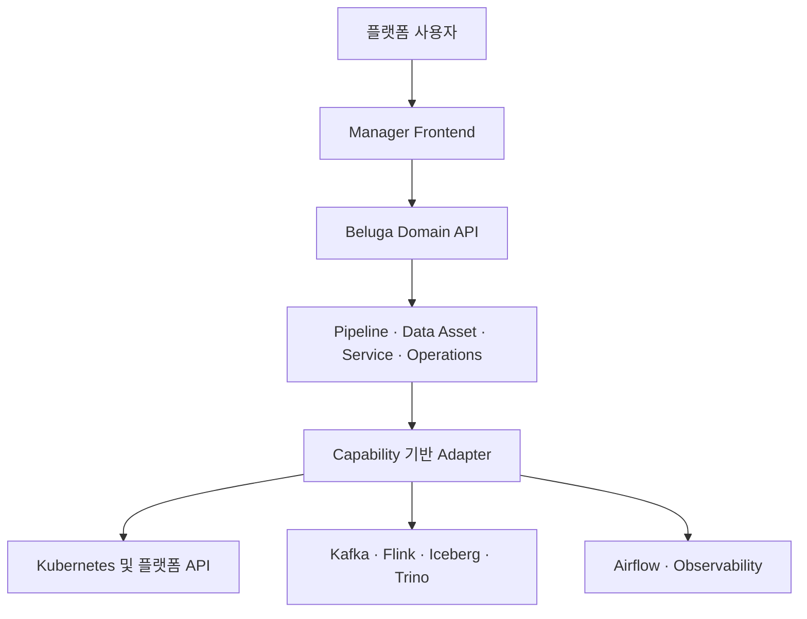

# 아키텍처

Beluga Manager는 Beluga Data Platform의 통합 및 Control Plane 계층입니다.

사용자 경험, Beluga Domain API, Integration Adapter, 각 플랫폼 서비스의 authoritative source를 분리합니다.

Frontend와 API는 계획된 제품 경계입니다. 현재 저장소는 아키텍처와 계약을 정립하는
단계이며 실제 실행 가능 범위는 [구현 상태](IMPLEMENTATION-STATUS-ko.md)를 기준으로 합니다.

## 설계 원칙

1. **API 우선 통합** — 각 구성요소가 제공하는 authoritative API를 사용합니다.
2. **통합 Domain Model** — 여러 OSS API를 Beluga의 개념으로 correlation합니다.
3. **불필요한 데이터 복제 금지** — Manager 자체를 또 하나의 metadata 플랫폼으로 만들지 않습니다.
4. **Locale-neutral API** — 현지화는 Frontend에서 처리합니다.
5. **Capability 기반 연동** — API 기능과 버전을 탐지합니다.
6. **명시적 Correlation** — 불확실한 관계를 authoritative 사실처럼 표시하지 않습니다.
7. **Air-gapped 친화성** — Self-hosted 환경에서 dependency와 runtime asset을 통제할 수 있어야 합니다.

## 첫 번째 Vertical Slice

첫 번째 End-to-End 제품 검증 대상은 다음입니다.

`Source → Kafka → Flink → Iceberg → Trino`

사용자가 여러 전문 UI를 순차적으로 방문하지 않고 하나의 Beluga Pipeline으로 전체 흐름을 탐색할 수 있도록 합니다.

English version: [architecture.md](architecture.md)

## 소유권 경계

| 영역 | 소유자 |
|---|---|
| 통합 탐색 및 Domain Model | Beluga Manager |
| Workload와 서비스의 Desired State | Beluga GitOps / Kubernetes |
| 스트림과 Lakehouse Runtime State | Kafka, Flink, Iceberg, Trino API |
| Scheduling State | Airflow API |
| Metrics, Logs, Traces | Observability Backend |

Manager는 이 정보를 correlation하지만 별도의 competing system of record로 암묵 복제하지
않습니다. 파생되거나 불확실한 관계는 provenance와 confidence를 유지해야 합니다.
