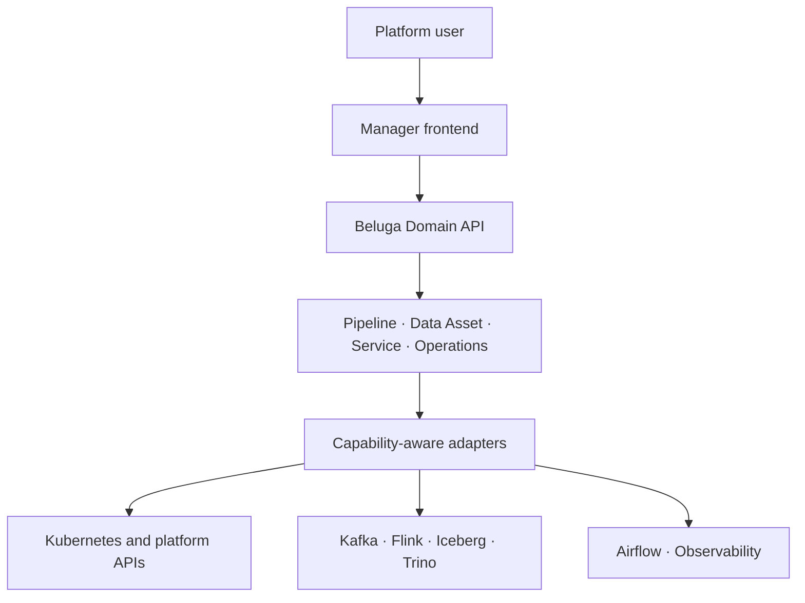

# Architecture

Beluga Manager is the integration and control-plane layer of the Beluga Data Platform.

The architecture separates the user experience, Beluga Domain API, integration adapters, and authoritative platform services.

The frontend and API are planned product boundaries. The current repository is an
architecture and contract foundation; the [implementation status](IMPLEMENTATION-STATUS.md)
is authoritative for what is executable today.

## Design Principles

1. **API-first integration** — use authoritative APIs exposed by each component.
2. **Unified domain model** — correlate multiple OSS APIs into Beluga concepts.
3. **No unnecessary duplication** — do not turn Manager into another metadata platform.
4. **Locale-neutral API** — localization happens in the Frontend.
5. **Capability-aware integration** — detect supported API features and versions.
6. **Explicit correlation** — uncertain relationships must not be presented as authoritative facts.
7. **Air-gapped friendly** — dependencies and runtime assets must be controllable for self-hosted environments.

## First Vertical Slice

The first end-to-end product validation is:

`Source → Kafka → Flink → Iceberg → Trino`

The goal is to represent this flow as one Beluga Pipeline instead of requiring users to move between multiple specialist UIs.

See the [Korean architecture document](architecture-ko.md) for the Korean version.

## Ownership Boundaries

| Area | Owner |
|---|---|
| Unified navigation and domain models | Beluga Manager |
| Workload and service desired state | Beluga GitOps / Kubernetes |
| Stream and lakehouse runtime state | Kafka, Flink, Iceberg and Trino APIs |
| Scheduling state | Airflow API |
| Metrics, logs and traces | Observability backends |

Manager correlates these sources but does not silently copy them into a competing system
of record. Derived or uncertain relationships must retain provenance and confidence.
